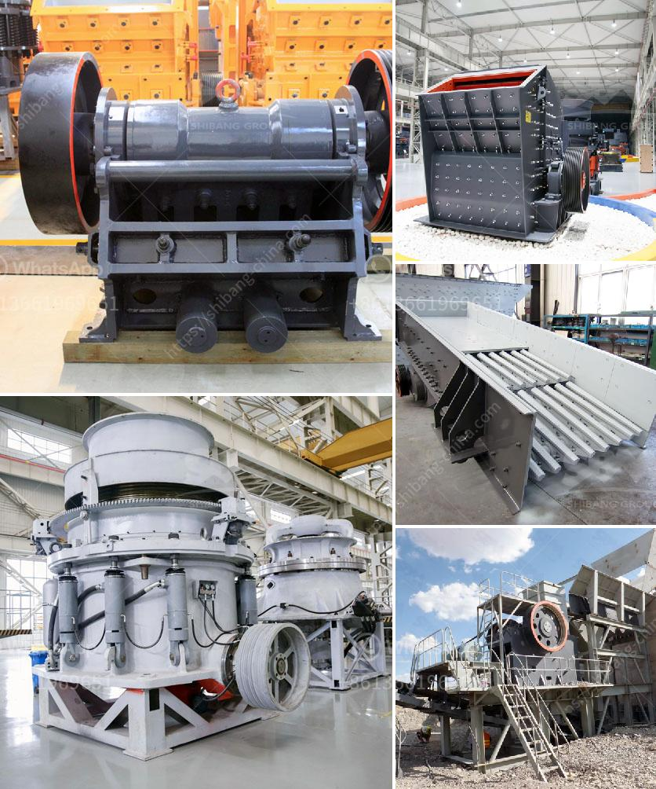

<h3>quarry crushing equipments manufacturers</h3>
In the quarry industry, successful rock crushing equipment manufacturers consistently aim to deliver high-quality products that help in optimizing operations. Efficiency, reliability, and durability are vital when choosing the right quarry crushing equipment. To meet the ever-increasing demands of the quarrying industry, several manufacturers have emerged over the years, offering a wide range of crushing equipment for various applications.

One prominent player in this field is XYZ Manufacturing, known for its state-of-the-art quarry crushing equipment. Their comprehensive range of machines ensures that the right equipment is available for every stage of the crushing process. From primary jaw crushers to cone crushers and impact crushers, XYZ Manufacturing offers a variety of options to suit different production requirements.

One of the key benefits of XYZ Manufacturing's equipment is their focus on efficiency. Each machine undergoes rigorous testing to ensure it delivers maximum productivity with minimal energy consumption. This not only helps in reducing operational costs but also promotes sustainable practices in the quarrying industry.

Another leading player in the market is ABC Machinery. Their extensive range of quarry crushing equipment includes both stationary and mobile solutions, catering to different site conditions. They offer advanced technologies like hydraulic systems and automation features, enabling operators to achieve higher productivity with improved safety.

When selecting a quarry crushing equipment manufacturer, it is crucial to consider factors such as after-sales support and spare parts availability. Established manufacturers like XYZ Manufacturing and ABC Machinery offer excellent customer service, ensuring prompt assistance in case of any equipment-related issues.

In conclusion, quarry crushing equipment manufacturers play a significant role in the success of quarry operations. Their innovative products contribute to improving efficiency, reliability, and sustainability in the industry. With the availability of a wide range of options, quarry operators can choose the most suitable equipment for their specific needs, ultimately leading to enhanced production and profitability.
<h3>Contact us</h3><ul><li><strong>Whatsapp:&nbsp;<a href="https://wa.me/8613661969651">+8613661969651</a></strong></li><li><a href="https://swt.shibang-china.com/?git&amp;zhl&amp;quarry crushing equipments manufacturers"><strong>Online Service(chat now)</strong></a></li></ul><h3>Related</h3><ul><li><a href='500tpd stone crushers.md'>500tpd stone crushers</a></li><li><a href='manufacturers of conveyor belts.md'>manufacturers of conveyor belts</a></li><li><a href='trommel ball mill.md'>trommel ball mill</a></li><li><a href='ballast stone crusher.md'>ballast stone crusher</a></li><li><a href='model ball mill.md'>model ball mill</a></li></ul>