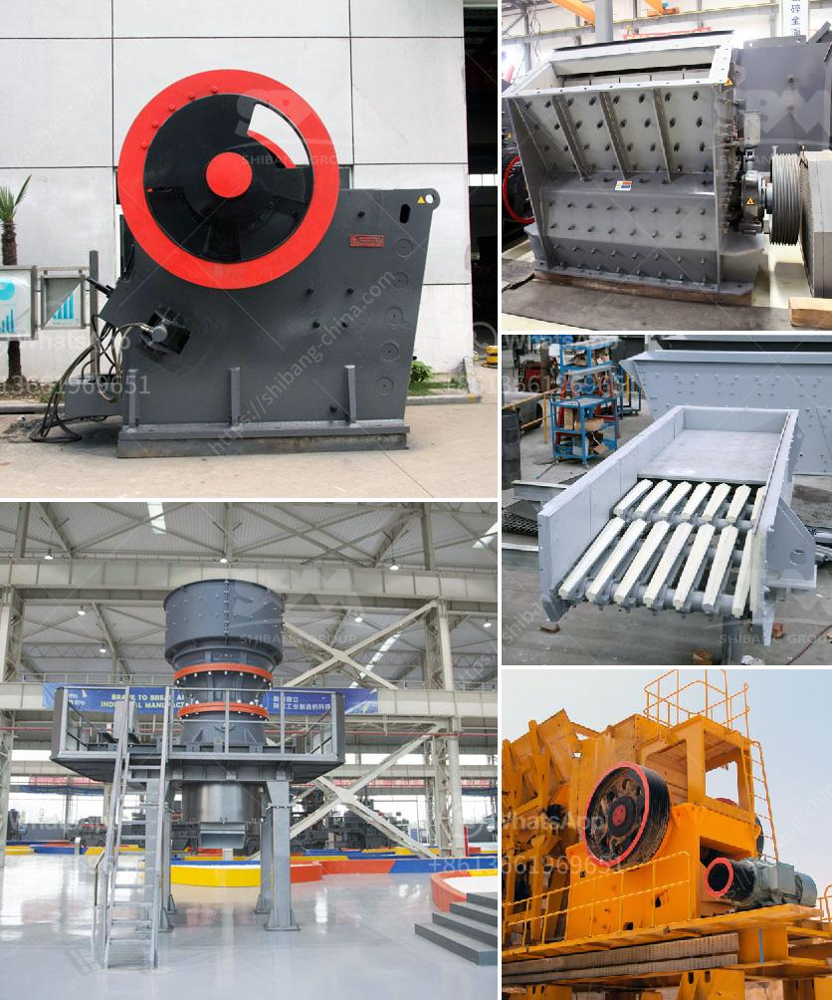

<h3>quarry crushing machine</h3>
Quarry crushing is generally operated in three stages according to stone properties and final products applications. The complete quarry and mine crushing production line may involves primary crushing, secondary crushing and tertiary crushing plant, screening machine, belt conveyor etc. Here are some popular quarry and mine crusher plant for sale.

Jaw crusher is available with stationary, mobile and portable applications. The jaw crushers combine a high reduction ratio and increased capacity with any feed materials: from extra hard rock to recycled materials. This is achieved through several unique features such as higher crushing speed, optimized kinematics, a longer stroke and easy adjustment.

Cone crushers are ideal for secondary and fine crushing. It features high capacity and reliability, in addition to top quality and cubical end products as well as low wear part costs. Used Stone Crushing Machine Suppliers

Small scale mining and quarrying industry is an important part of mining industry in Turkey. We provides used stone crusher for small scale crushing activities for mining, quarrying, construction, recycling applications etc. There are complete range of used stone crusher machine in Turkey for sale, which are available in stationary, portable and mobile applications. The production capacity ranges from 20tph to 600tph for choice, please contact us for more information.

Crushing plant is very important in stone quarry operations. A well designed stone quarrycrushing plant layout balances the capital and operating cost over mine life. Buildings, infrastructure, and main equipment, represent the major cost elements of a crushing plant. The designer must prepare a layout that suits the design criteria, flow sheet and selected equipment in the most economical possible configuration. It’s important to keep structural costs down, to minimize installation cost and to simplify maintenance.

Stone quarry crusher plant selection is an important part in stone quarry business plan. To choose crushing machine, several factors need to be considered, such as ore property, final product requirements, investment capacity etc. We can design the different crushing plant. Different stone crusher machine can be used for crushing materials into different size. Usually the complete quarrying plant uses jaw crusher for primary crushing, impact crusher for secondary crushing, then cone crusher as fine crusher.

Due to excellent low-cost low tariffs can save you a lot of costs, even after use of the product will bring you more and greater benefits, SBM is the trusted limestone crushing plant manufacturer in China, located in China, India, along with other Asian marketplaces to develop and develop, now we supply in excess of 130 nations, for example Russia, Canada, UK, South Africa, Zimbabwe, Australia, Germany, Ghana, USA, Philippines, Malaysia, Indonesia, Pakistan, Tanzania, Iran, Turkey, New Zealand, Kenya, Brazil, Egypt, Liberia, Sri Lanka, Zambia, Chile, Spain, France, Peru, Vietnam, Angola, Saudi Arabia,Thailand, Nigeria .,etc.If you would like more detailed prices, please make contact with us online!

In conclusion, quarry crushing is providing suitable materials for sorting operation. The quarry crusher directly affects ore dressing and economic indicators. So some people think that quarry crusher machine is the key to the success of ore production line. Therefore, the ore beneficiation plant should pay enough attention to selection of processing equipment and production management of ore crushing work. Related Quarry Crusher Machine. Impact Crusher; Sand Making Machine; Jaw Crusher; Cone Crusher; Cone Crusher; Quarry Crusher Machine; Mobile Crusher; Mobile Crusher; Quarry Crusher; Crusher Machine; Sand Making Machine; Portable Crusher; PE Jaw Crusher; PEW Jaw Crusher; VSI Crusher; PF Impact Crusher; PFW Impact Crusher; HJ Series Jaw Crusher; Grinding Mill+LM Vertical Grinding Mill; Hammer Mill; Solutions; Portable Crusher; Mobile Crusher; Quarry Crusher; Sand Making Machine; About us. No.416 Jianye Road, South Jinqiao Area, Pudong, Shanghai, China

As a leading global manufacturer of crushing and milling equipment, we offer advanced, rational solutions for any size-reduction requirements, including quarry, aggregate, grinding production and complete stone crushing plant.
<h3>Contact us</h3><ul><li><strong>Whatsapp:&nbsp;<a href="https://wa.me/8613661969651">+8613661969651</a></strong></li><li><a href="https://swt.shibang-china.com/?git&amp;zhl&amp;quarry crushing machine"><strong>Online Service(chat now)</strong></a></li></ul><h3>Related</h3><ul><li><a href='rock miller machine.md'>rock miller machine</a></li><li><a href='diamond mining equipment companies in usa.md'>diamond mining equipment companies in usa</a></li><li><a href='mobile vsi crusher.md'>mobile vsi crusher</a></li><li><a href='coal screening machine for sale in india.md'>coal screening machine for sale in india</a></li><li><a href='open cast mining equipment for sale south africa.md'>open cast mining equipment for sale south africa</a></li></ul>