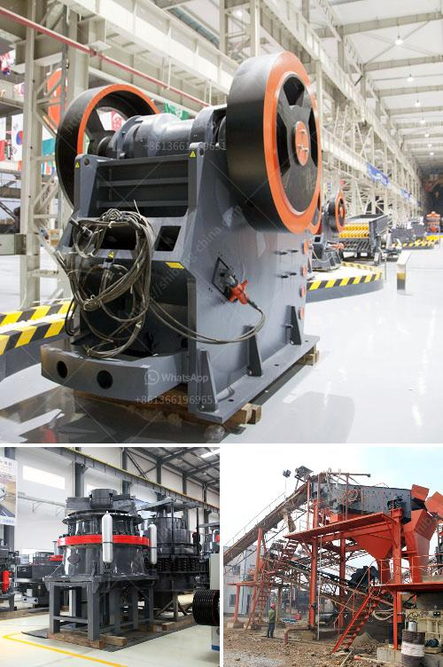

<h3>quarry dan peralatan yang dibutuhkan</h3>
Tambang merupakan salah satu sektor industri yang memiliki potensi ekonomi yang besar. Pertambangan batu, khususnya, memainkan peran penting dalam pembangunan infrastruktur dan konstruksi. Namun, untuk mencapai keberhasilan dalam operasi tambang, quarry dan peralatan yang dibutuhkan memegang peranan yang sangat penting.

Quarry adalah suatu tempat di mana batu-batu ditambang atau diproses. Menyediakan batu, kerikil, dan pasir bagi industri konstruksi adalah fungsi utama dari sebuah quarry. Untuk menjalankan operasi yang efisien di dalam quarry, peralatan yang tepat dan canggih sangat dibutuhkan. Dalam artikel ini, kita akan membahas beberapa peralatan yang dibutuhkan dalam operasi tambang yang sukses.

Pertama-tama, alat berat adalah peralatan utama dalam operasi quarry. Excavator, bulldozer, dump truck, dan loader adalah beberapa jenis alat berat yang sering digunakan dalam tambang. Excavator digunakan untuk menggali dan memuat batu dan tanah ke dalam truk, sementara bulldozer digunakan untuk meratakan dan membersihkan area. Dump truck berfungsi mengangkut batu atau tanah dari satu tempat ke tempat lain, sedangkan loader digunakan untuk memindahkan batu dari satu tempat ke area pengolahan.

Selain alat berat, crusher merupakan peralatan kunci lainnya dalam operasi quarry. Crusher adalah mesin yang digunakan untuk menghancurkan batu menjadi berbagai ukuran. Ada beberapa jenis crusher yang biasa digunakan, termasuk jaw crusher, impact crusher, dan cone crusher. Setiap jenis crusher memiliki kegunaan dan kelebihan masing-masing. Jaw crusher sering digunakan untuk menghancurkan batu besar menjadi ukuran yang lebih kecil, sedangkan impact crusher digunakan untuk menghancurkan batu dengan kecepatan tinggi dan efisiensi yang tinggi. Cone crusher digunakan untuk menghancurkan batu menjadi ukuran yang lebih halus dan lebih seragam.

Tak kalah pentingnya adalah layar getar atau vibrating screen. Alat ini berfungsi untuk menyaring batu dan material lainnya menjadi ukuran yang lebih kecil. Vibrating screen juga membantu memisahkan batu dari tanah dan material lainnya yang tidak diperlukan. Jika digunakan secara efektif, vibrating screen dapat meningkatkan efisiensi produksi dan mengurangi kerugian material yang tidak perlu.

Tidak hanya peralatan utama, tetapi perlengkapan seperti conveyor belt dan sistem pengolahan air juga penting dalam operasi quarry. Conveyor belt digunakan untuk memindahkan batu dan material lainnya dari satu area ke area lainnya dengan cepat dan efisien. Sistem pengolahan air diperlukan untuk membantu membersihkan, mendaur ulang, dan mengelola air yang digunakan dalam proses operasi. Hal ini penting untuk menjaga lingkungan kerja yang aman dan bersih serta mematuhi peraturan lingkungan yang berlaku.

Dalam kesimpulannya, quarry dan peralatan yang dibutuhkan memegang peranan yang sangat penting dalam operasi tambang. Peralatan seperti alat berat, crusher, layar getar, conveyor belt, dan sistem pengolahan air merupakan beberapa peralatan utama dan perlengkapan yang menjadi inti kesuksesan operasi tambang yang efisien. Dengan menggunakan peralatan yang tepat, operasi tambang dapat berjalan secara efektif, meningkatkan produktivitas, dan menghasilkan batu yang berkualitas tinggi untuk industri konstruksi.
<h3>Contact us</h3><ul><li><strong>Whatsapp:&nbsp;<a href="https://wa.me/8613661969651">+8613661969651</a></strong></li><li><a href="https://swt.shibang-china.com/?git&amp;zhl&amp;quarry dan peralatan yang dibutuhkan"><strong>Online Service(chat now)</strong></a></li></ul><h3>Related</h3><ul><li><a href='composition of ball mill liner.md'>composition of ball mill liner</a></li><li><a href='how does it hammer mill operats.md'>how does it hammer mill operats</a></li><li><a href='mobile screening and crushing equipment.md'>mobile screening and crushing equipment</a></li><li><a href='marchine stone crusher cost in kenya.md'>marchine stone crusher cost in kenya</a></li><li><a href='marble primary crusher manufacturer.md'>marble primary crusher manufacturer</a></li></ul>