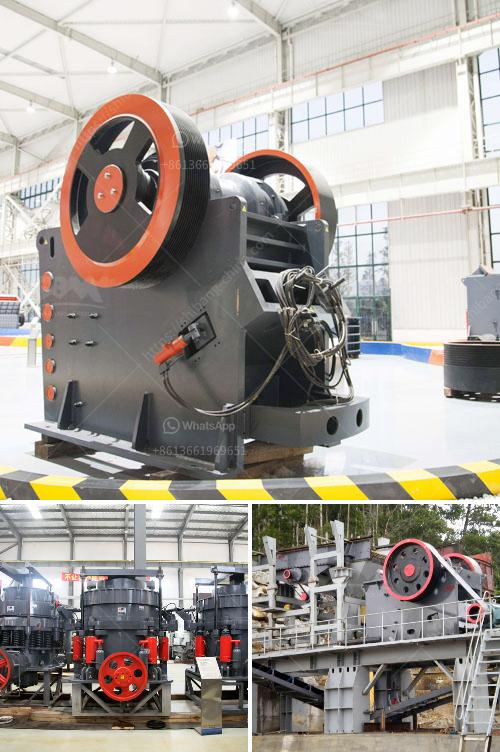

<h3>quarry equipment leasing companies in nigeria</h3>
Quarry equipment leasing is a viable opportunity in Nigeria that offers investors a chance to explore a profitable venture. While leasing requires minimal capital investment and provides access to a wide range of equipment types and models, it also offers immense flexibility for quarry operators in terms of lease duration and payment plans.

Nigeria is richly endowed with granite stone and other related solid minerals like marble, dolomite, and limestone. With the country's rapid urbanization and infrastructure development initiatives, the demand for construction aggregates is consistently on the rise. This has generated a need for quarry operators and investors to acquire specialized equipment to meet the growing demand.

Leasing companies in Nigeria have emerged to bridge the equipment financing gap in the industry. These companies provide quarry operators and investors with the option of leasing various types of equipment required for quarry operations, such as crushing equipment, drilling equipment, excavators, loaders, generators, and conveyors. The equipment can be leased for both short and long-term durations, depending on the specific needs of the quarry operator.

One of the advantages of equipment leasing is the preservation of capital. Leasing allows quarry operators to conserve their working capital and allocate it towards other critical areas of the business, such as sales and marketing, inventory management, and employee wages. By eliminating the need for large upfront payments, leasing provides more financial flexibility for quarry businesses, especially during the early stages of operation.

Another benefit of leasing is the ability to use the latest and most advanced equipment without a significant investment. Technology in the quarry industry is rapidly evolving, with newer and more efficient equipment continuously being introduced. Through leasing, quarry operators can access high-quality equipment and take advantage of the latest technology to optimize production and reduce operational costs. This gives them a competitive edge in the market.

Equipment leasing companies in Nigeria also offer flexible lease terms and payment options. Leasing agreements can be tailored to suit the specific needs and budget of the quarry operator. This includes options for lease periods ranging from a few months to several years, as well as different payment plans such as monthly or quarterly installments. These flexible options make equipment leasing a viable and attractive opportunity for quarry operators in Nigeria.

In conclusion, the quarry industry in Nigeria is experiencing rapid growth, fueled by the country's infrastructural development programs. Quarry equipment leasing provides a unique opportunity for investors to explore a lucrative business venture with minimal capital investment. Leasing companies in Nigeria offer quarry operators the flexibility of accessing a wide range of equipment types and models, while preserving their capital and taking advantage of the latest technology. With the demand for construction aggregates on the rise, leasing equipment for quarry operations is an attractive option for entrepreneurs looking to tap into this flourishing industry.
<h3>Contact us</h3><ul><li><strong>Whatsapp:&nbsp;<a href="https://wa.me/8613661969651">+8613661969651</a></strong></li><li><a href="https://swt.shibang-china.com/?git&amp;zhl&amp;quarry equipment leasing companies in nigeria"><strong>Online Service(chat now)</strong></a></li></ul><h3>Related</h3><ul><li><a href='rock crusher application.md'>rock crusher application</a></li><li><a href='crusher manufacturers prices.md'>crusher manufacturers prices</a></li><li><a href='used mining equipment for sale in ghana.md'>used mining equipment for sale in ghana</a></li><li><a href='crusher machine for crusher machine for sale.md'>crusher machine for crusher machine for sale</a></li><li><a href='how much mini cement plant cost in india.md'>how much mini cement plant cost in india</a></li></ul>