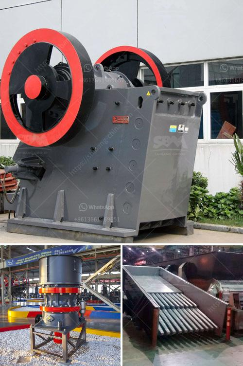

<h3>quarry equipment manufacturer asia</h3>
Asia is emerging as one of the fastest-growing markets for quarry equipment worldwide. In the past few years, infrastructure development has been a key factor fueling the demand for quarry equipment in the region. This is driven by the increasing investments in constructing roads, railways, airports, and other infrastructure projects across countries like China, India, Indonesia, and Vietnam. As a result, quarry equipment manufacturers in Asia are witnessing a surge in demand, offering exciting opportunities for growth and expansion.

One of the leading quarry equipment manufacturers in Asia is XYZ Company. With a robust manufacturing infrastructure and an extensive distribution network, XYZ Company has established itself as a reliable and trusted name in the industry. Their range of quarry equipment is designed to cater to the specific requirements of quarry operators, providing efficient and cost-effective solutions.

One of the key strengths of XYZ Company lies in its product portfolio. They offer a wide range of quarry equipment, including crushers, screens, conveyors, and loaders, which are essential for extracting and processing various types of stones and minerals. The equipment is built to withstand the challenging conditions of quarrying operations, ensuring long-lasting performance and reliability.

Quality is a top priority for XYZ Company. They adhere to stringent quality control measures at every stage of the manufacturing process, from sourcing raw materials to the final assembly of the equipment. This commitment to quality has earned XYZ Company a reputation for delivering superior products that meet the highest industry standards.

Furthermore, XYZ Company understands the importance of innovation in driving growth. They continuously invest in research and development to improve their existing product range and develop new solutions to meet evolving customer needs. This focus on innovation has allowed XYZ Company to stay ahead of the competition and provide cutting-edge quarry equipment to their customers.

In addition to manufacturing high-quality equipment, XYZ Company also places great emphasis on after-sales service. They have a dedicated team of service technicians who provide regular maintenance and support to ensure optimal performance of the equipment. This commitment to customer service has earned XYZ Company a loyal customer base in Asia and contributes to their success as a quarry equipment manufacturer.

In conclusion, the growing demand for quarry equipment in Asia presents a tremendous opportunity for manufacturers in the region. Companies like XYZ Company are well-positioned to capitalize on this market growth, thanks to their robust manufacturing infrastructure, extensive product portfolio, commitment to quality, focus on innovation, and dedication to customer service. As infrastructure development in Asia continues to accelerate, quarry equipment manufacturers can expect to see a steady increase in demand and a prosperous future ahead.
<h3>Contact us</h3><ul><li><strong>Whatsapp:&nbsp;<a href="https://wa.me/8613661969651">+8613661969651</a></strong></li><li><a href="https://swt.shibang-china.com/?git&amp;zhl&amp;quarry equipment manufacturer asia"><strong>Online Service(chat now)</strong></a></li></ul><h3>Related</h3><ul><li><a href='hard rock gold mining equipment.md'>hard rock gold mining equipment</a></li><li><a href='crushing and screening simulation software.md'>crushing and screening simulation software</a></li><li><a href='china manufacturers of sand washing machine.md'>china manufacturers of sand washing machine</a></li><li><a href='sand and gravel crusher machine for sale philippines.md'>sand and gravel crusher machine for sale philippines</a></li><li><a href='mineral ball mill.md'>mineral ball mill</a></li></ul>