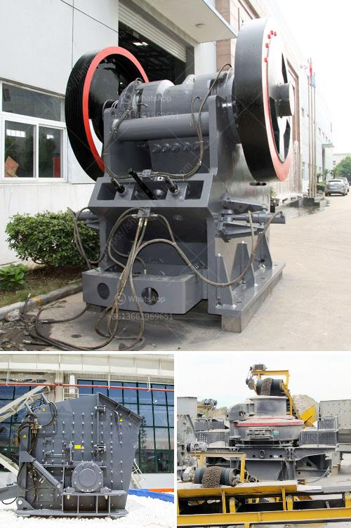

<h3>quarry equipment sale in usa</h3>
Quarries are essential for extracting various types of minerals and aggregates that are used in construction, infrastructure development, and other industries. To efficiently and effectively carry out quarrying operations, the right equipment is crucial. In the United States, there is a wide range of quarry equipment available for sale that can cater to diverse requirements.

One of the primary quarry equipment is the crusher, which processes large rocks and stones into smaller sizes suitable for further processing or use in construction projects. Crushers are available in different types, including jaw crushers, cone crushers, impact crushers, and gyratory crushers. Each type caters to specific applications and capacity needs.

Another important piece of equipment is the vibrating screen, which separates different sizes of crushed materials. It ensures that the final product meets the required specifications by efficiently classifying the materials based on size. Vibrating screens can be customized to meet specific screening requirements and are available in various sizes and designs.

For efficient material handling in quarries, conveyors play a crucial role. These equipment carry materials from one location to another, making the quarrying process more streamlined and productive. Different types of conveyors are available, including belt conveyors, vibrating conveyors, and bucket elevators, among others.

In addition to crushers, screens, and conveyors, there are various other types of quarry equipment available for sale in the USA. These include drills, loaders, excavators, and dump trucks. Each equipment serves a specific purpose and contributes to the overall efficiency of quarrying operations.

To ensure the safety and productivity of quarry operations, it is essential to invest in high-quality equipment from reputed manufacturers. There are several reputable suppliers and dealers in the USA that offer a wide range of quarry equipment for sale. These suppliers provide durable, reliable, and technologically advanced equipment that can withstand the demanding conditions of quarrying activities.

In conclusion, quarry equipment plays a vital role in the efficient and productive extraction of minerals and aggregates. The USA offers a wide range of quarry equipment for sale, including crushers, screens, conveyors, and other types of equipment necessary for successful quarrying operations. Investing in high-quality equipment from reputable suppliers ensures the safety and productivity of quarry operations. So, whether you are starting a new quarry or looking to upgrade your existing equipment, there are plenty of options available to meet your specific requirements.
<h3>Contact us</h3><ul><li><strong>Whatsapp:&nbsp;<a href="https://wa.me/8613661969651">+8613661969651</a></strong></li><li><a href="https://swt.shibang-china.com/?git&amp;zhl&amp;quarry equipment sale in usa"><strong>Online Service(chat now)</strong></a></li></ul><h3>Related</h3><ul><li><a href='cost of ball mill 40tonns capacity.md'>cost of ball mill 40tonns capacity</a></li><li><a href='stone crusher plant price in india.md'>stone crusher plant price in india</a></li><li><a href='calcite powder making.md'>calcite powder making</a></li><li><a href='the production process of cobblestone.md'>the production process of cobblestone</a></li><li><a href='small operations rock crushing equipment for sale.md'>small operations rock crushing equipment for sale</a></li></ul>