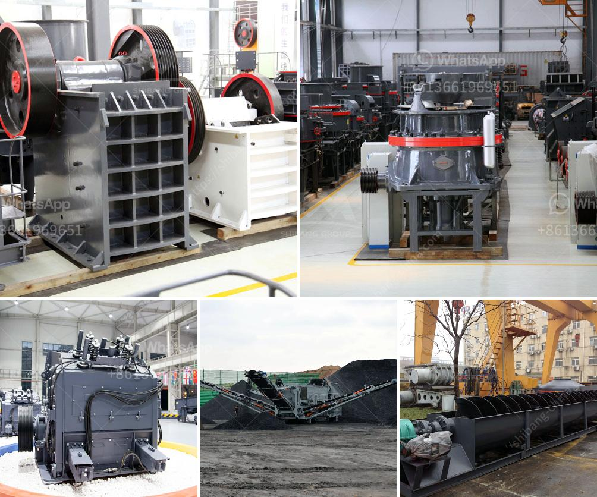

<h3>quarry equipment uk</h3>
The construction industry is one of the fastest-growing sectors in the United Kingdom. As urbanization and population growth continue to rise, the demand for new infrastructure development and building projects is at an all-time high. A key element in fulfilling these demands is the constant supply of high-quality aggregates and minerals from quarries. Quarry equipment plays a vital role in extracting and processing these valuable resources, ensuring that the construction industry is well-equipped and able to meet its growing demands.

Quarry equipment refers to a variety of machines used in the extraction, crushing, screening, and processing of aggregates, minerals, and other geological materials. These machines form an integral part of the necessary infrastructure in quarries and are crucial for efficiency and productivity. Without adequate quarry equipment, the process of extracting and processing materials from quarries would be labor-intensive, time-consuming, and costly.

One essential piece of quarry equipment is the crusher. Crushers are specialized machines designed to break larger rocks and minerals into smaller, more manageable sizes. They are crucial for preparing aggregates used in the construction of roads, highways, buildings, and other structures. Crushers come in various types, such as jaw crushers, cone crushers, and impact crushers, each with its own specific capabilities and applications.

In addition to crushers, quarry equipment also includes equipment for screening and sorting materials. Screens are used to separate different-sized aggregates, ensuring that only the desired sizes are used for construction purposes. Conveyor belts are another crucial component in quarries, as they transport the extracted materials from one stage to another, optimizing the overall production process.

Furthermore, excavators and wheel loaders are vital machinery in quarry operations. Excavators are used for digging and removing overburden or the top layer of soil that covers the valuable resources. Wheel loaders, on the other hand, are used for hauling the extracted materials and transporting them to the crushers or designated storage areas. These powerful machines improve efficiency by reducing manual labor and enabling higher productivity.

The importance of quarry equipment in the construction industry cannot be overstated. Without a reliable and efficient supply of aggregates and minerals, construction projects would be significantly delayed, and costs would skyrocket. Quarry equipment ensures that the construction industry can meet its demands for infrastructural development, providing the necessary materials in a timely and cost-effective manner.

Fortunately, the United Kingdom is home to a wide range of reputable quarry equipment suppliers. These suppliers offer a variety of high-quality machinery, tailored to the specific needs of the quarrying industry. From leading crusher manufacturers to specialist screening equipment providers, there are ample options available to meet the diverse requirements of different quarries.

In conclusion, quarry equipment is a vital necessity for the construction industry in the United Kingdom. The efficient extraction, crushing, screening, and processing of aggregates and minerals are crucial for the continuous growth and development of the sector. Investing in reliable quarry equipment ensures that the construction industry can meet the demands of infrastructure development, benefitting both the economy and society as a whole.
<h3>Contact us</h3><ul><li><strong>Whatsapp:&nbsp;<a href="https://wa.me/8613661969651">+8613661969651</a></strong></li><li><a href="https://swt.shibang-china.com/?git&amp;zhl&amp;quarry equipment uk"><strong>Online Service(chat now)</strong></a></li></ul><h3>Related</h3><ul><li><a href='business plan for a quarry crusher.md'>business plan for a quarry crusher</a></li><li><a href='stamp mill for sale in south africa.md'>stamp mill for sale in south africa</a></li><li><a href='hammer mill aluminum slag.md'>hammer mill aluminum slag</a></li><li><a href='jual ball mill second.md'>jual ball mill second</a></li><li><a href='portable crusher in malaysia.md'>portable crusher in malaysia</a></li></ul>