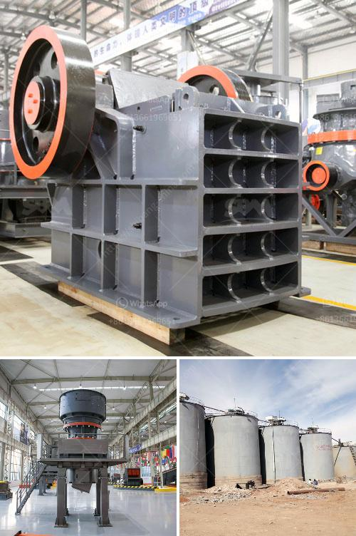

<h3>quarrying crusher machines south africa</h3>
Quarrying refers to the process of extracting minerals, rocks, or other geological materials from the surface or underground. These materials are then used for various purposes, such as construction, road building, or agricultural use. In South Africa, quarrying has played a significant role in the country's economy and infrastructure development.

One essential piece of equipment used in quarrying is the crusher machine. Crushers are used to break down large rocks into smaller, more manageable pieces. The main purpose of a crusher machine is to transform large rocks into aggregate materials, such as sand, gravel, or limestone. This aggregate is used in various construction projects or as a base material for road building.

South Africa is home to many quarries that produce aggregate materials used in construction. These quarries play a vital role in the local economy, as they provide job opportunities and support infrastructure development. To extract the desired minerals or rocks, quarrying operations require efficient and reliable crusher machines.

Quarrying crusher machines in South Africa come in different shapes and sizes, depending on the intended purpose. Some heavy-duty crushers are designed to crush large boulders into smaller rocks or gravel, while others are smaller machines that are used for mild crushing operations. Some machines are equipped with additional features to enhance productivity, such as hydraulic systems for easy adjustment of the crusher's settings.

The South African quarrying industry has seen significant advancements in crusher machine technology over the years. These machines have become more efficient, powerful, and versatile, allowing operators to produce a wide range of aggregate materials. Various types of crushers are commonly used in quarries, including jaw crushers, cone crushers, impact crushers, and roll crushers.

Jaw crushers are commonly used in quarrying operations as they can handle large rocks with a maximum feed size of up to 1,500mm. They are known for their reliability and high production capacity. Cone crushers, on the other hand, are used for secondary or tertiary crushing applications. These crushers are capable of producing finer and more uniform aggregate materials.

Impact crushers are often used in quarrying applications that require the production of smaller-sized aggregate materials. These machines deliver high-speed impact forces to break down rocks and create smaller particles. Roll crushers, on the other hand, are used for crushing material with a high percentage of fines. They produce a more cubical-shaped product, which is highly desirable in many construction applications.

In conclusion, quarrying crusher machines in South Africa are essential equipment in the mining industry. They help break down large rocks into smaller, more manageable pieces, which are then used as aggregate materials for various construction projects. These crusher machines have become more advanced, efficient, and versatile over the years, contributing to the growth of the South African quarrying industry. With the continuous development of technology and innovation, crusher machines will continue to play a vital role in the country's economy and infrastructure development.
<h3>Contact us</h3><ul><li><strong>Whatsapp:&nbsp;<a href="https://wa.me/8613661969651">+8613661969651</a></strong></li><li><a href="https://swt.shibang-china.com/?git&amp;zhl&amp;quarrying crusher machines south africa"><strong>Online Service(chat now)</strong></a></li></ul><h3>Related</h3><ul><li><a href='copper ore mining for sale in philippines.md'>copper ore mining for sale in philippines</a></li><li><a href='limestone grinding mill china.md'>limestone grinding mill china</a></li><li><a href='china ball mill supplier.md'>china ball mill supplier</a></li><li><a href='ball mills malaysia.md'>ball mills malaysia</a></li><li><a href='second hand concrete grinding machine supplier in dubai.md'>second hand concrete grinding machine supplier in dubai</a></li></ul>