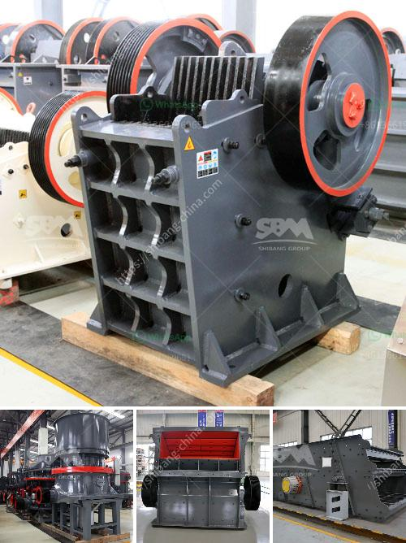

<h3>quartz ball for ball mill</h3>
Quartz ball, also known as silica ball, is a vital grinding medium utilized in ball mills in various industries. It is mostly used to grind ceramic materials, glaze, and other raw materials. The material sourced from reliable suppliers undergoes a stringent purification process, ensuring high purity and outstanding quality.

Thanks to its exceptional hardness and low abrasion rate, quartz ball provides efficient grinding results. It can withstand high temperatures and extreme mechanical forces without losing its shape or integrity. This makes it ideal for ball milling processes, where continuous grinding and blending are required.

In the world of ball milling, the quartz ball stands out due to its excellent wear resistance properties. It outperforms traditional grinding media options, such as porcelain balls and alumina balls, by lasting longer and reducing downtime for replacement.

The exceptional characteristics of quartz ball make it a popular choice in industries like ceramics, paints, chemical engineering, and mining. Whether it is used for grinding raw materials or producing a fine powder, quartz ball ensures consistently high performance.

When choosing a quartz ball for a ball mill, it is crucial to consider factors such as size, shape, and composition. The size must be appropriate to ensure efficient grinding and avoid inefficient impacts. The shape should also be uniform to provide consistent results.

Furthermore, the composition of the quartz ball determines its chemical resistance and stability at different temperatures. It is essential to select a high-purity quartz ball, free from impurities and contaminants that could affect the final product's quality.

In conclusion, the quartz ball is an indispensable grinding medium for ball mills, particularly in industries where high wear resistance and efficient grinding are critical. Its exceptional performance, endurance, and reliability make it a preferred choice for many manufacturers worldwide. By investing in high-quality quartz balls and optimizing the milling process, businesses can achieve consistently superior results, contributing to their growth and productivity.
<h3>Contact us</h3><ul><li><strong>Whatsapp:&nbsp;<a href="https://wa.me/8613661969651">+8613661969651</a></strong></li><li><a href="https://swt.shibang-china.com/?git&amp;zhl&amp;quartz ball for ball mill"><strong>Online Service(chat now)</strong></a></li></ul><h3>Related</h3><ul><li><a href='25kg h high capacity grinder hammer milling machine.md'>25kg h high capacity grinder hammer milling machine</a></li><li><a href='pineaple crushing machine in ghana.md'>pineaple crushing machine in ghana</a></li><li><a href='stone crushers poland.md'>stone crushers poland</a></li><li><a href='suplier sand making machine from philippines.md'>suplier sand making machine from philippines</a></li><li><a href='used asphalt plants for sale in japan.md'>used asphalt plants for sale in japan</a></li></ul>