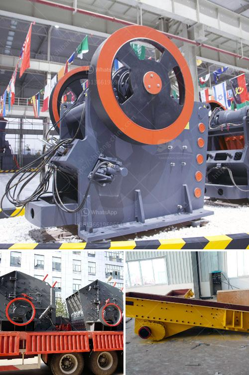

<h3>quartz ball mill manufacturer hyderabad</h3>
Quartz is a mineral that is typically found in granite, gneiss, and sandstone formations. It is used for various applications such as glass making, ceramics, and even electronics. To obtain quartz powder, quartz is first crushed into smaller particle sizes and then ground into a fine powder using a ball mill.

In Hyderabad, India, many quartz ball mill manufacturers have established themselves and they are delivering high-quality products to the customers. With the help of highly skilled and trained professionals, these manufacturers are able to deliver ball mills in different capacities including those that are ideal for laboratories, grinding mills, ceramic industry, and cement industry.

These quartz ball mills are highly durable and are widely recognized for their sturdy construction. The high-quality of the quartz ball mill manufacturers in Hyderabad is attributed to their stringent quality control mechanisms, which are closely monitored by the industry experts. These manufacturers also ensure that all the materials used in the production of their ball mills are of premium quality and sourced from reliable vendors in the market.

The quartz ball mills manufactured in Hyderabad utilize a rotating drum and steel balls to grind the quartz material into a fine powder. The quartz powder obtained through the grinding process is used for various applications such as in the production of glass, ceramics, and even semi-conductors. This ensures that the quartz ball mills manufactured in Hyderabad are versatile and make a significant contribution to various industries.

One of the major advantages of using a quartz ball mill is its low maintenance cost. These ball mills are designed to operate efficiently and require very minimal maintenance. This makes them cost-effective and a preferred choice for many manufacturers in Hyderabad. Additionally, these ball mills are also energy efficient, thereby reducing operational expenses and making them environmentally friendly.

Another important factor that sets the quartz ball mill manufacturers in Hyderabad apart is their prompt customer service. They have dedicated customer support teams that assist customers in choosing the right ball mills for their specific requirements. These teams are knowledgeable and provide necessary guidance throughout the purchase and installation process.

Furthermore, the quartz ball mill manufacturers in Hyderabad also offer customization options to meet specific requirements of their customers. They understand that different industries have different needs and therefore provide ball mills that can be tailored to those specific requirements. This ensures maximum customer satisfaction and establishes long-term relationships with customers.

In conclusion, the quartz ball mill manufacturers in Hyderabad have established themselves as reliable and trustworthy suppliers of high-quality ball mills. Their diligent quality control practices, low maintenance costs, energy efficiency, and prompt customer service make them the preferred choice for many industries. With their expertise in grinding quartz materials, these manufacturers contribute to the growth and success of various industries, ranging from glass making to ceramics and electronics.
<h3>Contact us</h3><ul><li><strong>Whatsapp:&nbsp;<a href="https://wa.me/8613661969651">+8613661969651</a></strong></li><li><a href="https://swt.shibang-china.com/?git&amp;zhl&amp;quartz ball mill manufacturer hyderabad"><strong>Online Service(chat now)</strong></a></li></ul><h3>Related</h3><ul><li><a href='crusher from china price.md'>crusher from china price</a></li><li><a href='tonne an hour ball mill.md'>tonne an hour ball mill</a></li><li><a href='calcium carbide production machinery.md'>calcium carbide production machinery</a></li><li><a href='want to lease diamond mining equipment in south africa.md'>want to lease diamond mining equipment in south africa</a></li><li><a href='gold wash plant for sale canada.md'>gold wash plant for sale canada</a></li></ul>