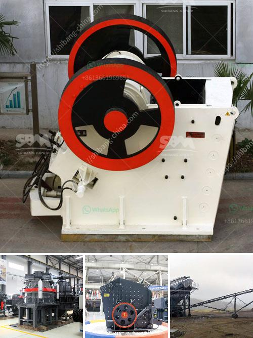

<h3>quartz ball milling machinery</h3>
Quartz is one of the most abundant minerals on Earth. It is widely used in various industries due to its physical and chemical properties. Notably, it is a crucial raw material in the production of glass, ceramics, and electronic components. To process quartz into a fine powder, manufacturers utilize quartz ball milling machinery.

Quartz ball milling machinery is a specialized machine used to grind and mix various materials such as ores, chemicals, ceramic raw materials, and paints. It is widely used in mineral processing, building materials, and chemical industries.

The main component of quartz ball milling machinery is a cylinder with a small diameter and large length. It is loaded with grinding media such as steel balls or pebbles. When the cylinder rotates, the grinding media falls and impacts the material, breaking it into finer particles. The grinding process ensures the uniform size reduction of the quartz particles.

There are several types of quartz ball milling machinery available in the market. One common type is the ball mill, which is used for both dry and wet grinding of materials. Another type is the planetary ball mill, which offers high-speed grinding with relatively low energy consumption. It consists of multiple jars with the grinding media positioned eccentrically on a wheel. The rotation of the wheel creates a centrifugal force, resulting in efficient grinding.

The quartz ball milling machinery is essential equipment for quartz processing plants. It provides an efficient and cost-effective method for grinding quartz into fine particles. This is crucial in the production of high-quality quartz products, such as glass and ceramics, which require precise particle size control.

Moreover, quartz ball milling machinery offers several advantages over other grinding methods. Firstly, it has a high grinding efficiency due to its large grinding capacity and short grinding time. Secondly, it provides a uniform and consistent particle size distribution, resulting in a higher quality end product. Thirdly, it can be easily operated and maintained, making it suitable for both small-scale and large-scale production.

In recent years, manufacturers have made significant advancements in quartz ball milling machinery. The machines now have improved designs and features, such as automated controls, which ensure precise and efficient grinding. Additionally, there is a growing trend towards the use of environmentally friendly grinding media, such as ceramic balls, which reduce pollution and improve the overall sustainability of the process.

To conclude, quartz ball milling machinery plays a pivotal role in the quartz processing industry. It facilitates the production of fine quartz particles required for various applications. The advancements in machine design and the use of innovative technologies have contributed to its efficiency and effectiveness. As the demand for high-quality quartz products continues to rise, the importance of quartz ball milling machinery will only increase.
<h3>Contact us</h3><ul><li><strong>Whatsapp:&nbsp;<a href="https://wa.me/8613661969651">+8613661969651</a></strong></li><li><a href="https://swt.shibang-china.com/?git&amp;zhl&amp;quartz ball milling machinery"><strong>Online Service(chat now)</strong></a></li></ul><h3>Related</h3><ul><li><a href='crushing equipment for sale in kenya.md'>crushing equipment for sale in kenya</a></li><li><a href='best machine brands for quarry.md'>best machine brands for quarry</a></li><li><a href='impact crusher pioneer chassis mounted.md'>impact crusher pioneer chassis mounted</a></li><li><a href='closed of all crushing plant.md'>closed of all crushing plant</a></li><li><a href='setting up a stone quarry crusher business.md'>setting up a stone quarry crusher business</a></li></ul>