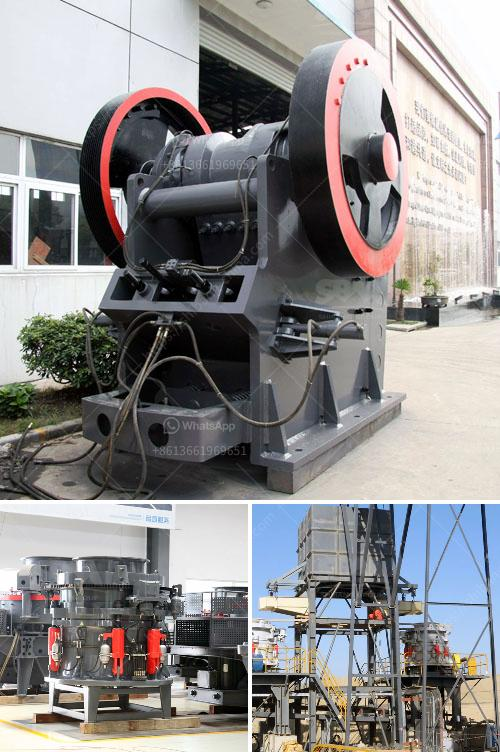

<h3>quartz grinding plant</h3>
Quartz is a mineral found in many rocks and sediments. It is made up of silicon dioxide, or silica, and is one of the most abundant minerals on Earth. Quartz crystals are known for their high hardness, transparency, and resistance to chemical corrosion.

Quartz grinding is an essential step in the production of quartz powder. It is commonly used in the manufacture of glass, ceramics, chemicals and other industries. Quartz grinding plant is a production line to produce quartz powder. It consists of quartz crushing machine and quartz grinding plant.

Quartz is an important raw material in many industries. There are many different forms of quartz, such as quartz crystal, amethyst, agate, jasper, rose quartz, and smoky quartz, among others. Quartz is used in a variety of industries because of its physical and chemical properties.

One of the main uses of quartz is as a raw material for glass manufacturing. Quartz glass, also known as fused silica glass or silica glass, is a type of glass that is composed of silicon dioxide molecules arranged in a regular, crystalline structure. It has high transparency, high purity, and excellent thermal and mechanical properties. Quartz glass is widely used in the manufacture of optics, semiconductors, laboratory equipment, and other high-tech applications.

In the ceramics industry, ground quartz powder is used as a filler and extender in ceramic products. It improves the mechanical properties, stability, and whiteness of ceramics. Quartz powder is also used as a raw material in the production of refractory bricks, which are used in high-temperature applications such as furnaces, kilns, and reactors.

In the chemical industry, ground quartz powder is used for manufacturing various chemicals and chemical products. It is used as a filler in the production of paints, coatings, and plastics to enhance their mechanical properties and weather resistance. Quartz powder is also used in the production of synthetic fibers, adhesives, rubber, and other chemical products.

A quartz grinding plant typically consists of a jaw crusher, a cone crusher, an impact crusher, a vibrating feeder, a vibrating screen, and a grinding mill. The grinding mill is used to grind the quartz powder into powder size. Quartz powder can be used in various applications such as ceramic materials, chemical products, and manufacturing electronic components.

In conclusion, quartz grinding is an essential step in the production of quartz powder. It is widely used in various industries such as glass, ceramics, chemicals, and high-tech applications. A quartz grinding plant is a production line to produce quartz powder. It consists of a variety of equipment, including crushers, feeders, grinding mills, and vibrating screens. Investing in a quartz grinding plant will benefit not only the company but also the environment by reducing waste and creating sustainable products.
<h3>Contact us</h3><ul><li><strong>Whatsapp:&nbsp;<a href="https://wa.me/8613661969651">+8613661969651</a></strong></li><li><a href="https://swt.shibang-china.com/?git&amp;zhl&amp;quartz grinding plant"><strong>Online Service(chat now)</strong></a></li></ul><h3>Related</h3><ul><li><a href='gypsum board making machine price in india.md'>gypsum board making machine price in india</a></li><li><a href='sale for stone crusher.md'>sale for stone crusher</a></li><li><a href='manufactured sand screening machine.md'>manufactured sand screening machine</a></li><li><a href='ethiopia stone crusher suppliers.md'>ethiopia stone crusher suppliers</a></li><li><a href='stone crushing turkey.md'>stone crushing turkey</a></li></ul>