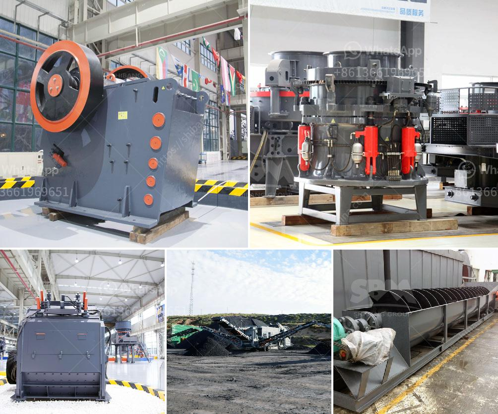

<h3>quartz manufacturing process from mineral</h3>
Quartz is an abundant mineral found in the Earth's crust. It is composed of silicon and oxygen atoms, arranged in a continuous framework of SiO4 silicon-oxygen tetrahedra, with each oxygen being shared between two tetrahedra, giving an overall chemical formula of SiO2. The manufacturing process of quartz involves several steps to transform the raw mineral into a usable product.

The first step in quartz manufacturing is to procure the quartz mineral. The quartz mineral can be sourced from various locations around the world, such as Brazil, Madagascar, and even from some parts of the United States. The mineral is typically extracted through the process of open-pit mining, where large machinery is used to remove the topsoil and extract the mineral.

Once the mineral has been extracted, it goes through a series of crushing and grinding processes to break it down into smaller particles. This is done in order to facilitate the next step in the manufacturing process, which is the purification of the quartz.

The purification process involves removing any impurities or contaminants that may be present in the quartz. This is typically done by washing the crushed quartz with water and then subjecting it to various chemical treatments, such as acid leaching, to dissolve and remove any unwanted minerals or impurities.

After the purification process, the quartz is dried and then undergoes further processing to turn it into a usable product. One common method is to melt the purified quartz and then cool it rapidly to form a solid mass. This process, known as fusion casting, creates a high-quality quartz material with excellent physical and chemical properties.

Another approach to quartz manufacturing is the use of a hydrothermal process. In this method, a specially-designed autoclave is used to heat and dissolve the quartz mineral in high-pressure water. This process allows for the control of various parameters, such as temperature and pressure, resulting in the formation of high-purity and highly-structured quartz crystals.

Once the quartz has been manufactured, it can be further processed into various forms for different applications. For example, it can be cut and polished to create quartz countertops and tiles, used as a raw material in the production of glass and ceramics, or even crushed to produce finely ground quartz powder for use in various industries.

In conclusion, the manufacturing process of quartz involves several steps, starting from the extraction of the mineral through open-pit mining to the purification and processing of the quartz into a usable product. The various methods used in quartz manufacturing, such as fusion casting and hydrothermal processes, result in high-quality quartz materials with a wide range of applications in industries ranging from construction to electronics.
<h3>Contact us</h3><ul><li><strong>Whatsapp:&nbsp;<a href="https://wa.me/8613661969651">+8613661969651</a></strong></li><li><a href="https://swt.shibang-china.com/?git&amp;zhl&amp;quartz manufacturing process from mineral"><strong>Online Service(chat now)</strong></a></li></ul><h3>Related</h3><ul><li><a href='industrial impact crusher.md'>industrial impact crusher</a></li><li><a href='rock stone zambia mining crushing plants.md'>rock stone zambia mining crushing plants</a></li><li><a href='quarry crusher for sale in nigeria.md'>quarry crusher for sale in nigeria</a></li><li><a href='hammer mill 40 ton hour.md'>hammer mill 40 ton hour</a></li><li><a href='used rock crushers for sale in germany.md'>used rock crushers for sale in germany</a></li></ul>