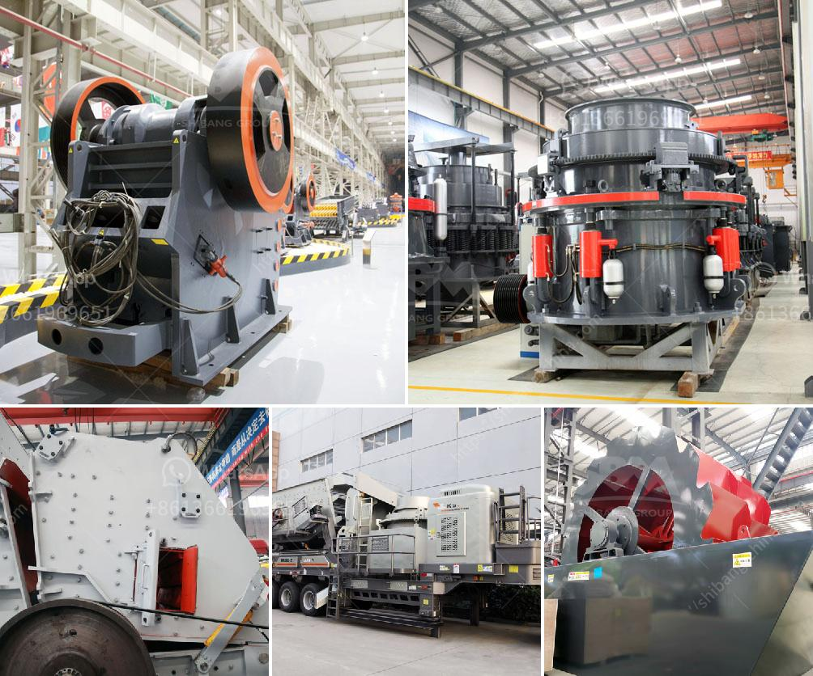

<h3>quartz mining machineries manufacturers</h3>
Quartz is one of the most abundant minerals in the Earth's crust and has a wide range of applications in various industries. The demand for high-quality quartz has been on the rise, leading to increased quartz mining activities worldwide. In order to extract quartz from the earth efficiently and in large quantities, specialized mining machinery is required. This article aims to shed light on some of the top quartz mining machinery manufacturers and their innovative solutions.

One prominent manufacturer in this field is XYZ Mining Equipment. With over 20 years of experience, XYZ has established itself as a leader in providing advanced mining machinery for quartz extraction. They offer a wide range of state-of-the-art equipment designed to maximize productivity while ensuring safety and minimizing environmental impact.

One of XYZ's flagship products is their quartz mining drill. This powerful machine is capable of drilling through layers of rock to access quartz deposits deep underground. Equipped with advanced automation technology, the drill can be remotely operated and monitored, reducing the risks to workers and improving overall efficiency. Its superior drilling capability enables mining operations to reach larger reserves of high-quality quartz, increasing the yield and profitability of quartz mining ventures.

Another renowned manufacturer in the industry is ABC Mining Equipment. ABC is known for its innovative approach to mining machinery and its commitment to sustainability. They have developed a range of eco-friendly quartz mining machinery that minimizes energy consumption and reduces carbon emissions.

One of ABC's notable inventions is their energy-efficient quartz sorter. This unique machine uses advanced sensor technology to separate quartz from other minerals, significantly reducing the need for manual sorting. It not only speeds up the extraction process but also reduces labor costs and improves the overall quality of the extracted quartz.

Additionally, DEF Quartz Mining Machinery is a leading manufacturer known for its robust and reliable equipment. Their quartz crushers and grinders are widely used in the industry and are designed to crush quartz into smaller, more manageable sizes. This ensures a consistent feed for downstream processes, such as sorting and purification, leading to increased efficiency and reduced wastage.

Furthermore, MNO Mining Equipment is another trusted manufacturer that specializes in providing quartz mining machinery. Their state-of-the-art mining trucks and loaders are designed to transport large quantities of quartz ore safely and efficiently. These heavy-duty machines are equipped with advanced suspension systems and powerful engines, enabling them to navigate challenging terrains and transport massive loads of quartz.

In conclusion, the demand for quartz in various industries has fueled the growth of quartz mining activities worldwide. Specialized mining machinery from leading manufacturers plays a vital role in extracting quartz efficiently, ensuring high productivity, and minimizing environmental impact. Manufacturers such as XYZ Mining Equipment, ABC Mining Equipment, DEF Quartz Mining Machinery, and MNO Mining Equipment offer innovative solutions designed to meet the specific requirements of quartz mining operations, driving the industry forward.
<h3>Contact us</h3><ul><li><strong>Whatsapp:&nbsp;<a href="https://wa.me/8613661969651">+8613661969651</a></strong></li><li><a href="https://swt.shibang-china.com/?git&amp;zhl&amp;quartz mining machineries manufacturers"><strong>Online Service(chat now)</strong></a></li></ul><h3>Related</h3><ul><li><a href='komatsu crawler jaw crusher.md'>komatsu crawler jaw crusher</a></li><li><a href='iron separator from steel slag.md'>iron separator from steel slag</a></li><li><a href='manganese mobile processing plants.md'>manganese mobile processing plants</a></li><li><a href='indonesia copper processing equipment for sale.md'>indonesia copper processing equipment for sale</a></li><li><a href='crushing  screening equipment.md'>crushing & screening equipment</a></li></ul>