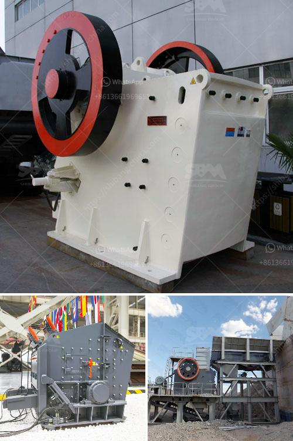

<h3>quartz powder ball mill in tamilnadu</h3>
Quartz powder ball mill is a versatile grinding mill that has a wide range of applications. It can be used in mineral ore, cement, refractories, paints, ceramics and so on. The ball mill is a key piece of equipment for grinding crushed materials, and it is widely used in production lines for powders such as cement, silicates, refractory material, fertilizer, glass ceramics, etc. as well as for ore dressing of both ferrous and non-ferrous metals.

Quartz is widely abundant in nature, and it occurs in many different geological settings. It is an essential mineral in various industries, such as glass, ceramics, optical fibers, and electronics. To obtain high-quality quartz powder, the quartzite should undergo various crushing, grinding, and classifying processes. The ball mill is an important step in this process.

In quartzite processing, many specialized equipment are required, including the quartzite crushing plant, grinding equipment, classifier, cyclone separator, magnetic separator, flotation machine, machinery required for quartzite mining, etc. Ball mill equipment is the most widely used and widely used equipment in the mining industry.

1. By adopting the ball milling method, the material is grinded and crushed, which greatly improves the grinding efficiency, reduces energy consumption, and saves costs.

2. The ball mill has a large crushing ratio and high ore particle size acceptance, which can crush and grind various ores and materials with different hardness.

3. The structure of the ball mill is simple and the operation is stable, making it easy to control the production process and ensure product quality.

4. The ball mill is equipped with a reasonable grading system, which can control the particle size distribution of the final product and ensure the qualified rate of the finished product size.

5. The ball mill has a wide range of applications and can grind various ores and other materials with dry or wet grinding methods. It is an efficient and energy-saving grinding equipment.

In conclusion, the quartz powder ball mill is vital equipment in industry. It can be used for grinding various ores and other materials, such as quartz stone, limestone, gold ore, iron ore, coal, cement clinker, etc. The ball mill is widely used in the production of cement, silicate products, new building materials, refractory materials, fertilizers, black and non-ferrous metal dressings and glass ceramics, dry or wet grinding various ores and other grindable materials. By choosing the right ball mill and controlling the process parameters, the desired product size and production capacity can be achieved, which is crucial for quartzite processing and the improvement of product value.
<h3>Contact us</h3><ul><li><strong>Whatsapp:&nbsp;<a href="https://wa.me/8613661969651">+8613661969651</a></strong></li><li><a href="https://swt.shibang-china.com/?git&amp;zhl&amp;quartz powder ball mill in tamilnadu"><strong>Online Service(chat now)</strong></a></li></ul><h3>Related</h3><ul><li><a href='used stone crushers dealer.md'>used stone crushers dealer</a></li><li><a href='project proposal on funding gold mining.md'>project proposal on funding gold mining</a></li><li><a href='price for cone crusher.md'>price for cone crusher</a></li><li><a href='rock stone zambia mining crushing plants.md'>rock stone zambia mining crushing plants</a></li><li><a href='small operations rock crushing equipment for sale.md'>small operations rock crushing equipment for sale</a></li></ul>