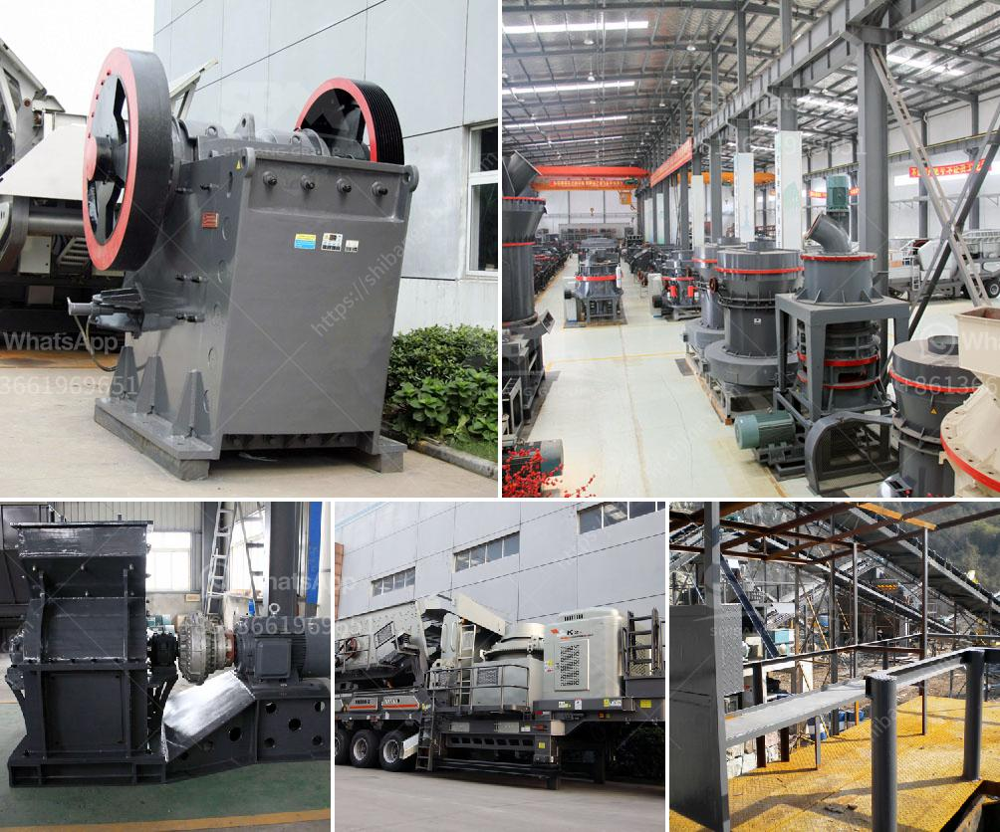

<h3>quartz powder ball mill</h3>
Quartz powder ball mill, also known as ball milling, is a widely used grinding equipment in mine, cement and chemical industries. It is the key equipment for grinding after the crushing process, which is widely used in the manufacture industries, such as cement, silicate, new building material, refractory material, fertilizer, ferrous metal, nonferrous metal and glass ceramics.

Quartz powder ball mill consists of feeding part, discharging part, rotary part and transmission part (reducer, small transmission gear, motor, electronic control) etc. The hollow shaft adopts steel casting, and the inner lining can be removed and replaced. The rotary gearwheel is processed with casting gear hobbing, and the barrel is embedded with wear-resistant lining, which has good wear resistance. The machine runs smoothly and reliably.

Quartz powder ball mill is a necessary equipment for crushing and grinding quartz stone. The quartz powder ball mill consists of feeding part, discharging part, rotary part, transmission part (reducer, small transmission gear, motor, electronic control) and other major parts. The hollow shaft adopts steel parts, and the lining is detachable. The turning gear is made of casting hobbing. The barrel body is embedded in the wear-resistant lining, and has a good wear resistance. The machine runs smoothly and works reliably.

Quartz powder ball mill uses a unique liner design, grinding media is made of high chromium alloy steel. This material can increase its hardness and strength, reduce its wear and extend its service life. Quartz powder ball mill also has excellent performance, such as low energy consumption, high productivity and low noise. Depending on the feeding and discharging size, the powder mill can be divided into several types. Choosing the suitable quartz powder ball mill depends on the production requirements.

Quartz powder ball mill is a kind of industrial grinding equipment. It is a key equipment for grinding quartz stone material after crushing, which is widely used in cement, silicate products, new building materials, refractory materials, fertilizers, black and non-ferrous metals and glass ceramics. Besides, it can also be used for dry and wet grinding for all kinds of ores and other grind-able materials.
<h3>Contact us</h3><ul><li><strong>Whatsapp:&nbsp;<a href="https://wa.me/8613661969651">+8613661969651</a></strong></li><li><a href="https://swt.shibang-china.com/?git&amp;zhl&amp;quartz powder ball mill"><strong>Online Service(chat now)</strong></a></li></ul><h3>Related</h3><ul><li><a href='gypsum powder machine.md'>gypsum powder machine</a></li><li><a href='limestone beneficiation.md'>limestone beneficiation</a></li><li><a href='standar operasional prosedur batubara mininh.md'>standar operasional prosedur batubara mininh</a></li><li><a href='picture of cone crusher.md'>picture of cone crusher</a></li><li><a href='feldspar grinding machine.md'>feldspar grinding machine</a></li></ul>