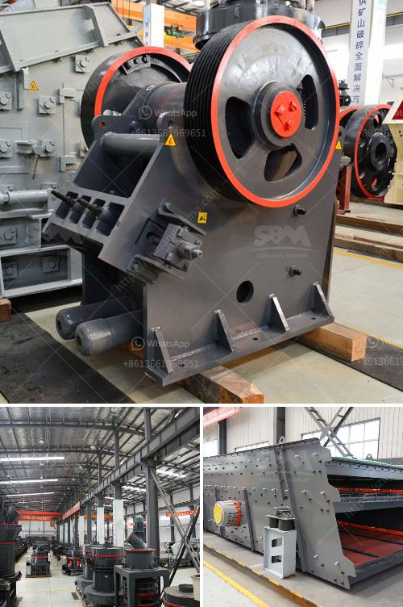

<h3>quartz powder machine manufacturer in india</h3>
The Indian market has witnessed a significant growth in recent years in the manufacturing and exporting of quartz powder machines. As a renowned manufacturer and exporter, Mr. Nilesh Modi, the founder of Prem Industries, has emerged as a prominent player in the industry. With an experience of over two decades, his company has become a go-to destination for all the quartz powder machine requirements in India.

Quartz is a mineral that is widely used in various industries such as glass, ceramics, and chemical manufacturing. Quartz powder is derived by finely grinding quartz rocks in various mining and manufacturing units. These powders are used for numerous applications, including making glass, ceramics, and cement.

Prem Industries, under the guidance of Mr. Nilesh Modi, has been flourishing in the production of quartz powder machines. The company offers a wide range of machines that are specifically designed for grinding, crushing, and pulverizing quartz rocks into fine powders. These machines are manufactured using state-of-the-art technology and are equipped with advanced features to ensure high-quality output.

One of the key factors that sets Prem Industries apart from its competitors is its commitment to quality. The company follows stringent quality control measures at every stage of the production process. From sourcing raw materials to final delivery, every aspect is closely monitored to ensure that only the best products reach the customers.

Another important aspect that has contributed to the success of Prem Industries is their relentless focus on innovation. Understanding the evolving needs of the industry, Mr. Nilesh Modi has ensured that his company stays ahead of the curve by continuously upgrading their machines. The company invests in research and development to constantly improve the efficiency and performance of their products.

Prem Industries also takes pride in its customer-centric approach. The company not only provides high-quality machines but also offers excellent after-sales service. The dedicated team of technicians is available round the clock to address any queries or concerns raised by the customers. This commitment to customer satisfaction has helped Prem Industries build a strong and loyal customer base.

In addition to serving the domestic market, Prem Industries has also made a significant mark in the international arena. The company exports its quartz powder machines to several countries across the globe. With its impeccable quality and competitive pricing, Prem Industries has gained recognition as a reliable and trustworthy supplier of quartz powder machines.

In conclusion, the success of Prem Industries can be attributed to its commitment to quality, innovation, and customer satisfaction. Under the astute leadership of Mr. Nilesh Modi, the company has emerged as a leading manufacturer and exporter of quartz powder machines in India. With its state-of-the-art technology and dedication to excellence, Prem Industries is poised to continue its impressive growth in the years to come.
<h3>Contact us</h3><ul><li><strong>Whatsapp:&nbsp;<a href="https://wa.me/8613661969651">+8613661969651</a></strong></li><li><a href="https://swt.shibang-china.com/?git&amp;zhl&amp;quartz powder machine manufacturer in india"><strong>Online Service(chat now)</strong></a></li></ul><h3>Related</h3><ul><li><a href='stone crusher price in dubai.md'>stone crusher price in dubai</a></li><li><a href='trommel ball mill.md'>trommel ball mill</a></li><li><a href='copper concentrate plant equipment list.md'>copper concentrate plant equipment list</a></li><li><a href='talc powder crushers.md'>talc powder crushers</a></li><li><a href='crusher manufacturers prices.md'>crusher manufacturers prices</a></li></ul>