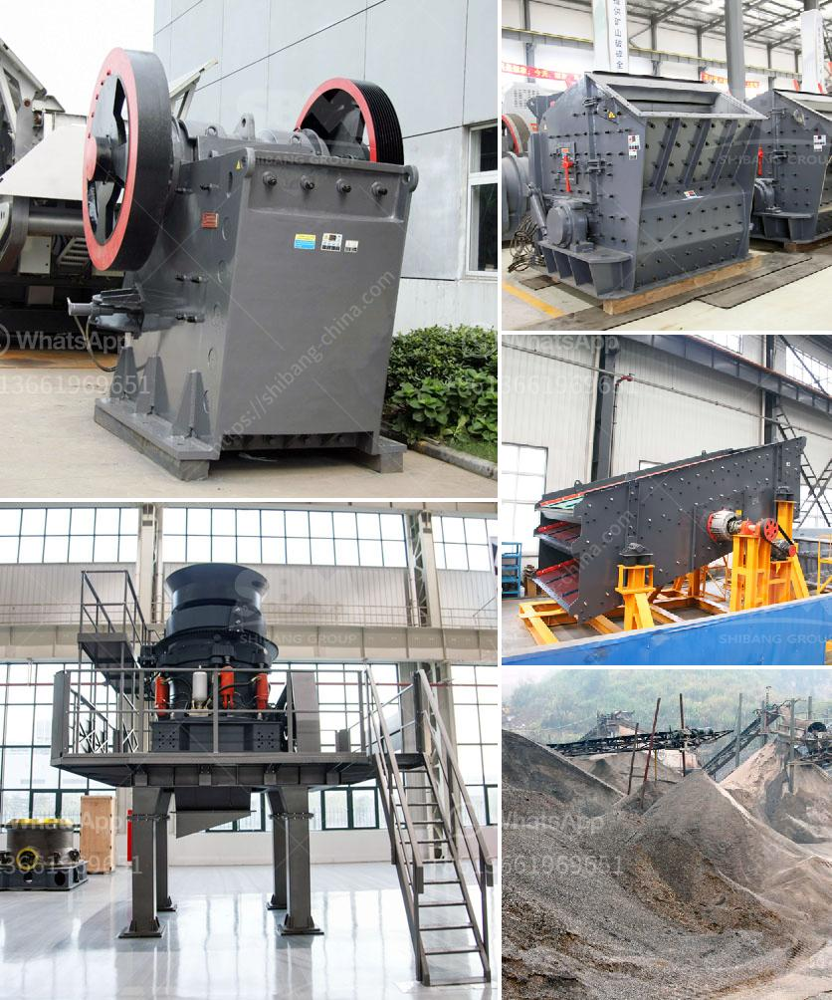

<h3>quartz processing technique</h3>
Quartz is a versatile mineral with various applications in industries such as electronics, glass manufacturing, and ceramics. To make the most of its properties, quartz processing techniques are employed to extract and refine the mineral into a usable form. This article explores the quartz processing techniques that are commonly used in the industry.

The first step in quartz processing is the extraction of raw quartz from quarries or mines. Depending on the geological formation of the deposit, explosives or hydraulic fracturing techniques may be used to loosen the quartz from its surrounding rock. Once extracted, the quartz is then transported to a processing plant where it undergoes several stages of refinement.

The initial crushing stage is crucial to break down the large quartz blocks into smaller, more manageable pieces. Various crushers, such as jaw crushers, cone crushers, or impact crushers, are used for this purpose. After crushing, the quartz is screened and classified to separate it into different size fractions.

The next step in quartz processing is grinding. The quartz particles are ground to achieve the desired particle size distribution and to ensure that impurities are removed. The grinding process can be carried out using various types of mills, such as ball mills, rod mills, or vertical roller mills. The choice of mill depends on factors such as the hardness and abrasiveness of the quartz, the desired particle size, and the production capacity required.

Once the quartz is ground to the desired size, it undergoes a flotation process. This process involves the use of chemicals to selectively separate quartz from other minerals and impurities. The quartz particles are mixed with water and flotation reagents, which attach to the quartz particles and make them hydrophobic (repel water). Air is then bubbled through the mixture, causing the hydrophobic quartz particles to float to the surface, where they can be skimmed off.

After flotation, the quartz undergoes further processing to remove any remaining impurities. This can include processes such as magnetic separation, gravity separation, or electrostatic separation, depending on the nature of the impurities present. These processes use differences in the physical and chemical properties of the quartz and impurities to separate them.

The final stage in quartz processing is drying and packaging. The quartz is dried to remove any remaining moisture, which could lead to product degradation or clumping during storage. Once dried, the quartz is carefully packaged to protect it from contamination and to ensure it reaches the end-user in the best possible condition.

In conclusion, quartz processing techniques play a crucial role in transforming raw quartz into a usable form. These techniques involve crushing, grinding, flotation, and various separation processes. By employing these techniques, the desired purity and particle size distribution of quartz can be obtained. This ensures that quartz can be utilized effectively in a wide range of applications across different industries.
<h3>Contact us</h3><ul><li><strong>Whatsapp:&nbsp;<a href="https://wa.me/8613661969651">+8613661969651</a></strong></li><li><a href="https://swt.shibang-china.com/?git&amp;zhl&amp;quartz processing technique"><strong>Online Service(chat now)</strong></a></li></ul><h3>Related</h3><ul><li><a href='quartz ball for ball mill.md'>quartz ball for ball mill</a></li><li><a href='small scale copper refining equipment.md'>small scale copper refining equipment</a></li><li><a href='cost of starting a quarry business.md'>cost of starting a quarry business</a></li><li><a href='price of central vertical roller mill.md'>price of central vertical roller mill</a></li><li><a href='ball mill for gold in south africa.md'>ball mill for gold in south africa</a></li></ul>