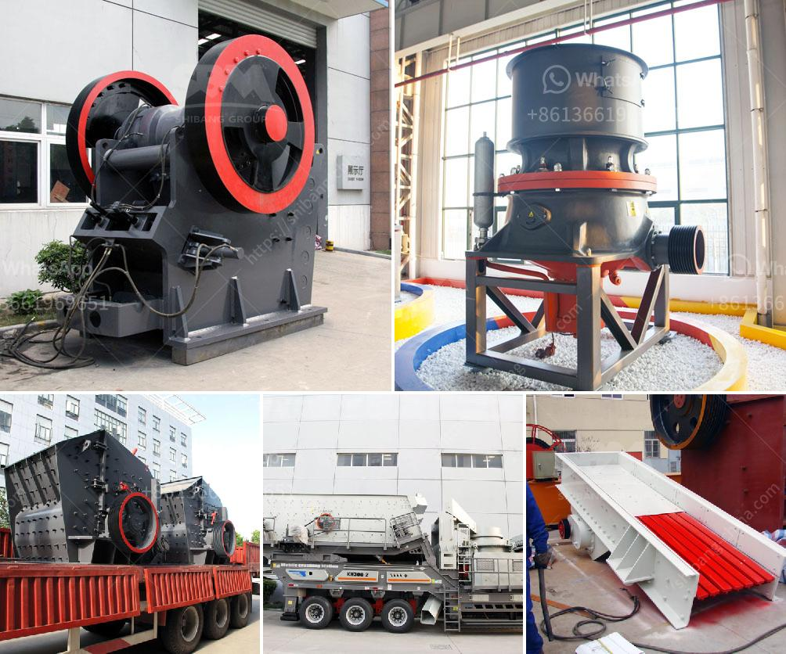

<h3>quartz stone 30 80 plant process</h3>
Quartz stone is a popular material used in the construction and home improvement industry due to its durability, versatility, and aesthetic appeal. Derived from natural minerals, quartz stone is a manmade product that combines natural quartz minerals with resins, pigments, and other materials to create a beautiful and resilient surface. The manufacturing process of quartz stone involves several stages, including the plant process known as Quartz Stone 30 80.

The Quartz Stone 30 80 plant process refers to the crushing and sieving process used to produce quartz powder in the 30 80 mesh size range. This powdered form is used primarily in quartz countertops, glass making, ceramics, and various other industrial applications. Let's take a closer look at the different steps involved in the Quartz Stone 30 80 plant process.

1. Quartz Stone Extraction: The process begins with the extraction of high-quality quartz stones from quarries or mines. These stones are carefully selected based on their color, texture, and purity to ensure the best end result.

2. Crushing: The extracted quartz stones are then crushed into smaller pieces using crushers. This reduces the size of the stones and prepares them for the next stage of the process.

3. Grinding and Pulverizing: The crushed quartz stones are further processed in a grinding mill to achieve the desired particle size. This process involves grinding the stones to a fine powder consistency, allowing for easier sieving and separation of impurities.

4. Sieving: The ground quartz powder is then sieved to separate it into different mesh sizes. In the case of the Quartz Stone 30 80 plant process, the sieving step ensures that the final product falls within the 30-80 mesh size range.

5. Magnetic Separation: After sieving, the quartz powder undergoes magnetic separation to remove any remaining impurities or metallic particles. This step helps improve the purity and quality of the final product.

6. Packaging and Distribution: Once the quartz powder has been processed and purified, it is packaged into bags or containers ready for distribution. The powdered form makes it convenient for easy transportation and handling.

The Quartz Stone 30 80 plant process is crucial in ensuring the production of high-quality quartz powder within the desired size range. This finer mesh size is often preferred in various industries, such as glassmaking, where a specific particle size is required for optimal performance. The process also helps eliminate impurities that may affect the overall quality and functionality of the final product.

In conclusion, the Quartz Stone 30 80 plant process plays a vital role in producing quartz powder of the desired size range for various applications. From extraction to crushing, grinding, sieving, and magnetic separation, each step contributes to the final product's purity, consistency, and quality. As a versatile material, quartz stone continues to find widespread use in both residential and commercial settings, offering durability, beauty, and longevity.
<h3>Contact us</h3><ul><li><strong>Whatsapp:&nbsp;<a href="https://wa.me/8613661969651">+8613661969651</a></strong></li><li><a href="https://swt.shibang-china.com/?git&amp;zhl&amp;quartz stone 30 80 plant process"><strong>Online Service(chat now)</strong></a></li></ul><h3>Related</h3><ul><li><a href='ball mill price.md'>ball mill price</a></li><li><a href='crusher machine for marble and granite.md'>crusher machine for marble and granite</a></li><li><a href='hammer mill 40 ton hour.md'>hammer mill 40 ton hour</a></li><li><a href='limestone production machinery.md'>limestone production machinery</a></li><li><a href='gold mining equipment mobile plant.md'>gold mining equipment mobile plant</a></li></ul>