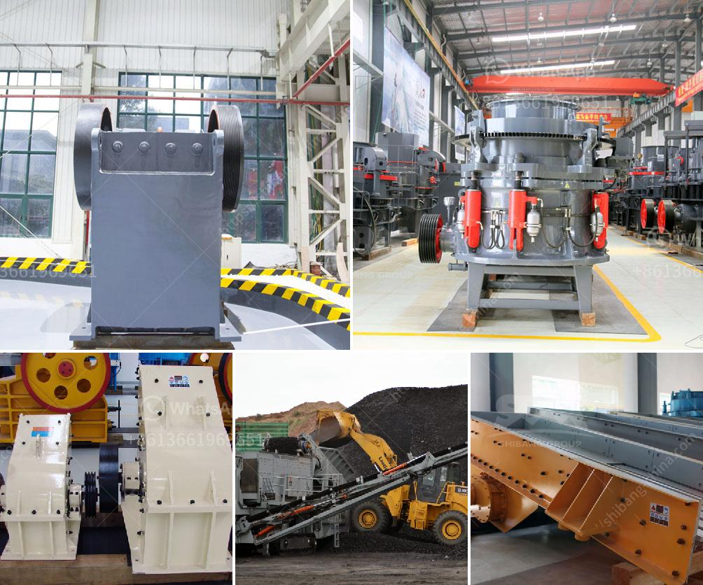

<h3>quartz stone making machine</h3>
The demand for quartz countertops has been steadily increasing over the years. With its durability, beauty, and low maintenance, it has become the go-to choice for homeowners and builders alike. But have you ever wondered how these stunning countertops are made? Enter the quartz stone making machine, a technological marvel that has revolutionized the countertop industry.

Quartz countertops are made from a combination of crushed quartz and resins, which are then molded into slabs and polished to create a smooth and shiny finish. The process of making these slabs used to be labor-intensive and time-consuming, with each slab being crafted by hand. However, the advent of the quartz stone making machine has changed the game completely.

One of the key benefits of using a quartz stone making machine is the increased efficiency it brings to the production process. These machines are equipped with cutting-edge technology that allows for faster production, with some machines capable of producing up to 300 square meters of quartz slabs per day. This level of output simply wouldn't be possible with manual labor alone. This increased efficiency is not only beneficial for manufacturers, but also for consumers who can enjoy quicker installation times.

Another advantage of using a quartz stone making machine is the level of precision and consistency it offers. These machines are calibrated to ensure each slab is uniform in size and thickness, eliminating any variations that may occur with manual production. This consistency is crucial, especially when it comes to joining multiple slabs together to create larger countertops. With machines, the edges are perfectly cut, resulting in seamless and visually stunning countertops.

Furthermore, the use of a quartz stone making machine has also contributed to the reduction of waste and a more sustainable production process. These machines are designed with high levels of accuracy, minimizing material wastage during the cutting and shaping process. Additionally, they can utilize offcuts and smaller pieces of quartz to create mosaic tiles or other smaller projects, reducing the overall environmental impact.

The quartz stone making machines available in the market today also offer a wide range of customization options. Manufacturers can choose from different molds and shapes to create unique designs that cater to the demands of their customers. The machines can also be programmed to produce slabs in various colors and patterns, allowing for endless possibilities when it comes to designing stunning quartz countertops.

In conclusion, the advent of the quartz stone making machine has revolutionized the countertop industry. The increased efficiency, precision, and customization options it offers have significantly improved the production process. From quicker installation times to consistent and visually appealing countertops, these machines have become an essential tool for manufacturers. As the demand for quartz countertops continues to grow, the quartz stone making machine will undoubtedly play a crucial role in meeting these demands while ensuring a sustainable and environmentally friendly production process.
<h3>Contact us</h3><ul><li><strong>Whatsapp:&nbsp;<a href="https://wa.me/8613661969651">+8613661969651</a></strong></li><li><a href="https://swt.shibang-china.com/?git&amp;zhl&amp;quartz stone making machine"><strong>Online Service(chat now)</strong></a></li></ul><h3>Related</h3><ul><li><a href='graphite powder machine.md'>graphite powder machine</a></li><li><a href='jaw crusher parameters.md'>jaw crusher parameters</a></li><li><a href='iron ore beneficiation process price.md'>iron ore beneficiation process price</a></li><li><a href='limestone crusher cost.md'>limestone crusher cost</a></li><li><a href='products mobile cone crusher.md'>products mobile cone crusher</a></li></ul>