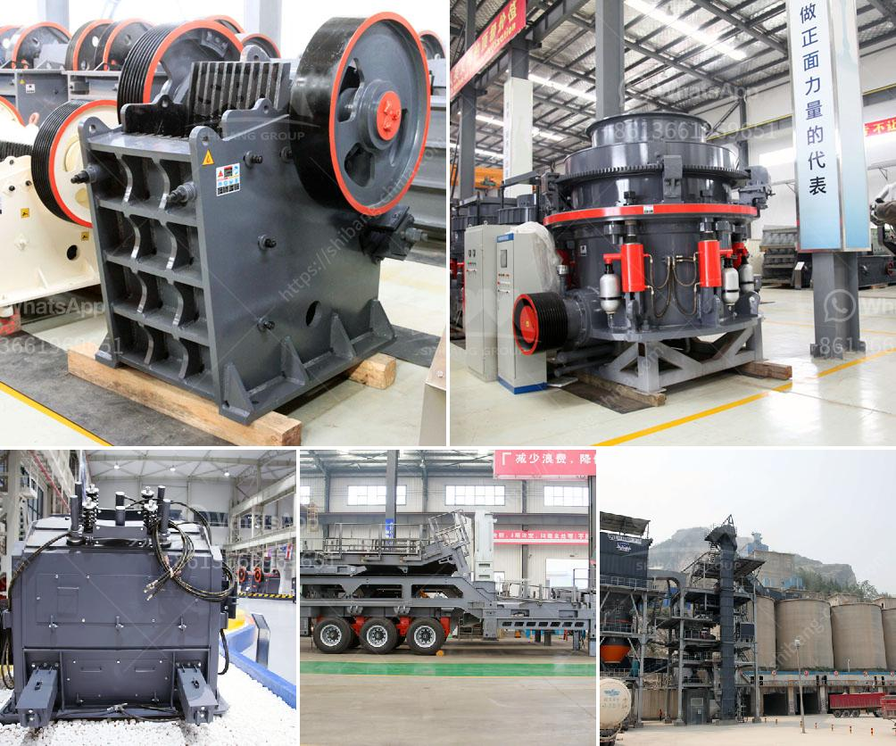

<h3>quartz stone manufacturing process</h3>
Quartz stone, also known as engineered stone, is a durable and versatile material used widely in the construction and interior design industries. It is composed of natural quartz crystals mixed with resins, polymers, and pigments to create a strong and beautiful surface. The manufacturing process of quartz stone involves several steps, ensuring the final product meets high-quality standards.

The first step in the manufacturing process is the selection of raw materials. The main component of quartz stone is natural quartz, which is mined from quarries all around the world. Quartz deposits are abundant, making it a readily available and sustainable material. The selected quartz crystals are then crushed into various sizes, depending on the desired end product.

After crushing, the quartz crystals are sorted and cleaned to remove any impurities or foreign particles. This ensures that only the purest quartz is used in the manufacturing process. The cleaned quartz crystals are then mixed with resins and polymers in a ratio of around 93% quartz and 7% resin, resulting in a strong and durable material. The pigments are also added at this stage to give the quartz stone its desired color.

The next step is the pressing and molding of the quartz mixture. The mixture is poured into a mold and compressed under high pressure to eliminate any air bubbles and form a solid slab. This compression process also ensures that the quartz stone has a consistent density throughout, providing it with its exceptional strength and durability.

Once the slab is formed, it goes through the curing process. The slab is placed in a curing oven and heated to a specific temperature for a designated amount of time. This process allows the resin to harden and bond with the quartz crystals, creating a stable and non-porous material. The curing process also enhances the physical properties of the quartz stone, making it highly resistant to stains, scratches, and heat.

After curing, the slab is polished to create a smooth and glossy finish. The polishing process involves multiple steps, starting with coarse abrasives that gradually refine the surface and remove any imperfections. Finer abrasives are then used to achieve the desired smoothness and shine. This polishing process not only enhances the aesthetic appeal of quartz stone but also improves its resistance to daily wear and tear.

The final step in the quartz stone manufacturing process is the inspection and quality control. Trained professionals carefully examine each slab to ensure that it meets the required standards in terms of color, size, finish, and overall quality. Any defects or imperfections are identified and rectified, ensuring that only the best quartz stone slabs are delivered to customers.

In conclusion, the manufacturing process of quartz stone involves the careful selection of raw materials, crushing and cleaning of quartz crystals, mixing with resins and pigments, pressing and molding, curing, and final polishing. This rigorous process ensures that quartz stone products are of high quality, durable, and visually appealing. Whether used for countertops, flooring, or wall cladding, quartz stone is a popular choice due to its versatility, strength, and timeless beauty.
<h3>Contact us</h3><ul><li><strong>Whatsapp:&nbsp;<a href="https://wa.me/8613661969651">+8613661969651</a></strong></li><li><a href="https://swt.shibang-china.com/?git&amp;zhl&amp;quartz stone manufacturing process"><strong>Online Service(chat now)</strong></a></li></ul><h3>Related</h3><ul><li><a href='crusher manufacturers in india.md'>crusher manufacturers in india</a></li><li><a href='gold crushing plant.md'>gold crushing plant</a></li><li><a href='dolomite ball mill price.md'>dolomite ball mill price</a></li><li><a href='crusher for marble.md'>crusher for marble</a></li><li><a href='fintec mobile screens for sale australia.md'>fintec mobile screens for sale australia</a></li></ul>