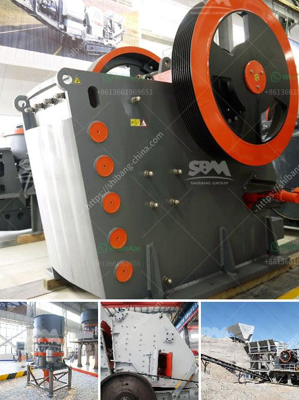

<h3>quartz stone powder machine manufacturing in india</h3>
India is known for its rich diversity and unlimited potential in various industries. One such industry that has been flourishing in recent years is the quartz stone powder machine manufacturing sector. Quartz is a mineral that is commonly used in various industries such as glass, ceramics, and construction. With its abundance in the country, India has become a major hub for quartz stone powder machine manufacturing.

The manufacturing of quartz stone powder machines in India involves the use of advanced technology, which ensures that the machines are efficient and durable. The machines used in the quartz powder manufacturing process include crushers, grinders, ball mills, and so on. The processing of quartz stone typically involves several steps, including crushing, grinding, screening, drying, and storing.

Quartz stone powder machines are widely used in India to produce high-quality quartz powder. The quartz powder manufactured in India is also exported to various countries such as the United States, Canada, and the United Kingdom. Quartz stone powder machines have become a staple in many industries, especially in the construction industry. The demand for quartz stone powder machines is constantly increasing due to the growth of the construction industry in India.

The manufacturing of quartz stone powder machines in India is also accompanied by increased job opportunities. Many skilled and semi-skilled workers are employed in the manufacturing units, contributing to the overall growth of the country's economy. The presence of these manufacturing units not only boosts the economy but also provides employment to many individuals, helping to alleviate poverty and improve the standard of living.

In conclusion, the quartz stone powder machine manufacturing sector in India has witnessed remarkable growth in recent years. The manufacturing of quartz stone powder machines not only caters to the domestic market but also serves the international market. With its advanced technology and skilled workforce, India has become a prominent player in the global quartz stone powder machine manufacturing industry.
<h3>Contact us</h3><ul><li><strong>Whatsapp:&nbsp;<a href="https://wa.me/8613661969651">+8613661969651</a></strong></li><li><a href="https://swt.shibang-china.com/?git&amp;zhl&amp;quartz stone powder machine manufacturing in india"><strong>Online Service(chat now)</strong></a></li></ul><h3>Related</h3><ul><li><a href='crusher companies in gauteng.md'>crusher companies in gauteng</a></li><li><a href='jaw crusher what price in china.md'>jaw crusher what price in china</a></li><li><a href='impact crusher equipment manufacturer.md'>impact crusher equipment manufacturer</a></li><li><a href='second hand concrete grinding machine supplier in dubai.md'>second hand concrete grinding machine supplier in dubai</a></li><li><a href='crushing plant and equipment.md'>crushing plant and equipment</a></li></ul>