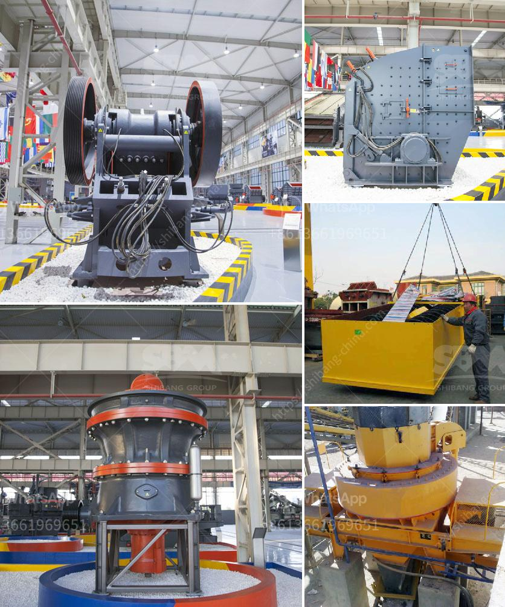

<h3>quick lime hammer crusher</h3>
Quicklime, also known as burnt lime or calcium oxide (CaO), is a versatile and widely used chemical compound. It is a white, caustic, alkaline crystalline solid that is made by heating limestone, a sedimentary rock composed mostly of calcium carbonate (CaCO3), in a kiln. Quicklime has numerous applications, including in the production of steel, paper, sugar, construction materials, and water treatment.

To obtain quicklime, limestone is first quarried and then crushed into small particles. The next step involves calcination, where the crushed limestone is heated at high temperatures to convert it into quicklime. However, the process of crushing limestone requires an efficient and reliable crusher, such as the quick lime hammer crusher.

The quick lime hammer crusher, or hammer mill, is an important crushing machine which is used to crush the limestone into smaller particles. This machine is commonly used in cement production, construction materials, and various other industries.

The hammer crusher can easily be adjusted to produce quicklime with a desired particle size and chemical composition. By adjusting the rotor speed or the gap between the hammer and the impact plate, the output size can be controlled. This is essential, as different industries require quicklime with specific characteristics for their applications.

One of the key advantages of the quick lime hammer crusher is its high production efficiency. It can process large quantities of limestone in a short amount of time, allowing for a continuous supply of quicklime. Additionally, the hammer crusher has a simple structure, making it easy to operate and maintain. Its low energy consumption also contributes to its cost-effectiveness.

Another important feature of the quick lime hammer crusher is its durability. The hammers and the impact plates are made of high-quality materials, ensuring a long service life even under harsh working conditions. This reduces the need for frequent replacements and helps in maintaining a steady production flow.

In conclusion, the quick lime hammer crusher is an indispensable tool for the production of quicklime. Its efficiency, versatility, and durability make it an excellent choice for various industries. By providing a reliable and cost-effective solution, it contributes to the smooth running of operations and ensures a steady supply of quicklime for different applications.
<h3>Contact us</h3><ul><li><strong>Whatsapp:&nbsp;<a href="https://wa.me/8613661969651">+8613661969651</a></strong></li><li><a href="https://swt.shibang-china.com/?git&amp;zhl&amp;quick lime hammer crusher"><strong>Online Service(chat now)</strong></a></li></ul><h3>Related</h3><ul><li><a href='gypsum plasterboard manufacturing process.md'>gypsum plasterboard manufacturing process</a></li><li><a href='copper crushing machines manufacturers in china.md'>copper crushing machines manufacturers in china</a></li><li><a href='stone crusher plant price in india.md'>stone crusher plant price in india</a></li><li><a href='used sand mobile washing equipment.md'>used sand mobile washing equipment</a></li><li><a href='calcium powder machine.md'>calcium powder machine</a></li></ul>