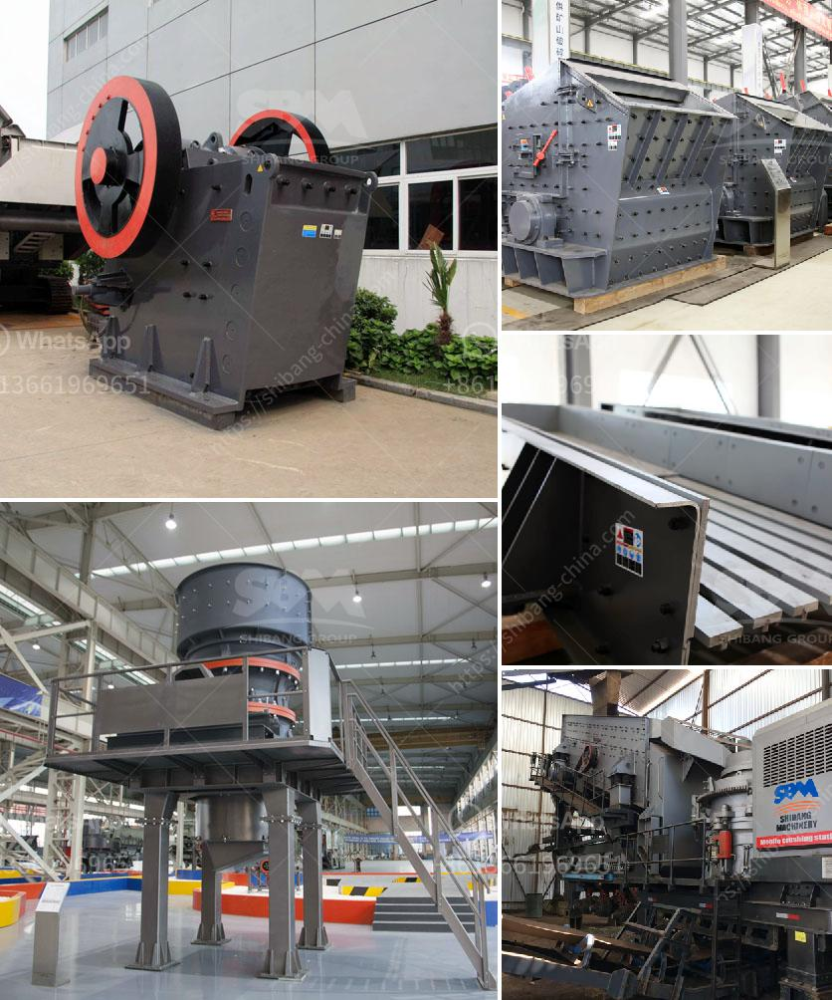

<h3>quick lime powder making machine</h3>
Quick lime powder is a versatile chemical compound used in a wide range of applications. It is also known as calcium oxide or burnt lime. With its diverse uses and high demand, the need for efficient quick lime powder making machines has risen.

The primary function of a quick lime powder making machine is to crush limestone into fine powder. This powder is then used in various chemical processes such as cement production, steel production, and other industrial processes. Additionally, it is also used in agriculture to neutralize acidic soils and improve soil quality.

One crucial aspect of a quick lime powder making machine is its efficiency. These machines are designed to crush limestone with minimal energy consumption, thus reducing operating costs. They are equipped with powerful motors and cutting-edge technology, ensuring smooth and consistent operation.

A high-quality quick lime powder making machine should also be user-friendly. It should have a simple and intuitive interface that allows operators to control and adjust various parameters easily. The machine's design should also ensure easy maintenance, with parts that are readily accessible and replaceable when needed.

Safety features are another vital consideration for a quick lime powder making machine. These machines operate at high speeds and can pose risks to operators if proper safety precautions are not in place. Therefore, it is crucial to invest in a machine with advanced safety mechanisms, such as emergency stop buttons, protective enclosures, and automatic shut-off systems.

Another significant aspect to consider when purchasing a quick lime powder making machine is its production capacity. Machines with higher production capacities can process larger quantities of limestone in a shorter time, increasing overall efficiency. However, it is essential to assess the specific needs of your project and choose a machine that aligns with those requirements.

The price of a quick lime powder making machine is another crucial factor for consideration. These machines can vary significantly in terms of cost, depending on their features, quality, and production capacity. It is advisable to research multiple suppliers and compare prices to ensure you get the best value for your investment.

Furthermore, it is essential to purchase a quick lime powder making machine from a reputable supplier. Reliable suppliers offer warranty periods and after-sales services, providing peace of mind to the buyers. It is also advisable to read customer reviews and testimonials to gauge the satisfaction levels of previous buyers.

In conclusion, a quick lime powder making machine is a vital tool in various industries. Its efficiency, user-friendliness, safety features, production capacity, and price are essential factors to consider when choosing the right machine for your needs. By investing in a high-quality machine from a reputable supplier, you can ensure smooth and reliable limestone crushing, producing top-grade quick lime powder for your applications.
<h3>Contact us</h3><ul><li><strong>Whatsapp:&nbsp;<a href="https://wa.me/8613661969651">+8613661969651</a></strong></li><li><a href="https://swt.shibang-china.com/?git&amp;zhl&amp;quick lime powder making machine"><strong>Online Service(chat now)</strong></a></li></ul><h3>Related</h3><ul><li><a href='ball grinder machine.md'>ball grinder machine</a></li><li><a href='mineral that is used to make talcum powder.md'>mineral that is used to make talcum powder</a></li><li><a href='kaolin crusher price.md'>kaolin crusher price</a></li><li><a href='silica sand crusher in ghana.md'>silica sand crusher in ghana</a></li><li><a href='vertical grinding machine manufacturers.md'>vertical grinding machine manufacturers</a></li></ul>