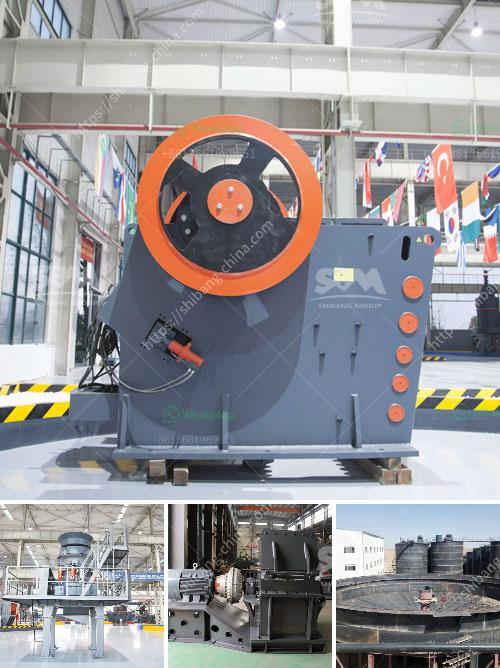

<h3>quotations for stone crushers</h3>
A stone crusher is a necessary machine for construction industry. Certain rocks, like granite and limestone, are invaluable to construction companies across the globe. Due to their durability and strength, these rocks have gained widespread popularity among various industries. It is, however, considered a challenging task to acquire these valuable rocks because of their limited availability. This is where stone crushers come into play. They are large machines that are primarily used to crush rocks into smaller pieces for various purposes, such as for construction materials, road paving, and mining. 

Quotations for stone crushers can vary in different parts of the world. Different manufacturers and suppliers offer different prices for their products. Some stone crushers are sourced from famous manufacturers in exotic locations, while others are manufactured in less-known countries. Regardless of their origin, it is important to obtain quotations from multiple sources to ensure that you get the best price possible. 

Aside from price, there are several other factors to consider when requesting quotations for stone crushers. One of the most important factors is the quality of the machine. Stone crushers should be durable and efficient, able to withstand heavy use. It is also essential to assess the reputation of the manufacturer or supplier offering the stone crusher. Reading reviews and seeking recommendations can help ensure that you choose a reliable and reputable company. Additionally, you should also analyze the warranty and after-sales services offered by the manufacturer, as this is crucial for maintenance and repairs.

Another important aspect to consider when requesting quotations for stone crushers is the type of crushers. There are various types of stone crushers available in the market, including jaw crushers, cone crushers, impact crushers, and roll crushers. Each type has its own advantages and disadvantages, and it is important to find the one that best suits your needs and requirements. Some stone crushers are designed for relatively small-scale applications, while others are designed for large-scale projects. Therefore, it is essential to clarify your specific needs to the supplier or manufacturer before requesting a quotation. 

Lastly, it is crucial to consider the delivery and shipping options when requesting quotations for stone crushers. Stone crushers are heavy machinery that require careful handling and transportation. Some suppliers may offer delivery services, while others may require you to arrange your own shipping. It is important to factor in transportation costs and logistics into your budget when requesting quotations. Additionally, you should also consider import taxes and customs duties if you are purchasing the stone crusher from a different country.

In conclusion, obtaining quotations for stone crushers is an essential step in any construction project. By comparing prices, analyzing the quality of the machine, and considering other factors like warranty and after-sales services, you can make an informed decision and choose the best stone crusher for your project. It is also important to consider the type of crusher and the delivery options to ensure a smooth and efficient process. With the right stone crusher, you can enhance productivity and efficiency while saving costs in your construction projects.
<h3>Contact us</h3><ul><li><strong>Whatsapp:&nbsp;<a href="https://wa.me/8613661969651">+8613661969651</a></strong></li><li><a href="https://swt.shibang-china.com/?git&amp;zhl&amp;quotations for stone crushers"><strong>Online Service(chat now)</strong></a></li></ul><h3>Related</h3><ul><li><a href='iron separator from steel slag.md'>iron separator from steel slag</a></li><li><a href='conveyor equipment in tanzania.md'>conveyor equipment in tanzania</a></li><li><a href='production of iron ore and manganese.md'>production of iron ore and manganese</a></li><li><a href='sell jaw crusher the dubia.md'>sell jaw crusher the dubia</a></li><li><a href='list of compartment of gypsum crusher plant.md'>list of compartment of gypsum crusher plant</a></li></ul>