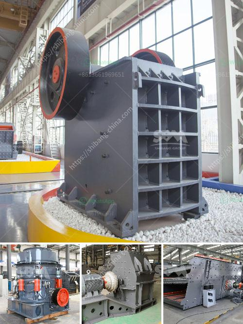

<h3>quote for vsi crusher</h3>
A quote for a VSI crusher refers to the price a potential buyer is given for this essential equipment that helps to process materials into a fine and uniform product. VSI stands for Vertical Shaft Impactor, and this type of crusher is used in various industries such as mining, building materials, and recycling. In this article, we will delve into the importance of a VSI crusher, its working mechanism, and factors that influence its price.

A VSI crusher is designed to crush materials into particles of a desired shape and size. It achieves this through a high-speed rotor, which throws the material against a fixed anvil or impact plates. As the material collides with the stationary anvils or plates, it breaks into smaller pieces, ultimately reaching the desired size. This process is known as particle-on-particle crushing.

The main advantage of using a VSI crusher is its ability to create a better-shaped product compared to traditional crushers. This enhanced shape is achieved due to the high-speed impact crushing and rock-on-rock crushing action. The particles produced by a VSI crusher are more cubical and have a more uniform shape, making them suitable for a wide range of applications such as concrete production, road construction, and asphalt manufacturing.

When requesting a quote for a VSI crusher, several factors can influence the price. First and foremost is the capacity or throughput of the crusher. Higher capacity crushers tend to be more expensive due to their larger size and higher horsepower requirements. The desired capacity depends on the specific application and the volume of material that needs to be processed.

Another factor to consider is the power source of the VSI crusher. Most crushers are designed to operate on electric power, while some can also be powered by diesel or hydraulic drives. The choice of power source will depend on factors such as availability, cost, and environmental considerations.

The quality and durability of the crusher's components also play a role in determining the price. High-quality materials and advanced manufacturing techniques contribute to a higher cost but ensure a longer lifespan and lower maintenance requirements. It is crucial to choose a reputable manufacturer that offers reliable and durable equipment.

Additional features and customization options can also influence the price. Some VSI crusher models come with additional features like adjustable feed hopper height, variable speed drives, and hydraulic lifting mechanisms. These features add convenience and versatility but can also increase the overall cost.

Lastly, market demand and competition also affect the quote for a VSI crusher. Prices may vary among different manufacturers and suppliers, so it is advisable to obtain quotes from multiple sources to compare and find the best deal.

In conclusion, a quote for a VSI crusher is a crucial step in the purchasing process for businesses in various industries. It is essential to consider factors such as capacity, power source, quality, additional features, and market demand when requesting a quote. By carefully evaluating these factors, potential buyers can make an informed decision and choose a VSI crusher that suits their specific needs and budget.
<h3>Contact us</h3><ul><li><strong>Whatsapp:&nbsp;<a href="https://wa.me/8613661969651">+8613661969651</a></strong></li><li><a href="https://swt.shibang-china.com/?git&amp;zhl&amp;quote for vsi crusher"><strong>Online Service(chat now)</strong></a></li></ul><h3>Related</h3><ul><li><a href='buy nigeria stone crusher.md'>buy nigeria stone crusher</a></li><li><a href='price of stone crusher machine.md'>price of stone crusher machine</a></li><li><a href='activated carbon a full set of production equipment.md'>activated carbon a full set of production equipment</a></li><li><a href='machine of ultra fine mills.md'>machine of ultra fine mills</a></li><li><a href='marble crusher machine in rajasthan.md'>marble crusher machine in rajasthan</a></li></ul>