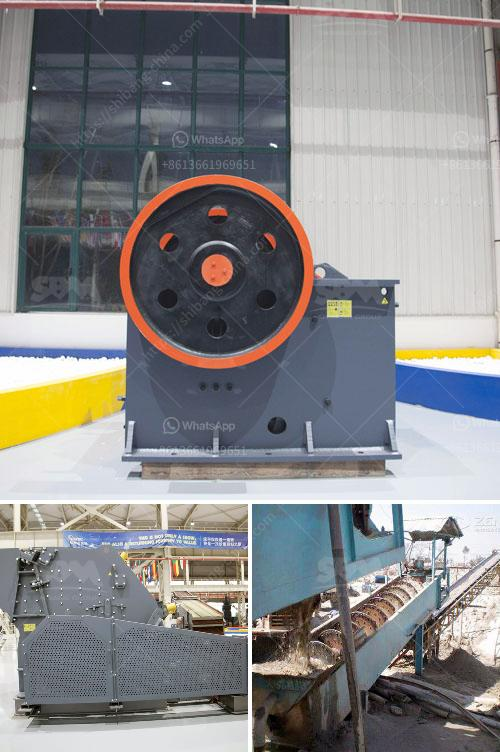

<h3>raymond grinder mill pakistan</h3>
In the field of grinding, Raymond mill is recognized as a common mill. It is one of the most popular grinding equipment in the industry. It has high working efficiency, low energy consumption, and can grind various materials with different hardness. Raymond Grinder Mill is widely used in many industrial sectors such as mining, building materials, chemical industry, and metallurgy.

Raymond Grinder Mill is a vertical mill designed by our company through years of R&D and production experience. It is widely used in cement, metallurgy, electric power, coal, chemical industry, and other industries. It has high grinding efficiency, low power consumption, large feeding size, and adjustable product fineness.

Pakistan is a developing country with a strong demand for infrastructure construction. This has greatly promoted the development of the grinding mill industry. Raymond Grinder Mill Pakistan, as a grinding equipment commonly used in the industry, is welcomed by local customers. With its reliable performance and good cost performance, it has been widely used in various processing fields.

Firstly, Raymond Grinder Mill Pakistan has a unique design. The grinding roller device of the mill adopts overlapping multi-stage sealing and grinding ring, which effectively prevents the dust generated during grinding from entering the grinding chamber. It effectively improves the working environment and reduces the dust pollution to the surrounding environment.

Secondly, Raymond Grinder Mill Pakistan has a wide range of applications. It can be used for grinding various non-flammable and explosive ores with Mohs hardness not exceeding 9.3 and humidity below 6%. The fineness of the finished product can be adjusted from 80 mesh to 325 mesh, which can meet the needs of different customers.

Thirdly, Raymond Grinder Mill Pakistan is equipped with a complete system. It adopts advanced technology and is equipped with a dust collector, pipeline device, and blower, which greatly reduces the pollution caused by dust and noise during operation. This provides a good working environment for the employees and ensures the continuous production of the mill.

In addition, Raymond Grinder Mill Pakistan has simple operation and convenient maintenance. The whole equipment system is sealed, which can effectively prevent dust leakage and ensure the normal operation of the equipment. The grinding roller and grinding ring are made of special wear-resistant materials, which have a long service life and reduce the replacement frequency of wearing parts.

In conclusion, Raymond Grinder Mill Pakistan is an essential tool for grinding in various industries. Its reliable performance, advanced technology, wide range of applications, and convenient maintenance make it widely used in the market. It not only meets the needs of customers but also promotes the development of Pakistan's grinding mill industry. With the continuous improvement of technology, Raymond Grinder Mill Pakistan will have a broader market prospect and bring more benefits to customers.
<h3>Contact us</h3><ul><li><strong>Whatsapp:&nbsp;<a href="https://wa.me/8613661969651">+8613661969651</a></strong></li><li><a href="https://swt.shibang-china.com/?git&amp;zhl&amp;raymond grinder mill pakistan"><strong>Online Service(chat now)</strong></a></li></ul><h3>Related</h3><ul><li><a href='sand washers machine.md'>sand washers machine</a></li><li><a href='companies selling mining equipment in dubai.md'>companies selling mining equipment in dubai</a></li><li><a href='limestone manufacture process.md'>limestone manufacture process</a></li><li><a href='open cast mining equipment for sale south africa.md'>open cast mining equipment for sale south africa</a></li><li><a href='stone crusher made in italy.md'>stone crusher made in italy</a></li></ul>