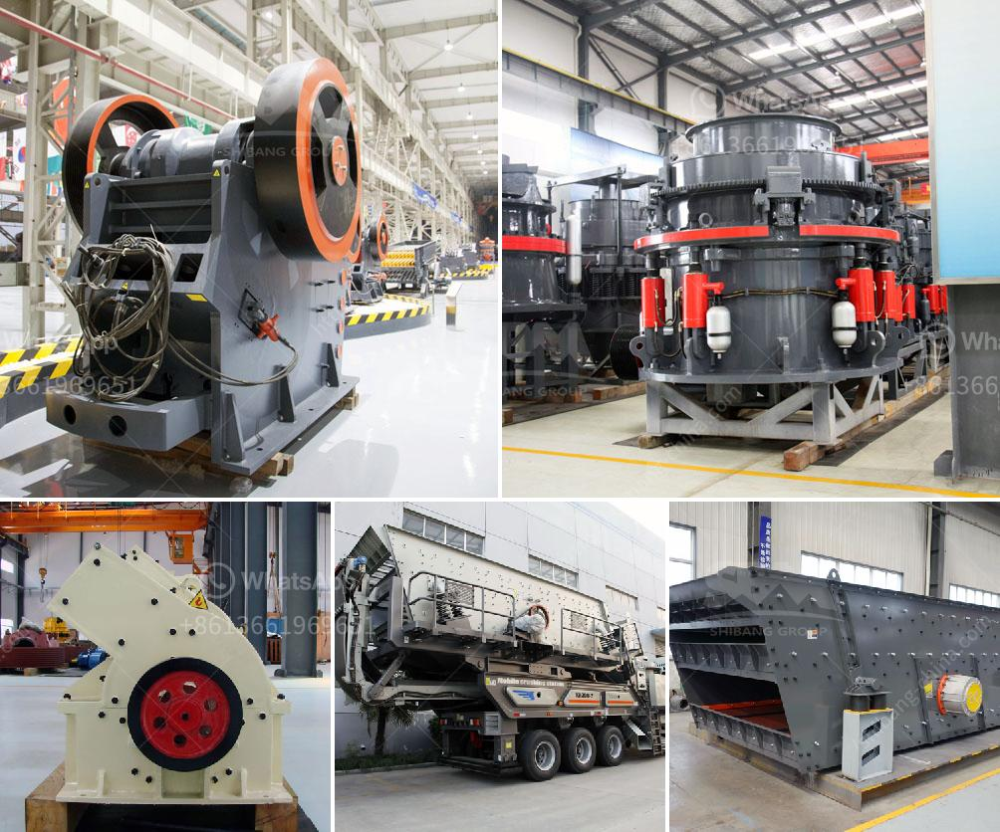

<h3>raymond grinding mill europe</h3>
Raymond grinding mill, also known as Raymond roller mill, is a widely used grinding equipment in Europe. It is suitable for processing various non-flammable and non-explosive mineral materials with Mohs hardness below 9.3 and humidity below 6%, such as quartz, feldspar, calcite, limestone, talc, ceramics, marble, granite, dolomite, bauxite, iron ore, barite, bentonite, coal gangue, coal, etc. With its superior performance and efficient grinding ability, Raymond grinding mill has gained popularity in the European market.

In recent years, the European market has witnessed a significant increase in demand for grinding mills due to the rapid development of various industries such as mining, metallurgy, construction, chemical engineering, and cement. Raymond grinding mill, with its outstanding features such as high grinding efficiency, low energy consumption, and low investment cost, has become the preferred choice for many European customers.

One of the key advantages of Raymond grinding mill is its unique design. The mill adopts a vertical structure, which occupies a small area and can achieve large-scale production. This design not only saves land resources but also reduces construction costs, making it an economical choice for European customers. Additionally, the grinding roller and grinding ring of Raymond grinding mill are made of special wear-resistant materials, ensuring the long service life of the equipment and reducing maintenance costs.

Furthermore, Raymond grinding mill is equipped with a high-efficiency impeller fan system, which improves the ventilation performance of the equipment and effectively avoids excessive temperature rise during the grinding process. This enhances the stability and reliability of the grinding mill, ensuring efficient and continuous operation. Moreover, the advanced dust removal system equipped with Raymond grinding mill effectively reduces dust pollution and meets the European environmental standards.

The European market also appreciates the advanced control system of Raymond grinding mill. The mill is equipped with an intelligent control system, which can automatically adjust and control the feeding amount, grinding pressure, and other parameters to achieve the desired grinding effect. This not only saves labor costs but also improves the grinding efficiency and product quality.

In terms of market demand, Europe's grinding mill market is diverse and evolving. Raymond grinding mill in Europe is not only used in traditional industries such as mining and metallurgy but also finds its applications in emerging industries such as chemical engineering, construction, and cement. As Europe focuses on sustainable development and green technologies, the demand for grinding mills with high efficiency and low energy consumption is expected to increase steadily.

In conclusion, Raymond grinding mill has become an essential equipment in the European market due to its outstanding performance, unique design, and advanced control system. It meets the diverse grinding needs of various industries, providing high efficiency, low energy consumption, and environmental protection. As Europe continues to embrace sustainable development and demands high-quality grinding mills, Raymond grinding mill will continue to play an important role in Europe's industrial landscape.
<h3>Contact us</h3><ul><li><strong>Whatsapp:&nbsp;<a href="https://wa.me/8613661969651">+8613661969651</a></strong></li><li><a href="https://swt.shibang-china.com/?git&amp;zhl&amp;raymond grinding mill europe"><strong>Online Service(chat now)</strong></a></li></ul><h3>Related</h3><ul><li><a href='price of grinding machine in bangladesh.md'>price of grinding machine in bangladesh</a></li><li><a href='second hand ball mill manufacturer in india.md'>second hand ball mill manufacturer in india</a></li><li><a href='mineral that is used to make talcum powder.md'>mineral that is used to make talcum powder</a></li><li><a href='mode of oeration of a gyratory crusher.md'>mode of oeration of a gyratory crusher</a></li><li><a href='total gypsum mill production in india.md'>total gypsum mill production in india</a></li></ul>