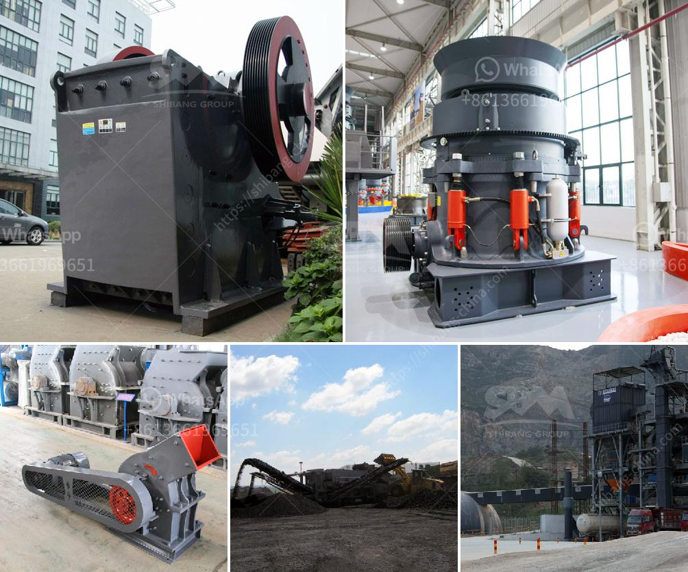

<h3>raymond mill company</h3>
When it comes to efficiency and innovation, Raymond Mill Company is one of the top players in the grinding industry. With a rich history spanning over a century, this manufacturer has consistently delivered reliable and high-quality grinding machines for various industries worldwide.

Established in 1906, Raymond Mill Company initially started as a small-scale industry manufacturing grinding equipment in a back alley of Springfield, Massachusetts. However, thanks to its dedication to manufacturing superior products, it quickly gained a reputation for its reliability and innovation, attracting customers from all over the world.

One of the primary strengths of Raymond Mill Company is its commitment to research and development. Throughout its long history, the company has consistently invested in technological advancements and improvements. This dedication has allowed them to stay ahead of the competition and deliver cutting-edge grinding solutions.

One of the standout innovations introduced by Raymond Mill Company is the patented pendulum roller grinding mill. This groundbreaking technology revolutionized the grinding industry by significantly improving efficiency and grinding capacity. The pendulum roller design ensures an even distribution of weight, resulting in a more effective grinding process.

In addition to the advanced technology, Raymond Mill Company's machines are known for their durability and longevity. The company uses high-quality materials and components, ensuring that its machines can withstand heavy usage without compromising performance. This focus on quality has earned them a loyal customer base who trust in the reliability of their equipment.

Customer satisfaction is also a top priority for Raymond Mill Company. Unlike others in the industry, the company takes a personalized approach to customer service. With a team of experienced technicians and engineers, they provide excellent after-sales support, including on-site installation, training, and maintenance services. This dedication to customer satisfaction has resulted in numerous long-term partnerships with clients across various industries.

Raymond Mill Company serves a wide range of industries, including mining, construction, metallurgy, chemical, and more. Their machines are used to grind various materials, such as limestone, gypsum, coal, calcite, barite, dolomite, marble, and many others. From small-scale operations to large-scale industrial projects, customers can rely on Raymond Mill Company to deliver the perfect grinding solutions tailored to their specific needs.

In conclusion, Raymond Mill Company has cemented its position as a leading manufacturer of grinding equipment. Their commitment to technological innovation, product quality, and exceptional customer service has made them a trusted name in the industry. With a strong focus on research and development, they continue to push the boundaries of grinding technology, providing efficient and reliable solutions for various industries worldwide.
<h3>Contact us</h3><ul><li><strong>Whatsapp:&nbsp;<a href="https://wa.me/8613661969651">+8613661969651</a></strong></li><li><a href="https://swt.shibang-china.com/?git&amp;zhl&amp;raymond mill company"><strong>Online Service(chat now)</strong></a></li></ul><h3>Related</h3><ul><li><a href='rock crusher in kenya.md'>rock crusher in kenya</a></li><li><a href='price of jaw crusher germany.md'>price of jaw crusher germany</a></li><li><a href='handmade rock crusher.md'>handmade rock crusher</a></li><li><a href='ball mill in romania italy.md'>ball mill in romania italy</a></li><li><a href='ballast crusher supplier.md'>ballast crusher supplier</a></li></ul>