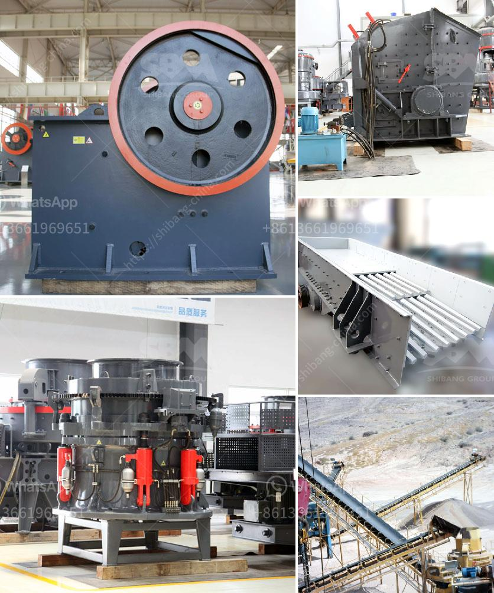

<h3>raymond mill for sale</h3>
Raymond mill is a commonly used grinding equipment in the industrial field. It has wide application and high performance. The Raymond mill for sale is a popular choice among investors. With the continuous improvement of Raymond mill technology, the equipment has made remarkable achievements in the grinding process, grading process and energy saving. Today, let's take a closer look at the reasons why Raymond mill is a great investment opportunity.

Firstly, Raymond mill has a high grinding efficiency. The grinding roller is used to crush and grind the materials inside the grinding chamber, which greatly improves the grinding efficiency. Moreover, the advanced technology and design of the grinding roller and grinding ring make the equipment more efficient and stable in operation. This high grinding efficiency ensures that the finished powder has a uniform fineness and high quality.

Secondly, Raymond mill has a wide range of applications. It is suitable for grinding various non-metallic minerals with Mohs hardness below 7 and humidity below 6%. These minerals include limestone, marble, barite, dolomite, talc, kaolin, gypsum, etc. Raymond mill can effectively grind these materials into different particle sizes for different applications. The flexibility and versatility of Raymond mill make it a preferred choice for many industries.

Thirdly, Raymond mill is equipped with advanced dust removal system, which effectively reduces the pollution caused by dust and noise. The dust removal system adopts pulse bag filter, which has high dust removal efficiency, low emission concentration and small air leakage rate. In addition, the noise elimination device installed in the grinding chamber can effectively reduce the noise generated during the operation of the equipment. This eco-friendly design not only protects the environment, but also provides a comfortable working environment for operators.

Lastly, Raymond mill has a long service life and low maintenance cost. The important parts of Raymond mill, such as grinding roller and grinding ring, are made of high-quality materials. The wear resistance and durability of these parts are greatly improved, which can effectively extend the service life of the equipment. Meanwhile, the maintenance and repair of Raymond mill are relatively simple. With regular maintenance, the equipment can maintain stable performance and high grinding efficiency for a long time.

In conclusion, Raymond mill for sale is a great investment opportunity. With its high grinding efficiency, wide range of applications, advanced dust removal system and long service life, Raymond mill has become a popular choice among investors. Whether it's for grinding limestone, marble or other non-metallic minerals, Raymond mill can provide excellent grinding performance and create considerable economic benefits. Therefore, if you are considering investing in the grinding industry, Raymond mill is worth your attention.
<h3>Contact us</h3><ul><li><strong>Whatsapp:&nbsp;<a href="https://wa.me/8613661969651">+8613661969651</a></strong></li><li><a href="https://swt.shibang-china.com/?git&amp;zhl&amp;raymond mill for sale"><strong>Online Service(chat now)</strong></a></li></ul><h3>Related</h3><ul><li><a href='barite machinery production plant.md'>barite machinery production plant</a></li><li><a href='mini sand stone crusher price.md'>mini sand stone crusher price</a></li><li><a href='primary double deck screen price.md'>primary double deck screen price</a></li><li><a href='bentonite granules making machinery india.md'>bentonite granules making machinery india</a></li><li><a href='feldspar ball mills manufacturers.md'>feldspar ball mills manufacturers</a></li></ul>