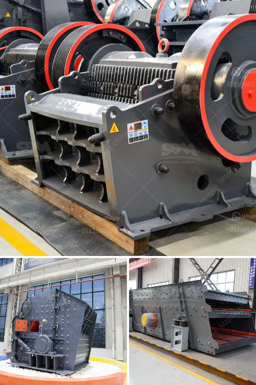

<h3>raymond mill for</h3>
Raymond mill is a commonly used grinding equipment in the field of industrial milling. With the continuous improvement of technology, Raymond mill has also made rapid development. In recent years, it has been widely used in various non-metallic ore grinding industries such as activated carbon, bentonite, kaolin, cement, phosphate rock, gypsum, glass, thermal insulation materials and other materials with Mohs hardness not greater than 9.3 and humidity below 6%.

Raymond mill is known for its excellent performance, high efficiency, energy saving, and environmental protection. It has a wide range of applications and can effectively grind various materials. The grinding roller device of Raymond mill uses a new type of sealing structure, which has long service life and minimal maintenance. The grinding roller and grinding ring are made of special wear-resistant steel, which can effectively improve the grinding efficiency and prolong the service life of the equipment.

Another advantage of Raymond mill is the fineness of the finished product. The fineness can be adjusted between 80-400 mesh, which is suitable for producing various powder products. Moreover, the Raymond mill has a small footprint and complete sets of strong performance, which can be a good solution for the grinding of different materials.

In addition, Raymond mill has a simple and convenient operation process. The whole grinding process is carried out in a closed system, which can effectively reduce dust pollution. The important parts of Raymond mill are made of high-quality steel, and the wear parts are made of high-performance wear-resistant materials, which can ensure the stability of operation and high efficiency.

In conclusion, Raymond mill is a reliable grinding equipment that can be used for various industries. Its excellent performance, convenient operation, and environmental protection greatly win the favor and appreciation of customers. With continuous technological innovation and improvement, Raymond mill is expected to have broader prospects in the future.
<h3>Contact us</h3><ul><li><strong>Whatsapp:&nbsp;<a href="https://wa.me/8613661969651">+8613661969651</a></strong></li><li><a href="https://swt.shibang-china.com/?git&amp;zhl&amp;raymond mill for"><strong>Online Service(chat now)</strong></a></li></ul><h3>Related</h3><ul><li><a href='raymond mill for.md'>raymond mill for</a></li><li><a href='rock breaker machine in south africa.md'>rock breaker machine in south africa</a></li><li><a href='mobile aggregate plant for sale in the philippines.md'>mobile aggregate plant for sale in the philippines</a></li><li><a href='rock crushing plants.md'>rock crushing plants</a></li><li><a href='stone crushers gold.md'>stone crushers gold</a></li></ul>