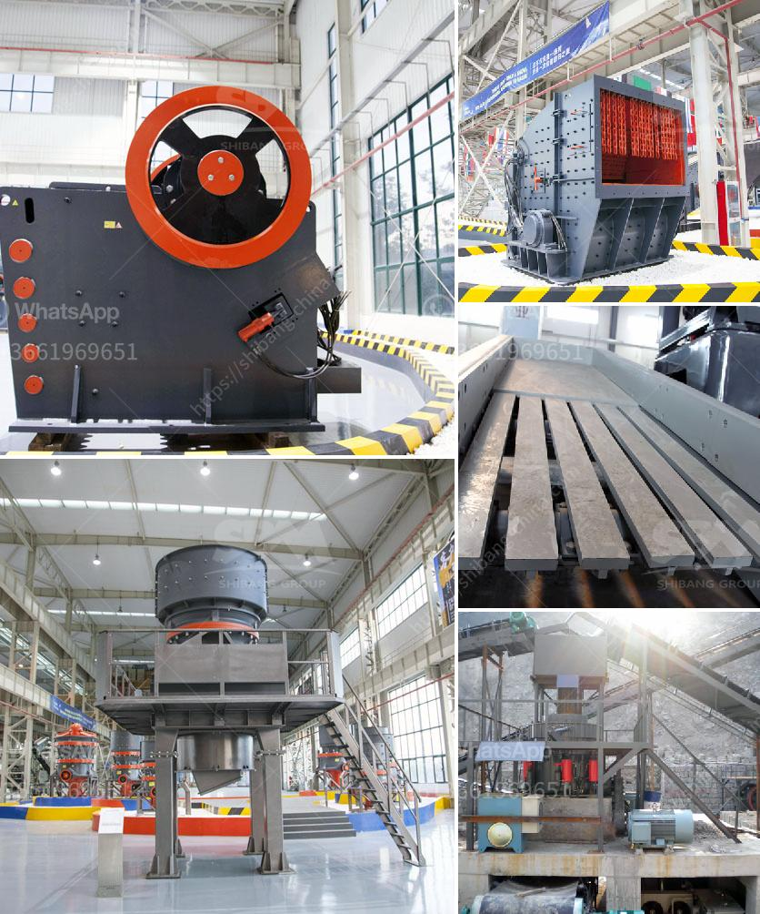

<h3>raymond mill in collins</h3>
The town of Collins, located in the heart of Missouri, is known for its charming ambience, tight-knit community, and beautiful natural landscapes. However, there is one lesser-known hero in Collins that has been silently driving the industrial growth of this serene town - the Raymond Mill. With its unique capabilities and unparalleled efficiency, the Raymond Mill has undoubtedly played a significant role in propelling the industrial sector in Collins to new heights.

First introduced in the early 20th century, the Raymond Mill revolutionized the grinding industry with its advanced engineering and innovative design. Over the years, it has gained immense popularity globally and has found its way to numerous industrial towns, including Collins. This robust machinery has become the backbone of many manufacturing plants, particularly those involved in the production of fine powder materials.

One of the key reasons behind the Raymond Mill's success is its ability to finely grind a variety of materials. From limestone and gypsum to bentonite and feldspar, the mill can process a wide range of raw materials, ensuring high-quality output for various industries. This versatility has made the Raymond Mill an indispensable tool for industries such as construction, mining, and chemical production in Collins.

Furthermore, the Raymond Mill's efficiency is second to none. Powered by advanced motor systems, this machinery can grind and process large quantities of materials in a short period. Its high-speed operation coupled with the cleverly designed grinding rollers ensures consistent and uniform grinding, eliminating any chances of quality compromise. Manufacturers in Collins have experienced a significant boost in productivity and cost savings due to the Raymond Mill's exceptional efficiency.

The Raymond Mill's impact goes beyond industrial growth; it also contributes to the environmental well-being of Collins. With sustainability being a priority for many industries, the Raymond Mill spares no expense in ensuring a greener future. Equipped with advanced dust removal systems, this machinery minimizes dust emissions and air pollution during the grinding process. The efficient handling of waste and usage of recycled water further enhance the Raymond Mill's eco-friendly image.

In addition to its technical prowess, the Raymond Mill also emerges as a source of employment in Collins. As more manufacturing plants adopt this technology, the demand for skilled workers with knowledge of Raymond Mill operation and maintenance increases. This results in job creation and economic growth in the town, providing opportunities for the local workforce to excel.

Looking ahead, Raymond Mill's influence is expected to grow further in Collins. With advancements in technology, newer models of the mill offer even greater efficiency and environmental sustainability. As the industrial sector evolves, the Raymond Mill will continue to play an essential role in ensuring Collins remains at the forefront of industrial progress.

In conclusion, the Raymond Mill has proven to be a game-changer for the industrial sector in Collins. Its ability to process a wide range of materials, exceptional efficiency, and commitment to sustainability have made it a crucial machinery for manufacturers in the town. With its continued impact on industrial growth, employment, and environmental sustainability, the Raymond Mill has rightfully earned its place as a hero of Collins.
<h3>Contact us</h3><ul><li><strong>Whatsapp:&nbsp;<a href="https://wa.me/8613661969651">+8613661969651</a></strong></li><li><a href="https://swt.shibang-china.com/?git&amp;zhl&amp;raymond mill in collins"><strong>Online Service(chat now)</strong></a></li></ul><h3>Related</h3><ul><li><a href='crushing and screening of aggregates in mexico.md'>crushing and screening of aggregates in mexico</a></li><li><a href='cement making machines for factory.md'>cement making machines for factory</a></li><li><a href='used steel ball mill.md'>used steel ball mill</a></li><li><a href='used sand mobile washing equipment.md'>used sand mobile washing equipment</a></li><li><a href='crusher 300 sampai 400 ton dan hr dijual.md'>crusher 300 sampai 400 ton dan hr dijual</a></li></ul>