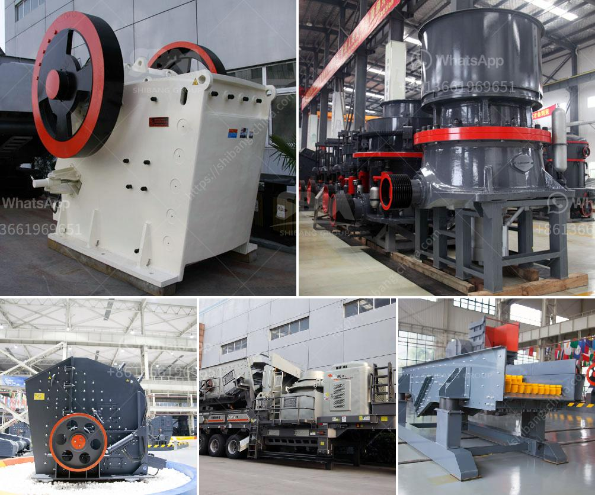

<h3>raymond mill mumbai and kolkata</h3>
Raymond Mills are synonymous with quality and reliability. Raymond is a brand that has become an integral part of the Indian textile industry. Known for its superior fabric quality and exquisite design, Raymond has been a leading textile player for over nine decades. Founded in 1925, the Raymond Group is headquartered in Mumbai, but its operations span throughout the country, with a strong presence in Kolkata as well.

Mumbai, the financial capital of India, is home to Raymond's corporate office. The city's bustling streets and dynamic business atmosphere perfectly capture the spirit of Raymond's success story. Mumbai has long been a hub for the textile industry, and Raymond's strategic location in the heart of the city has helped the brand establish itself as a leading player in the industry. The company's manufacturing units in nearby Thane and Vapi ensure that Raymond can cater to the demand for its products in a timely manner.

Kolkata, on the other hand, is a city with a rich textile heritage. Known for its traditional handloom industry, Kolkata has been a hub for textile production for centuries. The city's proximity to Eastern India's cotton belt has helped the brand procure high-quality raw materials for its products. Raymond's presence in Kolkata symbolizes the brand's commitment to preserving and promoting India's diverse textile heritage.

Raymond Mills in Mumbai and Kolkata have transformed the textile landscape with their innovative offerings. The brand is known for its wide range of products, including apparel, fabrics, and accessories, catering to both men and women. Raymond's apparel range includes formal wear, casual wear, and even ethnic wear, ensuring that there is something for everyone. The brand's fabrics are renowned for their impeccable quality and come in a variety of designs and patterns, making them a popular choice among fashion enthusiasts.

One of Raymond's key strengths is its state-of-the-art manufacturing facilities. The brand heavily invests in technology and innovation to constantly improve its production processes. This commitment to excellence has allowed Raymond to consistently deliver products that meet the highest standards of quality. The brand's mills in Mumbai and Kolkata are equipped with advanced machinery that ensures precision and efficiency in every step of the manufacturing process. From weaving to dyeing and finishing, every aspect of production is carefully monitored to ensure the finest end product.

Raymond's success in Mumbai and Kolkata can be attributed to its unwavering commitment to customer satisfaction. The brand has always prioritized customer needs, be it through its impeccable product quality or its extensive retail network. Raymond's presence in both cities is extensive, with numerous retail outlets and showrooms that offer a seamless shopping experience to consumers. Additionally, the brand has embraced e-commerce, making its products easily accessible to customers across the country.

As Raymond continues to expand its footprint in the Indian market and beyond, its mills in Mumbai and Kolkata will play a crucial role in shaping the future of the textile industry. With a rich legacy and a dedication to innovation, Raymond is poised to remain a trailblazer in the Indian textile landscape. Whether it's the bustling streets of Mumbai or the vibrant textile heritage of Kolkata, Raymond's presence in these cities is a testament to the brand's commitment to excellence, quality, and customer satisfaction.
<h3>Contact us</h3><ul><li><strong>Whatsapp:&nbsp;<a href="https://wa.me/8613661969651">+8613661969651</a></strong></li><li><a href="https://swt.shibang-china.com/?git&amp;zhl&amp;raymond mill mumbai and kolkata"><strong>Online Service(chat now)</strong></a></li></ul><h3>Related</h3><ul><li><a href='price of jaw crusher germany.md'>price of jaw crusher germany</a></li><li><a href='cost on vsi crusher.md'>cost on vsi crusher</a></li><li><a href='slag crusher korean dealer in india.md'>slag crusher korean dealer in india</a></li><li><a href='stone crushing business in pakistan.md'>stone crushing business in pakistan</a></li><li><a href='iron separator from steel slag.md'>iron separator from steel slag</a></li></ul>