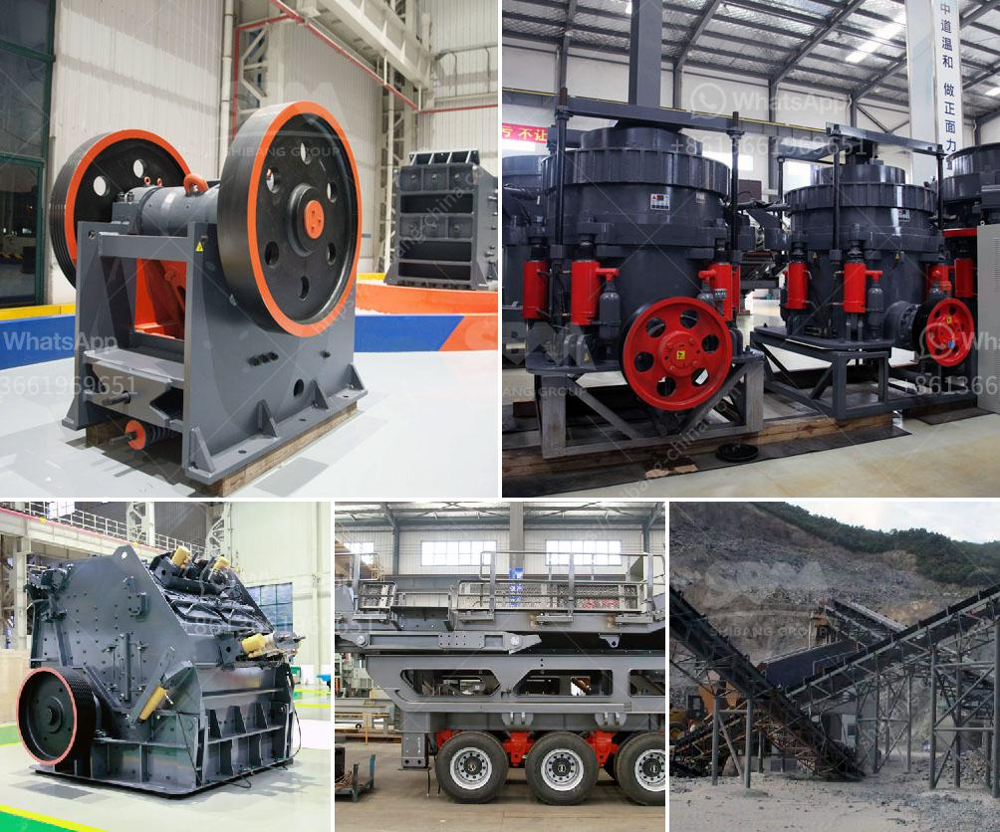

<h3>raymond mill price in india</h3>
Raymond mill is one of the mainstream mining equipment widely used in non-metallic ore grinding and processing market. As a professional manufacturer, Hongxing Machinery has spent many years in the research and development of Raymond mills. It has created a series of high-quality and efficient Raymond mills through continuous improvement and technological innovation.

The price of Raymond mill in India is influenced by numerous factors, including: equipment quality, market demand, production cost, government policies and other external factors. Of these factors, the core factor that affects the price of Raymond mill is the production cost.

Among them, the production cost of Raymond mill of different manufacturers varies greatly. Zhengzhou Hongxing Machinery, as a leading manufacturer in mining machinery industry, has been continuously exploring and improving technology, and has developed a series of energy-saving and efficient Raymond mills through technical innovation. Its Raymond mills have better performance and lower production cost compared with similar mills.

In addition, the market demand and the overall level of economic development are also important factors affecting Raymond mill price. Hongxing Machinery has a professional sales team to analyze the market demand and customize the appropriate production plan according to customer needs. Therefore, the Raymond mill produced can meet the needs of different customers, and the price is more reasonable.

Government policies also affect the price of Raymond mill to some extent. During the 14th Five-Year Plan period, the government will continue to promote the transformation and upgrading of the mining industry, eliminating backward production capacity, supporting the development of high-quality mining equipment, and encouraging technological innovation. Under such favorable policies, the price of Raymond mill in India is expected to be more competitive.

To sum up, the price of Raymond mill in India is influenced by multiple factors, such as equipment quality, market demand, production cost, government policies, etc. Hongxing Machinery has been committed to improving and innovating Raymond mills, constantly optimizing its production plan, and providing customers with more efficient and cost-effective equipment. It is believed that the price of Raymond mill in India will become more reasonable and competitive in the future.
<h3>Contact us</h3><ul><li><strong>Whatsapp:&nbsp;<a href="https://wa.me/8613661969651">+8613661969651</a></strong></li><li><a href="https://swt.shibang-china.com/?git&amp;zhl&amp;raymond mill price in india"><strong>Online Service(chat now)</strong></a></li></ul><h3>Related</h3><ul><li><a href='cost of limestone crusher plant.md'>cost of limestone crusher plant</a></li><li><a href='aggregate washing machine cost.md'>aggregate washing machine cost</a></li><li><a href='used stone crusher for sale in florida.md'>used stone crusher for sale in florida</a></li><li><a href='quarry equipment uk.md'>quarry equipment uk</a></li><li><a href='concrete aggregate recycle machine.md'>concrete aggregate recycle machine</a></li></ul>