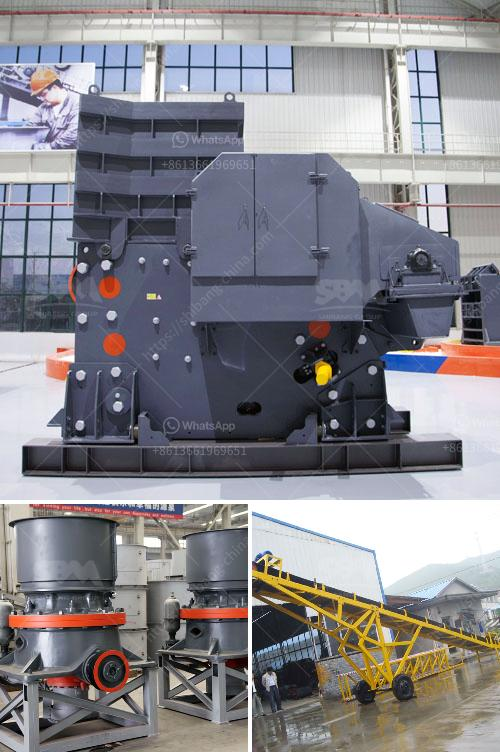

<h3>raymond mill spare part</h3>
The Raymond Mill is one of the most widely used grinding equipment in the industrial field. When operating the Raymond Mill, it is inevitable that some breakdowns will occur due to the wear and tear of the equipment. One of the essential components of the Raymond Mill is its spare parts, which play a crucial role in the smooth operation and enhanced productivity of the mill.

The Raymond Mill spare parts mainly include grinding rollers, grinding rings, blades, shovel, and grinding elements. These components are all crucial to the Raymond Mill's performance. Without these parts, the Raymond Mill would not be able to grind materials effectively and produce high-quality final products.

One of the essential Raymond Mill spare parts is the grinding roller. It consists of several grinding wheels that are evenly spaced and aligned on the vertical shaft. The grinding rollers rotate around their own axis, which provides the necessary grinding force to grind the materials between the grinding roller and the grinding ring. Over time, the grinding roller may wear out or become damaged, affecting the overall performance of the Raymond Mill. Hence, regular maintenance and replacement of the grinding roller are necessary to ensure smooth operation and optimal grinding efficiency.

Another significant spare part of the Raymond Mill is the grinding ring. This component is located at the inner circumference of the Raymond Mill and is responsible for grinding the materials. The grinding ring works in conjunction with the grinding roller to crush and pulverize the materials into fine particles. Like the grinding roller, the grinding ring is subject to wear and tear, resulting in reduced grinding efficiency. Regular inspection and replacement of the grinding ring are crucial to maintain the Raymond Mill's performance.

The blades and shovel are other critical spare parts of the Raymond Mill. These components are responsible for scooping the materials and directing them towards the grinding area. The blades and shovel ensure a constant and steady flow of materials, allowing for efficient grinding. Over time, the blades and shovel may become worn or damaged, affecting the Raymond Mill's ability to process materials effectively. Thus, regular inspection and replacement of these parts are vital to ensure uninterrupted operation and enhanced productivity.

Furthermore, the Raymond Mill spare parts also include various grinding elements, such as liners and grinding balls. These components are made of high-quality materials to withstand the grinding force exerted during operation. However, over time, these components may wear out or break down, compromising the performance of the Raymond Mill. Regular inspection and replacement of these grinding elements are essential to maintain the Raymond Mill's grinding efficiency and output quality.

In conclusion, the spare parts of the Raymond Mill are vital for ensuring smooth operation and enhanced productivity. Components such as the grinding roller, grinding ring, blades, shovel, and grinding elements play a crucial role in grinding and processing materials efficiently. Regular maintenance, inspection, and replacement of these parts are necessary to optimize the performance of the Raymond Mill and achieve high-quality final products. By prioritizing the maintenance and replacement of spare parts, industries can maximize the lifespan and performance of their Raymond Mills, ensuring continuous and efficient operation.
<h3>Contact us</h3><ul><li><strong>Whatsapp:&nbsp;<a href="https://wa.me/8613661969651">+8613661969651</a></strong></li><li><a href="https://swt.shibang-china.com/?git&amp;zhl&amp;raymond mill spare part"><strong>Online Service(chat now)</strong></a></li></ul><h3>Related</h3><ul><li><a href='sand washing plants in india.md'>sand washing plants in india</a></li><li><a href='rock stone zambia mining crushing plants.md'>rock stone zambia mining crushing plants</a></li><li><a href='iron ore beneficiation process for sale.md'>iron ore beneficiation process for sale</a></li><li><a href='limestone crusher cost.md'>limestone crusher cost</a></li><li><a href='industrial impact crusher.md'>industrial impact crusher</a></li></ul>