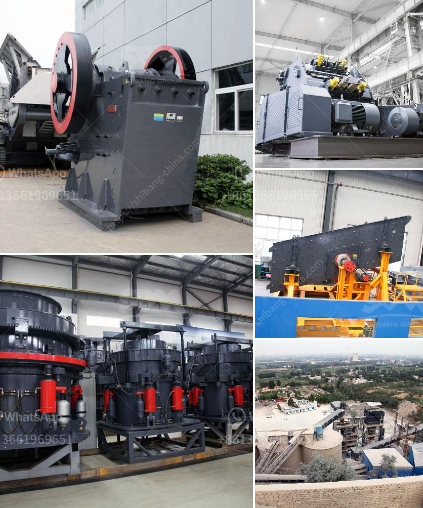

<h3>raymond mills mumbai philippines</h3>
Raymond Mills Mumbai is one of the most prominent landmarks in the bustling metropolis of Mumbai, India. Known for its architectural grandeur and rich history, this structure has become an iconic symbol of the city. However, not many people are aware of the significant presence of Raymond Mills in the beautiful Philippines.

Established in Mumbai in 1925, Raymond Limited is one of India's leading textile manufacturers. Over the years, the company has expanded its operations to numerous countries, including the Philippines. The journey of Raymond Mills Mumbai in the Philippines has witnessed remarkable growth and success.

Raymond Mills Mumbai entered the Philippines market in the 1990s, and since then, it has been revolutionizing the textile industry in the country. The company brought its expertise and experience to the local market, introducing high-quality fabrics and garments to Filipino consumers. With its commitment to providing stylish and superior products, Raymond Mills Mumbai quickly made a name for itself in the Philippines.

One of the key factors contributing to the success of Raymond Mills Mumbai in the Philippines is its commitment to innovation and design. The company constantly strives to stay ahead of the fashion curve, offering trends that cater to the diverse tastes of Filipino customers. From classic and sophisticated to trendy and contemporary, Raymond Mills Mumbai delivers fashion-forward collections that resonate with the local market.

Another aspect that sets Raymond Mills Mumbai apart is its focus on sustainability and ethical practices. The company recognizes the importance of responsible manufacturing and has implemented various initiatives to reduce its environmental footprint. Raymond Mills Mumbai utilizes sustainable materials, such as organic cotton and recycled fibers, in its production processes. Additionally, the company promotes fair trade practices and ensures safe working conditions for its employees.

Raymond Mills Mumbai has also played a significant role in empowering local communities in the Philippines. The company actively supports social initiatives that uplift marginalized groups and contribute to the overall development of society. Through various programs, Raymond Mills Mumbai has provided education and skill development opportunities to underserved communities, empowering individuals to lead better lives.

In recent years, Raymond Mills Mumbai has expanded its presence in the Philippines by opening numerous retail outlets across the country. These stores offer customers a wide range of products, including men's and women's apparel, accessories, and fabrics. The brand has gained a loyal following in the Philippines, thanks to its quality and style.

The success story of Raymond Mills Mumbai in the Philippines is a testament to the brand's dedication to excellence, innovation, and sustainability. The company has transformed the textile industry in the country, offering Filipino consumers access to world-class fashion at their doorstep. Raymond Mills Mumbai has not only enriched the lives of individuals with its products but has also made a positive impact on the environment and the community.

As Raymond Mills Mumbai continues its glorious journey in the Philippines, it will undoubtedly continue to set new benchmarks in the textile industry and inspire other brands to follow in its footsteps. Through its values and commitment to excellence, Raymond Mills Mumbai has become an indelible part of the Filipino fashion landscape, leaving a lasting legacy for generations to come.
<h3>Contact us</h3><ul><li><strong>Whatsapp:&nbsp;<a href="https://wa.me/8613661969651">+8613661969651</a></strong></li><li><a href="https://swt.shibang-china.com/?git&amp;zhl&amp;raymond mills mumbai philippines"><strong>Online Service(chat now)</strong></a></li></ul><h3>Related</h3><ul><li><a href='jaw crusher price suppliers.md'>jaw crusher price suppliers</a></li><li><a href='bentonite powder plant in surat.md'>bentonite powder plant in surat</a></li><li><a href='limestone crusher cost.md'>limestone crusher cost</a></li><li><a href='cement clinker manufacturing plant.md'>cement clinker manufacturing plant</a></li><li><a href='stone crusher plant price in india.md'>stone crusher plant price in india</a></li></ul>