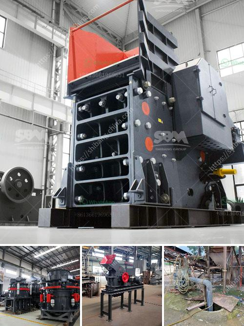

<h3>rent a rock crusher saudi</h3>
Renting a rock crusher in Saudi Arabia is not as daunting as it may seem. The availability of crushers for rent in the region attracts numerous businesses that are looking for machinery to rent. Crushers are a very important part of the construction industry where they reduce the size of large rocks and stones so they can be easily transported for further processing.

Saudi Arabia has long been known for its vast mineral reserves, particularly in gold, copper, and phosphate mining. Renting a rock crusher in Saudi Arabia also enables businesses to take advantage of the country's mineral resources without having to invest in their own mining machinery.

As a professional cement crusher manufacturer and supplier, we have over 30 years' experience in researching and developing cement crushing technology. So, we can provide you with a variety of cement crushers, such as jaw crusher, hammer crusher, impact crusher, cone crusher, etc.

In terms of convenience, renting a rock crusher in Saudi Arabia can serve as a wise choice. Since it eliminates the need for cumbersome transportation and permits, renting a rock crusher in Saudi Arabia is an affordable alternative to the ongoing construction boom happening within the Kingdom.

With the introduction of crushers, leasing companies can facilitate the process of mining in Saudi Arabia by providing machinery for rent. These machines can be utilized in a variety of mining operations to facilitate the extraction of minerals such as gold, silver, copper, zinc, iron, and phosphate.

Renting a rock crusher in Saudi Arabia can save companies valuable time and resources as the machines are capable of excavating and crushing large quantities of rock, resulting in a more efficient and cost-effective construction process.

In conclusion, renting a rock crusher in Saudi Arabia is a viable option for many construction companies. It offers the opportunity to access a range of equipment without the commitment of buying machinery outright, bridging the gap between long-term and short-term needs.
<h3>Contact us</h3><ul><li><strong>Whatsapp:&nbsp;<a href="https://wa.me/8613661969651">+8613661969651</a></strong></li><li><a href="https://swt.shibang-china.com/?git&amp;zhl&amp;rent a rock crusher saudi"><strong>Online Service(chat now)</strong></a></li></ul><h3>Related</h3><ul><li><a href='rock stone milling machine.md'>rock stone milling machine</a></li><li><a href='price list of sand manufacturing machine india.md'>price list of sand manufacturing machine india</a></li><li><a href='tonne an hour ball mill.md'>tonne an hour ball mill</a></li><li><a href='slag crusher korean dealer in india.md'>slag crusher korean dealer in india</a></li><li><a href='sale for stone crusher.md'>sale for stone crusher</a></li></ul>