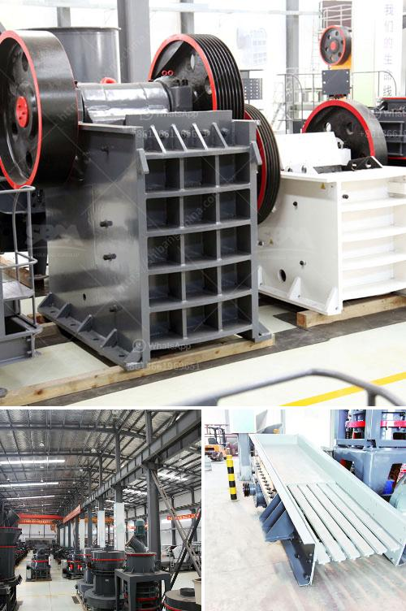

<h3>robo sand machinery cost manufactures</h3>
Robo sand machinery cost manufactures, a widely used material across various construction sectors such as infrastructure, buildings, roads, bridges, and dams, has seen a steady rise in demand over the past decade. While this material is nothing new to the industry, it has certainly evolved over time. Initially, this sand was collected naturally from riverbeds and was used as a key ingredient in cement production. However, with growing environmental concerns and scarcity of river sand, the need for an alternative solution became apparent.

Enter robo sand machinery, which offers the perfect replacement for conventional river sand used in construction. Not only does it effectively enhance the overall strength of concrete, but it also acts as a sustainable and eco-friendly alternative. This manufactured sand is produced by crushing granite rocks using state-of-the-art machinery. It not only eliminates the need for river sand extraction but also ensures that no harmful pollutants are released into the environment.

The cost-effectiveness of robo sand machinery is another essential factor driving its widespread adoption. Unlike the natural river sand that has erratic availability and high costs, robo sand machinery is readily available and can be conveniently produced in large quantities. This ensures a steady supply of sand at an affordable price, making it an attractive choice for both large-scale construction projects and individual homeowners.

In terms of cost, the robo sand machinery is a worthy investment. The equipment offers significant savings in labor and operating expenses. Not only is the initial cost of setting up the machinery cheaper compared to traditional sand processing plants, but the machines also require minimal maintenance, leading to reduced operation costs over time. Additionally, the advanced technology and automation in these machines ensure precision and consistency in sand production, further optimizing efficiency.

Manufacturers of robo sand machinery are actively investing in research and development to enhance the quality and reduce production costs. The innovative techniques used in these machines result in better particle shape and grading, leading to improved concrete strength. Moreover, the machinery can be customized to produce different types and sizes of sand, catering to the specific needs of each project.

In conclusion, robo sand machinery cost manufactures offer a valuable alternative to traditional river sand. The benefits of this material ensure a smoother and more cost-effective construction process while also contributing to a sustainable future. With the continuous advancement in technology and cost optimization, manufacturers are making it easier than ever to access high-quality robo sand machinery at competitive prices. By embracing this innovative solution, the construction industry can ensure a steady supply of sand, reduce dependence on natural resources, and mitigate the environmental impact of construction activities.
<h3>Contact us</h3><ul><li><strong>Whatsapp:&nbsp;<a href="https://wa.me/8613661969651">+8613661969651</a></strong></li><li><a href="https://swt.shibang-china.com/?git&amp;zhl&amp;robo sand machinery cost manufactures"><strong>Online Service(chat now)</strong></a></li></ul><h3>Related</h3><ul><li><a href='jaw crusher parameters.md'>jaw crusher parameters</a></li><li><a href='coal preparation plant cost.md'>coal preparation plant cost</a></li><li><a href='simple grinding mill type in ethiopia.md'>simple grinding mill type in ethiopia</a></li><li><a href='almeida stone crusher.md'>almeida stone crusher</a></li><li><a href='ethiopia gypsum manufacturers.md'>ethiopia gypsum manufacturers</a></li></ul>