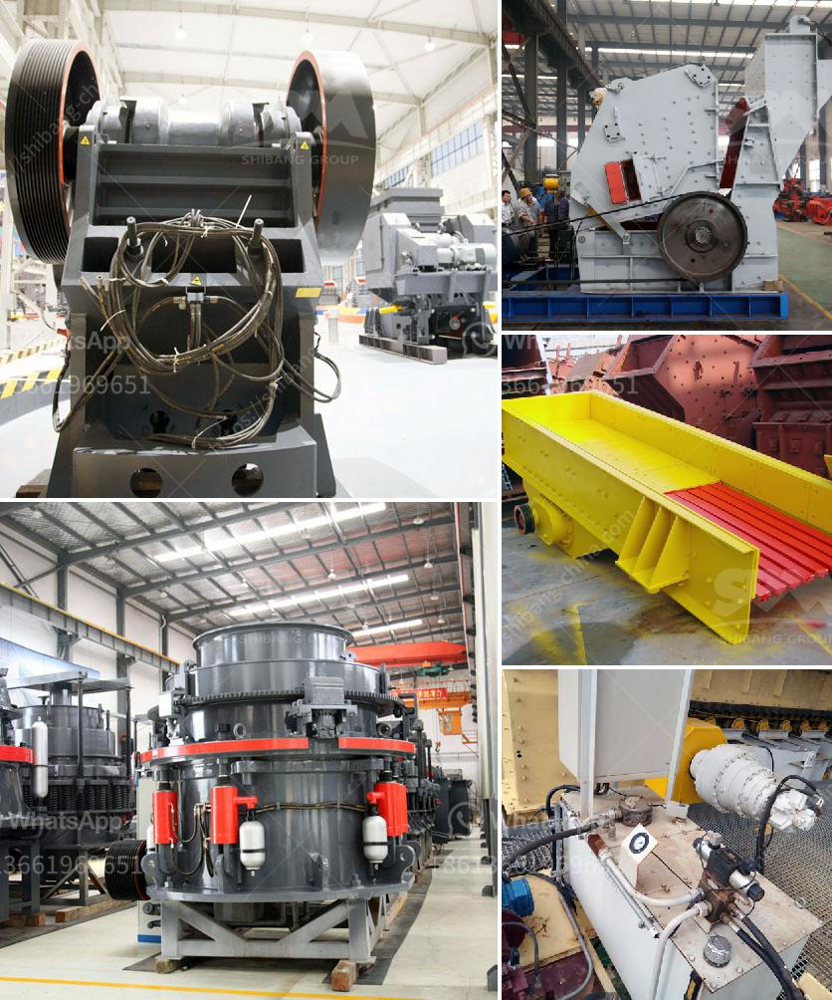

<h3>robo sand manufacturing process</h3>
Robo sand is an ideal substitute for river sand. It is manufactured by crushing granite rocks, creating a texture similar to natural sand. This process helps to conserve valuable river sand, which is becoming increasingly scarce due to excessive mining leading to ecological imbalance.

The manufacturing process of robo sand involves three stages. First, the raw material is crushed to a suitable size and then it is screened to remove any impurities. After that, it is mixed with water, cement, and additives to form a consistent mixture. This mixture is then shaped into solid blocks or pieces and allowed to dry.

One of the advantages of robo sand is that it has a consistent particle size distribution. As a result, it can be used in concrete production without the need for additional processing or screening. This leads to significant time and cost savings for construction projects.

Robo sand also offers various environmental benefits. Since it is made from crushing rocks, it does not require riverbed mining, reducing the pressure on rivers and their ecosystems. Additionally, the use of robo sand helps to reduce the carbon footprint of construction activities, as it reduces the need for transportation of river sand and the associated greenhouse gas emissions.

Furthermore, robo sand manufacturing plants can help in utilizing local stone resources and reducing reliance on river sand, which is imported from other states or countries. This not only boosts the local economy but also contributes to the sustainable development of the region.

In conclusion, the manufacturing process of robo sand plays a crucial role in conserving natural resources and alleviating the growing scarcity of river sand. Its consistent particle size distribution, environmental benefits, and contribution to local economies make it an ideal substitute for river sand in construction projects.
<h3>Contact us</h3><ul><li><strong>Whatsapp:&nbsp;<a href="https://wa.me/8613661969651">+8613661969651</a></strong></li><li><a href="https://swt.shibang-china.com/?git&amp;zhl&amp;robo sand manufacturing process"><strong>Online Service(chat now)</strong></a></li></ul><h3>Related</h3><ul><li><a href='crushing and screening simulation software.md'>crushing and screening simulation software</a></li><li><a href='kenya cone crusher is manufactured.md'>kenya cone crusher is manufactured</a></li><li><a href='calcium carbonate mill equipment.md'>calcium carbonate mill equipment</a></li><li><a href='what is the hammer mill.md'>what is the hammer mill</a></li><li><a href='stone crusher in germany.md'>stone crusher in germany</a></li></ul>