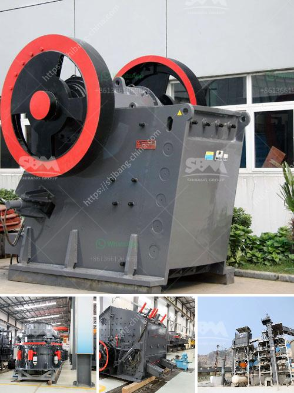

<h3>rock breaker machine in south africa</h3>
South Africa, rich in natural resources, has long been a hub for mining and construction activities. These industries play a crucial role in the country's economic growth, providing employment and contributing significantly to its GDP. In recent years, there has been a surge in the demand for rock breaker machines in South Africa, revolutionizing both the mining and construction sectors.

A rock breaker machine, also known as a hydraulic hammer, is a powerful attachment used in various industries to break oversized rocks or demolish concrete structures. It operates on the principle of hydraulics, utilizing the force of compressed fluid to deliver a high-velocity impact. These machines are commonly used in mining, construction, and demolition applications, where removing large rocks or breaking through concrete is necessary.

One of the primary industries benefiting from the use of rock breaker machines in South Africa is mining. The country is renowned for its vast mineral reserves, including platinum, gold, diamonds, and coal. Mines often involve extracting minerals from hard rock formations, which can be challenging and time-consuming. Traditional methods of rock breaking, such as blasting, are not always feasible due to safety concerns and environmental regulations. Moreover, the presence of densely populated areas near mining sites makes controlled rock breaking necessary.

Rock breaker machines provide a safe and efficient alternative to conventional methods of rock extraction, reducing the risk of accidents and minimizing environmental impact. These hydraulic hammers are highly versatile, capable of breaking through even the toughest rocks. They can be mounted on various mining machinery, such as excavators or loaders, allowing easy integration into existing operations. With their precise control and powerful impact, rock breaker machines improve productivity by significantly reducing the time required for rock extraction.

In addition to mining, rock breaker machines have found widespread use in the booming construction sector of South Africa. The country has experienced a surge in construction activities, driven by expanding urbanization, infrastructure development, and government-led initiatives such as the National Infrastructure Plan. Whether it's demolishing old structures or breaking rocks for foundation excavation, rock breaker machines have become an indispensable tool for construction companies.

Their sheer power and precise control facilitate efficient demolition and excavation, saving time and costs. Moreover, the use of rock breaker machines in construction projects enhances worker safety by minimizing manual labor and reducing exposure to hazardous conditions. Contractors and developers increasingly rely on these machines to ensure timely project completion while adhering to stringent safety standards.

It is worth mentioning that the popularity of rock breaker machines in South Africa extends beyond mining and construction. They are also widely used in the quarrying industry for stone extraction, road construction projects, and civil works involving tunneling or excavation.

In conclusion, the emergence of rock breaker machines has transformed the mining and construction industries in South Africa. These powerful hydraulic hammers offer a safer and more efficient method of rock breaking and concrete demolition, enhancing productivity and worker safety. With South Africa's rich mineral reserves and increasing construction activities, the demand for rock breaker machines is only expected to rise in the coming years, driving further technological advancements in the field.
<h3>Contact us</h3><ul><li><strong>Whatsapp:&nbsp;<a href="https://wa.me/8613661969651">+8613661969651</a></strong></li><li><a href="https://swt.shibang-china.com/?git&amp;zhl&amp;rock breaker machine in south africa"><strong>Online Service(chat now)</strong></a></li></ul><h3>Related</h3><ul><li><a href='limestone ore processing plant.md'>limestone ore processing plant</a></li><li><a href='project proposal on funding gold mining.md'>project proposal on funding gold mining</a></li><li><a href='portable diamond processing plant supplier.md'>portable diamond processing plant supplier</a></li><li><a href='best machine brands for quarry.md'>best machine brands for quarry</a></li><li><a href='vertical grinding machine manufacturers.md'>vertical grinding machine manufacturers</a></li></ul>