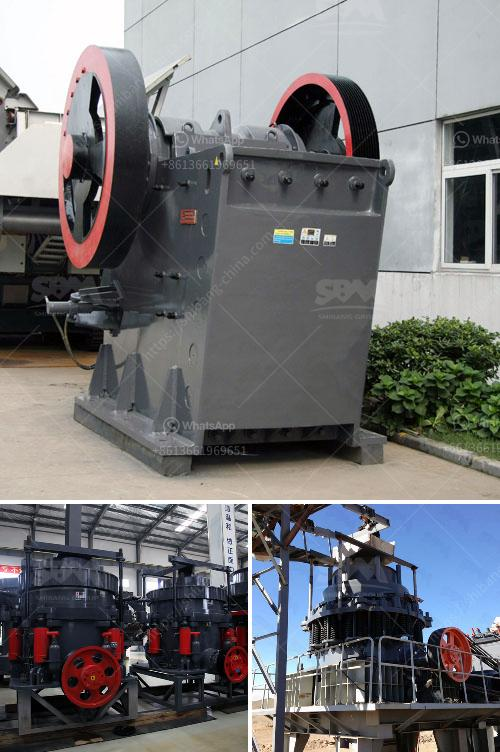

<h3>rock crusher application</h3>
A rock crusher is a machine designed to reduce the size of large material (like rocks and stone) into smaller aggregate such as gravel, recycled concreate, crushed stone, or dust. Large mining operations can often use more than one crusher. Construction projects are also heavy users of these machines and the materials they produce. In the face of such a huge demand, it is essential to consider how the rock crusher can be applied and its related advantages.

1. Construction: When you think of construction sites, you think of dirt, dust, and debris. However, a lot of these materials can be recycled and used as useful products for construction projects. A rock crusher is crucial to this process. Taking all the rock, stone, and concrete from a site and crushing it into a usable material helps reduce costs and waste. Concrete is stripped from construction sites and piled up in landfills, contributing to environmental pollution. By utilizing a rock crusher, the valuable materials can be reused and transformed into new construction projects, making it a more sustainable and economical solution.

2. Mining: The mining industry utilizes crushers for breaking down hard and abrasive ores, including coal, limestone, and diamond-bearing rock. This process ensures the valuable minerals can be extracted from the waste rock without causing damage to the equipment. A rock crusher plays a vital role in the process of mining, as it provides the coal, iron ore, and limestone necessary to create concrete and surface treatments for roads, buildings, and bridges.

1. Versatility: With so many machines available in the market, it is essential to choose the right crusher for the job. A rock crusher can handle various materials, including large rocks and ores. The size of the material being crushed is typically measured in inches or millimeters, so it is important to consider the desired outcome and choose the appropriate crusher.

2. Efficiency: Rock crushers are designed to reduce the size of large rocks into smaller rocks, gravel, or dust by applying mechanical force. This process is extremely efficient, as it utilizes the energy stored in the rock itself. Additionally, reducing the size of the material makes it easier and more cost-effective to handle and transport.

3. Safety: Crushing rocks and materials can be dangerous if not done properly. A rock crusher is designed to minimize the possibility of accidents, especially during operation. Safety features such as emergency shut-off, full guarding, and interlocking systems help protect the operator and others in the area.

In conclusion, a rock crusher is an invaluable tool when it comes to construction and mining applications. Its ability to break down large materials into smaller, more manageable pieces makes it an essential piece of machinery. By utilizing a rock crusher, construction projects can become more efficient, sustainably-minded, and cost-effective. Likewise, the mining industry can extract valuable minerals without causing unnecessary damage to the environment. Whether it's for construction or mining purposes, the rock crusher is a key component in any operation.
<h3>Contact us</h3><ul><li><strong>Whatsapp:&nbsp;<a href="https://wa.me/8613661969651">+8613661969651</a></strong></li><li><a href="https://swt.shibang-china.com/?git&amp;zhl&amp;rock crusher application"><strong>Online Service(chat now)</strong></a></li></ul><h3>Related</h3><ul><li><a href='grinding wet ball mill limestone.md'>grinding wet ball mill limestone</a></li><li><a href='looking for a partner for machinery crusher.md'>looking for a partner for machinery crusher</a></li><li><a href='stone crusher machine japan.md'>stone crusher machine japan</a></li><li><a href='sand washing machine for sale.md'>sand washing machine for sale</a></li><li><a href='screen for iron ore pellets.md'>screen for iron ore pellets</a></li></ul>