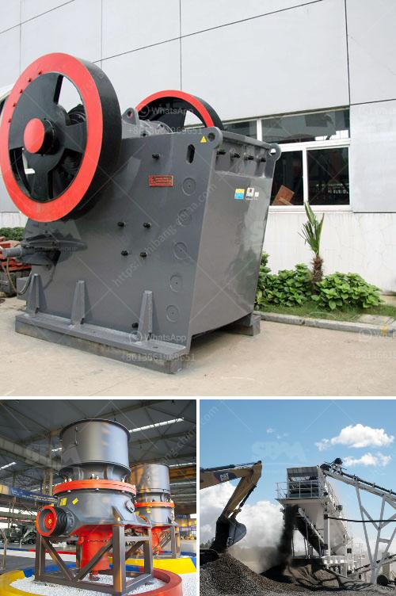

<h3>rock crusher china</h3>
When it comes to crushing and screening equipment, there are many options available in the market from stationary to mobile setups. However, for industries such as mining and construction, wheeled or track-mounted rock crushers are preferred. With the rapid development of China's infrastructure projects, the demand for rock crushers is on the rise.

Rock crushers are effective and efficient machines that are designed to crush, size, and classify rocks into various sizes. They are widely used in the mining industry, construction industry, and recycling industry. Rock crushers have different types and models to choose from depending on your requirements. From primary crushers to secondary and tertiary crushers, there is a vast range of options available.

China is known for its manufacturing capabilities, and the rock crusher industry is no exception. With decades of experience and numerous technological advancements, China rock crusher manufacturers have made significant strides in terms of product quality and performance. Many Chinese manufacturers combine state-of-the-art technology with cost-effective solutions, making their rock crushers highly competitive in the global market.

One of the advantages of purchasing a rock crusher from China is its lower cost. China has lower labor and production costs compared to many other countries. As a result, Chinese manufacturers can offer competitive pricing to customers without compromising on quality. This makes it an attractive option for buyers looking for efficient and affordable crushing equipment.

Moreover, China's rock crushers are known for their versatility and reliability. They can be used for a wide range of applications, including crushing various types of rocks, concrete, and asphalt. China rock crushers come in different sizes and capacities to suit different projects and requirements. Whether you need a portable or stationary rock crusher, China has a solution for you.

In conclusion, China has emerged as a major player in the rock crusher industry. Its competitive pricing, combined with high-quality and versatile products, has made it a preferred choice for businesses worldwide. If you are in need of efficient and reliable crushing equipment, exploring China's rock crusher solutions might be a wise decision.
<h3>Contact us</h3><ul><li><strong>Whatsapp:&nbsp;<a href="https://wa.me/8613661969651">+8613661969651</a></strong></li><li><a href="https://swt.shibang-china.com/?git&amp;zhl&amp;rock crusher china"><strong>Online Service(chat now)</strong></a></li></ul><h3>Related</h3><ul><li><a href='stone crusher machine factory in china.md'>stone crusher machine factory in china</a></li><li><a href='mobile impact crusher for sale.md'>mobile impact crusher for sale</a></li><li><a href='ton per jam jaw crusher.md'>ton per jam jaw crusher</a></li><li><a href='sand gold crusher equipment made in canada.md'>sand gold crusher equipment made in canada</a></li><li><a href='working scale model stone crusher.md'>working scale model stone crusher</a></li></ul>