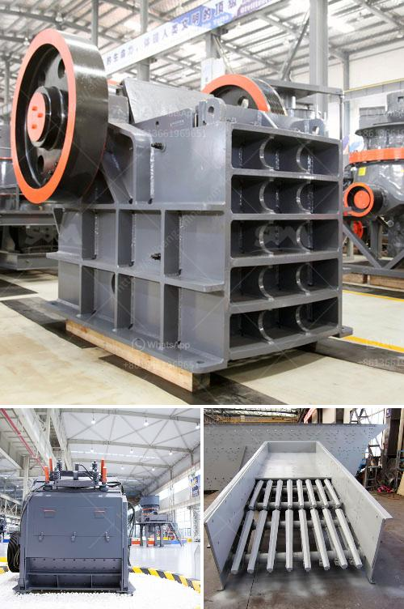

<h3>rock crusher company</h3>
Rock crushers are machines that reduce large rocks into smaller pieces or granules. Rock crushers play an important role in many different industries such as mining, construction, and demolition, recycling, and more. The Rock Crushing process inevitably involves some wear and tear on machinery, but it is vital to ensure that the process runs smoothly for maximum efficiency and output. A rock crusher company plays a crucial role in the industrial sector to provide the necessary materials needed for construction and other purposes.

One leading company in the rock crusher field is Rock Crusher Company. With more than 20 years of experience, they specialize in crushing, screening, and demolition works. Aimed at providing customers with a complete solution for their rock and mineral processing needs, Rock Crusher Company offers their customers high-quality products and services.

Quality is of utmost importance when it comes to rock crushers. A reliable rock crusher company ensures that their machines are built using the latest technology and materials to guarantee durability and long lifespan. Rock crushers are subjected to intensive loads and high pressures, which is why their quality cannot be compromised.

Furthermore, Rock Crusher Company also takes pride in its team of skilled engineers and technicians who are dedicated to providing efficient solutions for their customers. A reputable rock crusher company should have well-experienced professionals who can analyze and understand customers' requirements, customize solutions, and provide technical support whenever needed.

The variety of products provided by Rock Crusher Company is another factor that sets them apart from their competitors. They offer a wide range of crushers, including jaw crushers, cone crushers, impact crushers, and more. Each type of crusher has its unique advantages, making it suitable for different applications and requirements.

Customer satisfaction is paramount for Rock Crusher Company. They believe in establishing long-term relationships with their clients by consistently delivering excellent services and products. A satisfied customer is more likely to become a repeat customer and also recommend the company to others. A rock crusher company that prioritizes customer satisfaction ensures that their clients receive proper assistance, quick response times, and timely delivery of their products and services.

In conclusion, rock crushers are an essential part of numerous industries. A reliable rock crusher company like Rock Crusher Company plays a vital role in ensuring the availability of high-quality materials for construction, manufacturing, and other purposes. With their commitment to quality, knowledgeable team, and diverse range of products, they prove to be a valuable partner in the industrial sector. So, when it comes to fulfilling your rock crushing needs, consider partnering with a reputable rock crusher company like Rock Crusher Company.
<h3>Contact us</h3><ul><li><strong>Whatsapp:&nbsp;<a href="https://wa.me/8613661969651">+8613661969651</a></strong></li><li><a href="https://swt.shibang-china.com/?git&amp;zhl&amp;rock crusher company"><strong>Online Service(chat now)</strong></a></li></ul><h3>Related</h3><ul><li><a href='kaolin crusher price.md'>kaolin crusher price</a></li><li><a href='conveyor belts philippine price.md'>conveyor belts philippine price</a></li><li><a href='silica sand machinery manufacturer from india.md'>silica sand machinery manufacturer from india</a></li><li><a href='coal crusher supplier.md'>coal crusher supplier</a></li><li><a href='coal handling plant maintenance pdf.md'>coal handling plant maintenance pdf</a></li></ul>