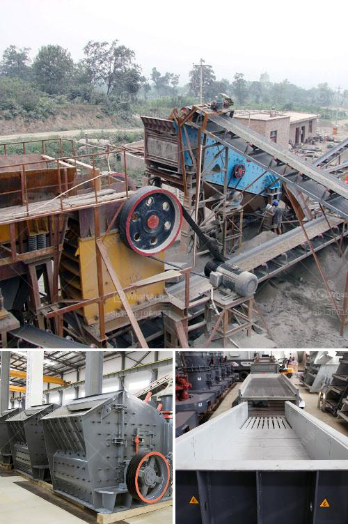

<h3>rock crusher dust fog control system philippines</h3>
Rock crushing operations generate dust, which becomes a major issue across the globe. As awareness of harmful dust particles increases, the importance of implementing an effective dust control system becomes paramount. The Philippines is no stranger to this issue, as rock crushers operate in quarrying sites all over the country. However, unlike many other countries, mining activities in the Philippines are governed by existing laws and regulations which are strictly enforced. Consequently, experts agree that implementing a comprehensive dust control system is an essential measure in minimizing the health and environmental hazards from rock crusher dust.

One of the essential tools in combating the dust generated by rock crushers is a well-designed dust suppression system. The dust control system should be proficient in capturing dust particles before they escape into the environment. It should also be effective in suppressing the dust generated during the crushing process. This is where a dust fog control system becomes essential.

A dust fog control system sprays a fine mist or fog of water particles, ideally in the range of 1 to 10 microns, from atomizing nozzles mounted around the circumference of the crushing chamber. The crushing process produces a significant amount of fine dust particles, which can be easily entrained into the air, causing numerous health hazards for both nearby residents and workers. However, a dust fog control system can effectively capture these particles by binding the dust particles together, causing them to drop back to the ground instead of being released into the atmosphere. This type of system can significantly reduce the amount of dust that escapes from the crushing chamber.

Moreover, a dust fog control system also has the added advantage of reducing water consumption compared to traditional water sprays. This is achieved by using high-pressure pumps, which atomize the water particles into a fine fog. The small water droplets have greater surface area and, as a result, can more efficiently suppress the dust particles. Additionally, the fog-like mist created by the control system also generates an added cooling effect, which can be beneficial during hot and dry seasons.

Implementing a dust fog control system aids in minimizing the environmental impact of rock crushing operations. By capturing and suppressing dust particles, the system helps in preserving air quality by reducing the amount of airborne particulate matter. This leads to a healthier environment for both workers and nearby residents. It also helps in reducing the chances of respiratory problems caused by prolonged exposure to airborne dust particles.

In conclusion, the implementation of an effective dust control system is essential for rock crushing operations in the Philippines. A dust fog control system, with its ability to capture and suppress dust particles, proves to be an ideal solution for mitigating health and environmental hazards. By efficiently reducing airborne particulate matter, the system ensures a healthier environment for workers and nearby residents. As the need for sustainable mining practices increases, investing in a rock crusher dust fog control system becomes a crucial step towards achieving a greener and healthier Philippines.
<h3>Contact us</h3><ul><li><strong>Whatsapp:&nbsp;<a href="https://wa.me/8613661969651">+8613661969651</a></strong></li><li><a href="https://swt.shibang-china.com/?git&amp;zhl&amp;rock crusher dust fog control system philippines"><strong>Online Service(chat now)</strong></a></li></ul><h3>Related</h3><ul><li><a href='gold ore hammer mills that are diesel driven.md'>gold ore hammer mills that are diesel driven</a></li><li><a href='vertical mill ireland.md'>vertical mill ireland</a></li><li><a href='mobile rock crusher rental in malaysia.md'>mobile rock crusher rental in malaysia</a></li><li><a href='ball mills caractecrsistiacs techniques.md'>ball mills caractecrsistiacs techniques</a></li><li><a href='crusher for crushing calcium carbonate.md'>crusher for crushing calcium carbonate</a></li></ul>