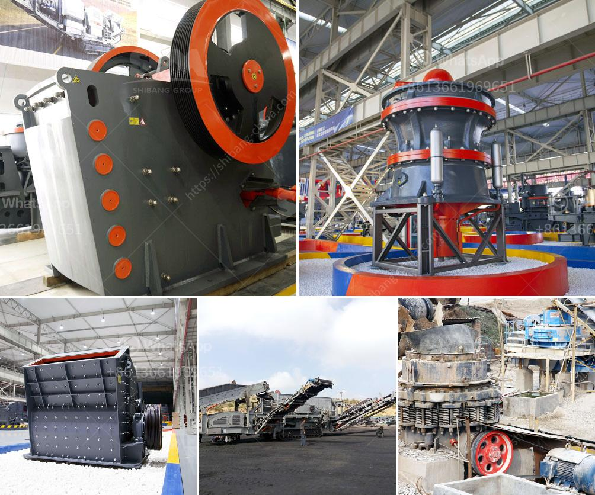

<h3>rock crusher gravel production</h3>
Crushing rock is used in many industrial processes and is the backbone of many industries such as construction, manufacturing, and agriculture. Rock crushers are widely used in mining, metallurgy, construction, highway, railroad, and chemistry industries. As a lot of rock crusher manufacturers on the planet, We provide stone crushers with top quality and low price, which are include pe jaw crusher, jc jaw crusher, pf impact crusher, and hydraulic impact crusher and hydraulic cone crusher etc. Stone crusher we have solutions for your rock and gravel inquiries and we have suitable equipment for the production of both materials. Crushed rock, sand, gravel as well as quarried and decorative aggregates are all produced by these machines.

Rock crushers have become an essential part of many industries' production line, facing a variety of conditions and places to use. They are divided into two categories: primary and secondary crushers, crushers or secondary crushers.

Primary crushers can break large rock chunks into smaller ones. At the same time, the secondary crushers are used for smaller rocks compared to the primary crusher. These machines not only better meet the production needs of various industries but also solve the problem of excessive or uneven particle size in a production line.

The gravel production line itself is a complex operation line of various equipment, which requires a certain degree of coordination and cooperation between equipment. This requires manufacturers to ensure that the production line is both efficient and smooth in operation while producing high-quality gravel.

One of the essential equipment for producing gravel is the rock crusher. Since gravel is a natural product of weathering rocks, it typically has a rounded shape, which is associated with vibrant colors. Crushed stone, sand, and gravel can all be used as aggregates in construction sites. Crushed stone is a product of rocks being broken down using a crushing machine. Crushed stone is sourced—also known as quarried—from a parent rock. The most common parent rocks used for crushed stone are:

Rock crusher plays an important role in gravel production line. It not only determines the quality of the gravel, but also enriches the natural resources and saves energy. For both the professional and the ordinary gravel plant, rock crusher can help them a lot. Most of the rock crushers are designed to achieve multiple production purposes by using major crushers in the front and secondary crushers in the rear with the maximum capacity and low maintenance costs.

The rock crusher creates gravel for roads with a pressure-free bed. It gradually breaks down the material into small pieces. Crushing requires passion, perseverance, and precision. Crushing rock increases the cost of concrete and structural repairs, which ultimately increases the overall cost of construction.

The rock crusher is also used in the automotive industry to refine crude oil. The material that is crushed can be used as a base material, as an advantage during retouching or increasing untreated gravel, including:

In conclusion, rock crushers are an essential piece of equipment for any industrial operation. They offer a cost-effective solution for crushing large rocks into smaller ones, making them suitable for a wide range of applications in various industries. Whether it's constructing roads, manufacturing concrete, or refining crude oil, rock crushers play a crucial role in the production process. So, investing in a reliable and efficient rock crusher can significantly improve gravel production efficiency while reducing overall costs.
<h3>Contact us</h3><ul><li><strong>Whatsapp:&nbsp;<a href="https://wa.me/8613661969651">+8613661969651</a></strong></li><li><a href="https://swt.shibang-china.com/?git&amp;zhl&amp;rock crusher gravel production"><strong>Online Service(chat now)</strong></a></li></ul><h3>Related</h3><ul><li><a href='used vsi crusher for sale in india.md'>used vsi crusher for sale in india</a></li><li><a href='rock crushing plants.md'>rock crushing plants</a></li><li><a href='vertical ball mill with price.md'>vertical ball mill with price</a></li><li><a href='quartz mining machineries manufacturers.md'>quartz mining machineries manufacturers</a></li><li><a href='crusher manufacturer in gujarat.md'>crusher manufacturer in gujarat</a></li></ul>