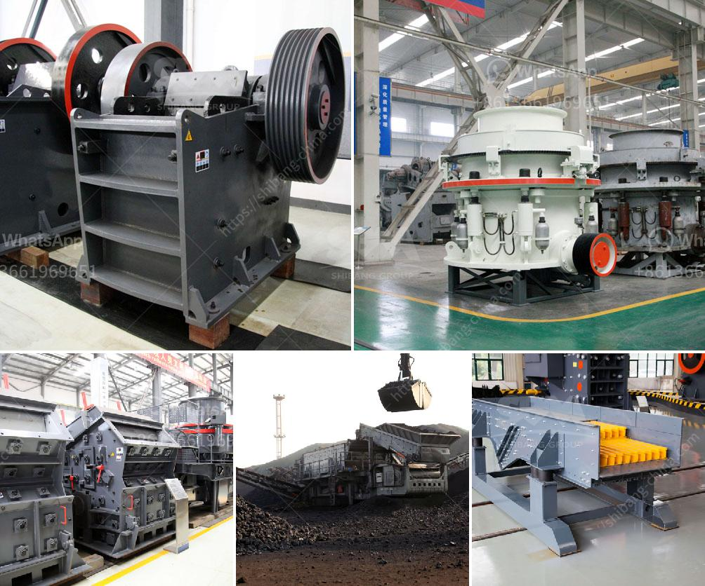

<h3>rock crusher hammer mills for sale</h3>
Rock crusher hammer mills are widely utilized in the mining industry because of their ability to crush rock materials into desired sizes. The machines are equipped with powerful hammers that make them able to process even the hardest and toughest materials. These hammer mills for sale are ideal for crushing materials such as limestone, coal, gypsum, and more.

One of the key features of rock crusher hammer mills for sale is their high capacity and efficiency. Compared to other types of crushing machines, they can process a larger volume of materials within a shorter period. This makes them a popular choice for industries that require large-scale production of crushed materials.

Another advantage of using rock crusher hammer mills is their versatility. These machines can be used in various applications, from construction and demolition waste recycling to mining operations. Whether it is reducing the size of large rocks or pulverizing materials into finer particles, these hammer mills are designed to handle a wide range of tasks.

These machines are also user-friendly and easy to maintain. They are typically equipped with a simple control panel that allows operators to adjust the speed and size of the materials being processed. Moreover, they require minimal maintenance, ensuring that businesses can focus on their production without worrying about frequent breakdowns or costly repairs.

In terms of safety, rock crusher hammer mills are built with robust features to protect operators and prevent accidents. They are often equipped with safety switches and guards that prevent the machine from operating if certain criteria are not met. Additionally, they are designed with noise reduction technology to minimize noise pollution in the working environment.

When looking for rock crusher hammer mills for sale, it is important to consider the reputation of the manufacturer. Choose a reputable manufacturer that has been in the industry for a long time and has a track record of producing high-quality machines. This ensures that you will receive a reliable and durable product that will serve your business well for years to come.

Furthermore, it is also important to consider the specific requirements of your operation. Determine the size and type of materials you will be processing and choose a hammer mill that is suitable for your needs. Consulting with an expert or a manufacturer's representative can help you select the right machine for your specific application.

In conclusion, rock crusher hammer mills are powerful and efficient machines that are widely used in the mining industry. They offer high capacity and versatility, making them ideal for various applications. With proper maintenance and by choosing a reputable manufacturer, businesses can benefit from these machines' durability and reliability. So, if you are in need of a rock crusher hammer mill for sale, carefully evaluate your requirements and make an informed purchase decision for your business.
<h3>Contact us</h3><ul><li><strong>Whatsapp:&nbsp;<a href="https://wa.me/8613661969651">+8613661969651</a></strong></li><li><a href="https://swt.shibang-china.com/?git&amp;zhl&amp;rock crusher hammer mills for sale"><strong>Online Service(chat now)</strong></a></li></ul><h3>Related</h3><ul><li><a href='cost setting up limestone mine.md'>cost setting up limestone mine</a></li><li><a href='crusher plant structure.md'>crusher plant structure</a></li><li><a href='ball mill feldspar 200 mesh output.md'>ball mill feldspar 200 mesh output</a></li><li><a href='quarry dan peralatan yang dibutuhkan.md'>quarry dan peralatan yang dibutuhkan</a></li><li><a href='oman marble quarry companies.md'>oman marble quarry companies</a></li></ul>