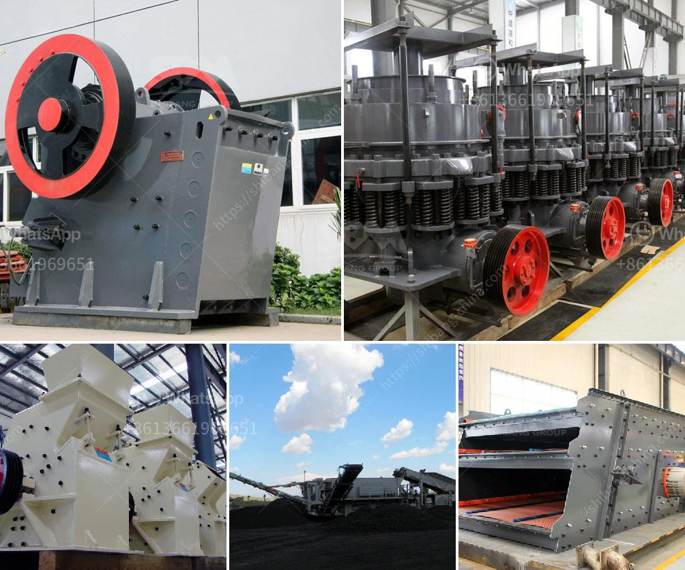

<h3>rock crusher in kenya</h3>
Rock crusher is designed to finely crush rock and stone materials, thus it is mostly used in highway and railway construction as well as mining industry. As its name suggests, Rock Crushers crushes the rocks into smaller sizes and can be used in various operations including crushing of rocks in quarries, mining operations, rocks recycling, and road building industry.

Rock Crushers are cost-effective machines with a durable design and efficient performance. This article focuses on a jaw crusher in the rock crushing process and the factors that influence its effectiveness.

The Nordberg® C Series™ jaw crusher, which is indisputably the world's favorite jaw crusher due to its unmatched performance and reliability. The jaw crusher is widely used in mining, metallurgy, building materials, water conservancy, chemical industry, and other industries. It can crush various kinds of materials with a compressive strength not exceeding 320 MPa.

The jaw crusher is designed with a deep V-shaped crushing chamber, which ensures greater crushing efficiency and productivity. With its excellent geometrical design, the jaw crusher produces highly uniform end products that are consistent in shape and size. It also has a large feed opening that can accommodate ore blocks with a maximum size of 1200mm. As a result, the jaw crusher can produce large quantities of high-quality materials efficiently.

Another notable feature of the jaw crusher is its ability to recycle construction waste and produce recycled aggregates. In many construction projects, there is a substantial amount of concrete and asphalt rubble that needs to be recycled and reused. The jaw crusher can turn this waste material into valuable construction aggregate, thus reducing the need for new raw materials and minimizing the environmental impact of construction projects.

In the mining industry, the jaw crusher is widely used for crushing various materials, such as granite, basalt, limestone, river pebble, iron ore, copper ore, etc. The jaw crusher is also a crucial part of the mining process, as it is responsible for reducing the size of ore blocks to facilitate subsequent crushing and grinding processes.

Maintenance plays an important role in the overall performance of the jaw crusher. Regular inspection and maintenance of the jaw crusher can extend its service life and maximize its efficiency. It is essential to check the jaw crusher regularly for wear and tear, such as worn or loose jaw plates, worn or damaged toggle seats, worn or damaged bearings, etc. Replacing or repairing the damaged parts in a timely manner can prevent unexpected breakdowns and ensure the jaw crusher operates at its optimal capacity.

In conclusion, the jaw crusher is an efficient and cost-effective rock crushing equipment that is widely used in many industries. The jaw crusher is designed to crush rock efficiently and evenly, thanks to its extra-deep crushing chamber and optimized motion parameters. The jaw crusher produces high-quality materials with excellent particle size distribution, resulting in improved overall performance of the downstream processes. Regular maintenance and inspection of the jaw crusher are necessary to ensure its smooth operation and prolonged service life. In summary, the jaw crusher is a versatile machine that is a valuable asset in any rock crushing operation, and it is worth investing in for improved productivity and profitability.
<h3>Contact us</h3><ul><li><strong>Whatsapp:&nbsp;<a href="https://wa.me/8613661969651">+8613661969651</a></strong></li><li><a href="https://swt.shibang-china.com/?git&amp;zhl&amp;rock crusher in kenya"><strong>Online Service(chat now)</strong></a></li></ul><h3>Related</h3><ul><li><a href='vibrating screen manufacturers.md'>vibrating screen manufacturers</a></li><li><a href='ball mill manufacturer in philippines.md'>ball mill manufacturer in philippines</a></li><li><a href='ethiopia unused cone crusher for sale.md'>ethiopia unused cone crusher for sale</a></li><li><a href='stone crusher price in dubai.md'>stone crusher price in dubai</a></li><li><a href='250 tons per hour crushers.md'>250 tons per hour crushers</a></li></ul>