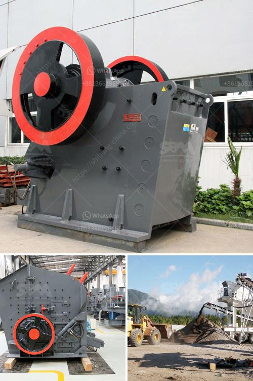

<h3>rock crusher oman manufacturers in nigeria</h3>
Nigeria is a blessed country with abundant natural resources, such as coal, iron ore, gold, limestone, etc. However, mining and quarrying activities in the country are not adequately developed as there is a lack of awareness and funding. One crucial equipment that is needed in these mining and quarrying industries is a rock crusher. It is used to crush large rocks into small particles for further processing and usage.

Fortunately, there are rock crusher manufacturers in Oman who can provide reliable and efficient crushing equipment. Oman is a country in the Middle East known for its vast desert landscape and rich mineral resources. It has been a leader in the production of deep-sea minerals and has expertise in mining and metal manufacturing. The rock crusher manufacturers in Oman are leveraging their technical expertise, experience, and financial resources to support Nigeria in achieving its full mining potential.

By partnering with these rock crusher manufacturers, Nigeria can improve its mining infrastructure and further develop its mining and quarrying industries. This will not only boost economic growth but also create employment opportunities for the local population. Additionally, it will attract foreign investments and technology transfers, leading to further advancements in the sector.

The rock crusher manufacturers in Oman can offer a variety of crushing equipment, such as jaw crushers, impact crushers, cone crushers, and hammer crushers. They use the latest technologies and high-quality materials to ensure excellent performance and durability. These manufacturers also provide comprehensive after-sales support, including installation, maintenance, and spare parts services.

Nigeria should explore partnerships with rock crusher manufacturers in Oman to acquire the necessary crushing equipment for its mining and quarrying industries. This collaboration will undoubtedly contribute to the growth and development of Nigeria's mining sector, positioning it as a major player in the global mining industry.

In conclusion, rock crusher manufacturers in Oman can be valuable partners for Nigeria. Their technical expertise, experience, and equipment can help Nigeria unlock its mining potential and contribute to its economic growth. It is crucial for the government and relevant stakeholders to actively seek collaborations with these manufacturers and create a favorable environment for investments in the mining sector.
<h3>Contact us</h3><ul><li><strong>Whatsapp:&nbsp;<a href="https://wa.me/8613661969651">+8613661969651</a></strong></li><li><a href="https://swt.shibang-china.com/?git&amp;zhl&amp;rock crusher oman manufacturers in nigeria"><strong>Online Service(chat now)</strong></a></li></ul><h3>Related</h3><ul><li><a href='ball mill in romania italy.md'>ball mill in romania italy</a></li><li><a href='mtm 160 mill spare parts suppliers in india.md'>mtm 160 mill spare parts suppliers in india</a></li><li><a href='india stone crusher machine price.md'>india stone crusher machine price</a></li><li><a href='mining equipment for hire in kenya.md'>mining equipment for hire in kenya</a></li><li><a href='iron ore beneficiation plant cost.md'>iron ore beneficiation plant cost</a></li></ul>