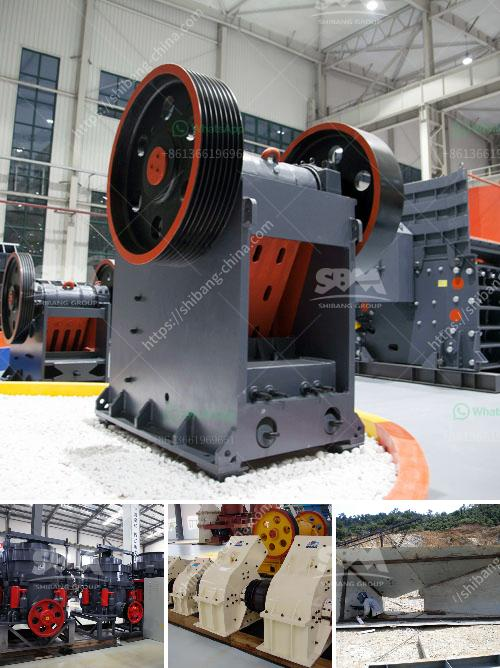

<h3>rock crusher plant for sale</h3>
Rock Crusher Plant For Sale: The rock crusher plant is the excellent equipment for construction waste recyling, which is also called solid waste disposal facility. The rock crusher plant provides the ideal solution for construction waste products and stone/rock crushing process to sell. With more than 20 years' experience in crushing technology and research, DSMAC has developed the efficient stone crushing plant "Unique Insider Team". 

Rock crusher plant for sale is now the hottest equipment globally and it's another prove of how DSMAC products have been benefited by its large customer base. Experienced marketers and burning ambition take DSMAC to supply the boxer machines for any customers in the world. The advent of rock crusher plant has brought the mining industry into a brand new era, which changed the construction waste disposal industry and innovative that gave birth to this miracle.

Rock crusher plant for sale has become the mantra for construction recycling, which showed that the rock crusher plant has expanded the market scope, from small-scale stationary crushing plant to mobile and portable crushing plant. DSMAC rock crusher plants are designed so that there are many unique advantages. DSMAC rock crusher plants have been exported successfully to more than 100 countries and regions, such as Indonesia, Philippines, Malaysia, Vietnam, Thailand, Sri Lanka, Egypt, Iran, Russia, Kazakhstan, Zambia, Turkey, Brazil, Peru and so on.

Rock crusher plant for sale has crusher, vibrating screen, belt conveyor, sand washing machine, vibrating feeder, etc. DSMAC is a professional rock crusher plant manufacturer and supplier. DSMAC proposes the most suitable production line to meet the customers' different requirements and choose the most appropriate equipment. DSMAC rock crusher plants products are characterized by large crushing ratio, high production efficiency, low energy consumption, easy operation and maintenance, etc. An effective rock crusher plant ensures a high-quality stone in the construction industry. Take DSMAC rock crusher plant as an example, its main technical parameters are as follows:

Rock crusher plant for sale has been widely used in construction waste treatment and rock crushing for various minerals. With the expanding market, rock crusher plant for sale has become more and more popular. Customers can choose various crushing equipment options, such as jaw crusher, cone crusher, impact crusher, hammer crusher, etc., to meet different crushing requirements. Moreover, DSMAC provides a whole set of services, including the integration of installation, operation, commissioning and maintenance.

In conclusion, rock crusher plant for sale has become the most popular construction waste crusher equipment worldwide. Rock crusher plant for sale not only achieves the recycling of construction waste, but also improves the utilization rate of resources. Rock crusher plant for sale plays an important role in aggregate production, mining industry, construction waste recycling and road and railway construction. It is also the necessary equipment for coal, metallurgy, chemical industry, environmental protection and other industries. Rock crusher plant for sale is a reliable and trusted brand for stone crushing production line and sand making production line worldwide.
<h3>Contact us</h3><ul><li><strong>Whatsapp:&nbsp;<a href="https://wa.me/8613661969651">+8613661969651</a></strong></li><li><a href="https://swt.shibang-china.com/?git&amp;zhl&amp;rock crusher plant for sale"><strong>Online Service(chat now)</strong></a></li></ul><h3>Related</h3><ul><li><a href='organic fertilizer production line in india.md'>organic fertilizer production line in india</a></li><li><a href='sell jaw crusher the dubia.md'>sell jaw crusher the dubia</a></li><li><a href='quartz stone making machine.md'>quartz stone making machine</a></li><li><a href='rock crusher china.md'>rock crusher china</a></li><li><a href='stone crusher in mexico.md'>stone crusher in mexico</a></li></ul>