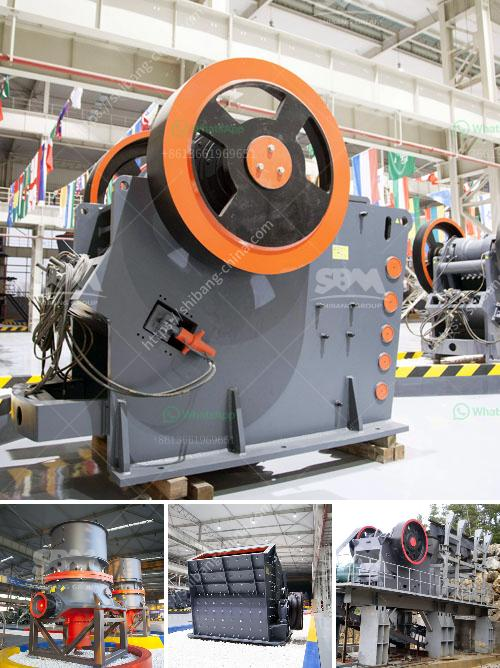

<h3>rock crusher production line</h3>
Rock crushers are widely used in mining, metallurgy, construction, highways, railways, water conservancy, and chemical industries. They have the potential to crush large rocks into smaller, more manageable rocks, gravel, or even rock dust. A rock crusher production line is crucial to the success of any quarry or mining business.

1. High crushing ratio: The crushing ratio of the rock crusher is typically 10 to 20% higher than that of conventional crushers, which results in a greater reduction ratio and more fine particles. This ensures efficient and high-quality crushing.

2. Productivity boost: The rock crusher production line improves productivity by reducing downtime, which saves operational costs. With automated features, the rock crusher can be started, stopped, and adjusted remotely, reducing the need for manual intervention and allowing for continuous operation.

3. Versatility: Modern rock crushers are capable of processing a wide range of materials, including limestone, granite, concrete, brick, asphalt, and more. This versatility allows businesses to sell a variety of crushed material sizes to different customers, maximizing profits.

4. Environmental friendliness: Rock crushers have advanced dust suppression systems that significantly reduce the generation of dust and other harmful airborne particles. This protects the environment and improves the health and safety of the workers in the production line.

5. Ease of maintenance: Rock crushers are designed for easy maintenance, with replaceable wear parts that can be interchanged quickly. This reduces maintenance downtime and keeps the production line running smoothly without interruptions.

6. Energy efficiency: The motors and engines used in modern rock crushers are energy-efficient, leading to lower power consumption and reduced energy costs. This benefits both the environment and the operation's bottom line.

7. Customization options: Rock crushers can be designed and configured to meet specific requirements. Whether it is the size, shape, or capacity, customization allows businesses to tailor the rock crusher production line to their unique needs.

8. Reduced noise pollution: Older rock crushers can generate significant noise levels, which can be harmful to workers and neighboring communities. However, newer models are equipped with noise-reduction features, ensuring a quieter and more comfortable working environment.

In conclusion, a rock crusher production line offers numerous benefits and advantages for quarry and mining businesses. High crushing ratios, improved productivity, versatility, environmental friendliness, easy maintenance, energy efficiency, customization options, and reduced noise pollution are key features that contribute to the success of these production lines. By investing in a modern, well-designed rock crusher production line, businesses can improve their operational efficiency, decrease costs, and provide high-quality crushed material to various industries.
<h3>Contact us</h3><ul><li><strong>Whatsapp:&nbsp;<a href="https://wa.me/8613661969651">+8613661969651</a></strong></li><li><a href="https://swt.shibang-china.com/?git&amp;zhl&amp;rock crusher production line"><strong>Online Service(chat now)</strong></a></li></ul><h3>Related</h3><ul><li><a href='used vsi crusher for sale in india.md'>used vsi crusher for sale in india</a></li><li><a href='marble granite stone grinding machine price.md'>marble granite stone grinding machine price</a></li><li><a href='robo sand manufacturing process.md'>robo sand manufacturing process</a></li><li><a href='aggregate roller crushing mill malaysia.md'>aggregate roller crushing mill malaysia</a></li><li><a href='komatsu crawler jaw crusher.md'>komatsu crawler jaw crusher</a></li></ul>